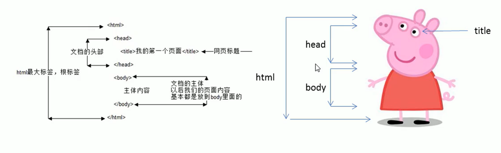
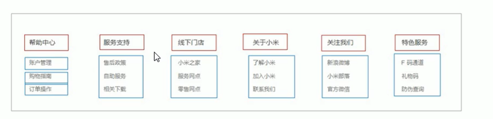
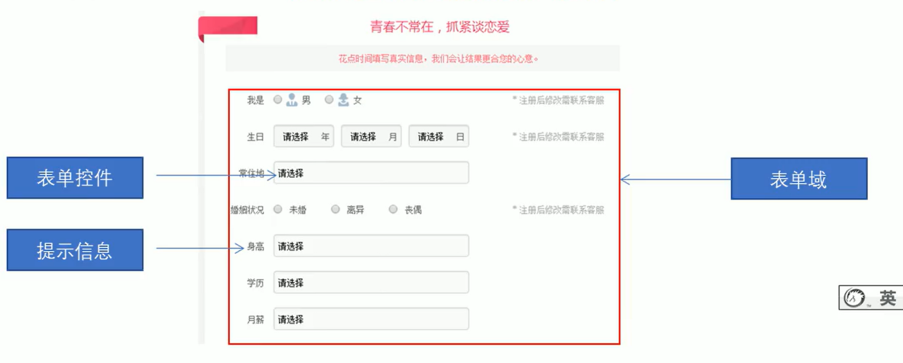

## 网页

**什么是网页**

网站是指在因特网上根据一定的规则，使用HTML等制作的用于展示特定内容相关的网页集合。
网页是网站中的一“页”，通常是HTML格式的文件，它要通过浏览器来阅读。

网页是构成网站的基本元素，它通常由图片、链接、文字、声音、视频等元素组成。通常我们看到的网页，常见以.htm 或.html后缀结尾的文件，因此将其俗称为HTML文件。

**什么是HTML**

HTML指的是超文本标记语言(HyperText Markup Language),
它是用来描述网页的一种语言。
HTML不是一种编程语言，而是一种标记语言(markup language)。
标记语言是一套标记标签(markup tag)。

超文本：

- 可以加入图片、声音、动画、多媒体等内容
- 可以从一个文件跳到另一个文件

**网页的形成**

网页是由网页元素组成的，这些元素是利用html标签描述出来，然后通过浏览器解析来显示给用户的。

## 浏览器

浏览器内核：

浏览器内核（渲染引擎)∶负责读取网页内容，整理讯息，计算网页的显示方式并显示页面。

## Web 标准

Web标准是由W3C组织和其他标准化组织制定的一系列标准的集合。W3C(万维网联盟）是国际最著名的标准化组织。

遵循Web标准除了可以让不同的开发人员写出的页面更标准、更统一外，还有以下优点∶

- 让 Web的发展前景更广阔
- 内容能被更广泛的设备访问
- 更容易被搜寻引擎搜索
- 降低网站流量费用
- 使网站更易于维护
- 提高页面浏览速度

### Web 标准的构成

- **结构**：结构用于对网页元素进行整理和分类，现阶段主要学的是HTML

- **表现**：表现用于设置网页元素的版式、颜色、大小等外观样式，主要指的是CSS
- **行为**：行为是指网页模型的定义及交互的编写，现阶段主要学的是 JavaScript

最佳体验方案：结构、样式、结构分离

# HTML标签


## HTML语法规范

### 基本语法概述

- HTML标签是由尖括号包围的关键词，例如`<html>`。
- HTML标签通常是成对出现的，例如`<html>`和`</html>`，我们称为双标签。标签对中的第一个标签是开始标签，第二个标签是结束标签。
- 有些特殊的标签必须是单个标签(极少情况），例如`<br/>`我们称为单标签。

### 标签关系

#### 包含关系(父子关系)

```html
<head>
	<title></title>
</head>
```

#### 并列关系

```html
<head></head>
<body></body>
```

## HTML基本结构标签

每个网页都会有一个基本的结构标签(也称为骨架标签），页面内容也是在这些基本标签上书写。

1、`<html></html>`

HTML标签，页面中最大的标签，称为根标签

2、`<head></head>`

文档的头部，注意在 head 标签中我们必须要设置的标签是 title

3、`<title></tilte>`

文档的标题，让页面拥有一个网页标题

4、`<body></body>`

文档的主题，元素包含文档的所有内容，页面内容基本都是放在 body中

```html
<html>
	<head>
		<title>第一个页面</title>
	</head>
	<body>
		Hello world!
	</body>
</html>
```



<!DOCTYPE html>

```html
<!DOCTYPE html>

<html lang="en">
<head>

    <meta charset="UTF-8">

    <meta http-equiv="X-UA-Compatible" content="IE=edge">

    <meta name="viewport" content="width=device-width, initial-scale=1.0">

  <title>Document</title>

</head>

<body>

  Hello world

</body>

</html>
```

### 文档类型声明标签

`<!DOCTYPE>`文档类型声明，作用就是告诉浏览器使用哪种HTML版本来显示网页。
`<! DOCTYPE html>`这句代码的意思是:当前页面采取的是HTML5版本来显示网页.
注意:

- `<!DOCTYPE>`声明位于文档中的最前面的位置，处于`<html>`标签之前。
  
- `<!DOCTYPE>`不是一个HTML标签，它就是文档类型声明标签。

### `lang` 语言种类

用来定义当前文档显示的语言。

-  `en` 定义语言为英语

- `zh-CN` 定义语言为中文

简单来说,定义为`en`就是英文网页,定义为`zh-CN`就是中文网页

### 字符集

字符集(Character set)是多个字符的集合。以便计算机能够识别和存储各种文字。
在 `<head>` 标签内，可以通过 `<meta>` 标签的 charset 属性来规定HTML文档应该使用哪种字符编码。

`<meta charset="UTF-8"/>`
charset 常用的值有:GB2312、BlG5、GBK和UTF-8，其中UTF-8也被称为万国码，基本包含了全世界所有国家需要用到的字符
注意：上面语法是必须要写的代码，否则可能引起乱码的情况。一般情况下，统一使用“UTF-8”编码，尽量统一写成标准的`UTF-8`，不要写成“utf8"或"UTF8"。

## 常用标签

### 标签语义

学习标签是有技巧的，重点是记住每个标签的语义。简单理解就是指标签的含义，即这个标签是用来干嘛的。
根据标签的语义，在合适的地方给一个最为合理的标签，可以让页面结构更清晰。

### 标题标签

为了使网页更具有语义化，我们经常会在页面中用到标题标签。HTML提供了6个等级的网页标题，即`<h1> ~ <h6>`。

单词 head 的缩写，意为头部、标题。
标签语义︰作为标题使用、并且依据重要性递减。

**特点**:

- 加了标题的文字会变的加粗，字号也会依次变大
- 一个标题独占一行

```html
	<h1>标题一共六级选，</h1>
	<h2>文字加粗一行显。</h2>
	<h3>由大到小依次减，</h3>
	<h4>从重到轻随之变。</h4>
	<h5>语法规范书写后，</h5>
	<h6>具体效果刷新见。</h6>
```

### 段落标签

在网页中，要把文字有条理地显示出来，就需要将这些文字分段显示。在 HTML 标签中，<p>标签用于定义段落，它可以将整个网页分为若干个段落。

`<p>我是一个段落标签</p>`

单词 paragraph 的缩写，意为段落。标签语义∶可以把 HTML 文档分割为若干段落。

**特点**:

- 文本在一个段落中会根据浏览器窗口的大小自动换行
- 段落和段落之间保有空隙

### 换行标签

在HTML中，一个段落中的文字会从左到右依次排列，直到浏览器窗口的右端，然后才自动换行。如果希望某段文本强制换行显示，就需要使用换行标签`<br />`
`<br />`
单词 break 的缩写，意为打断、换行。标签语义∶强制换行。
**特点**:

- `<br />`是个单标签
- `<br />`标签只是简单地开始新的一行，跟段落不一样，段落之间会插入一些垂直的间距

### 文本格式化标签

- `<strong></strong>`，`<b></b>`加粗
- `<em></em>`，`<i></i>`倾斜
- `<del></del>`，`<s></s>`删除线
- `<ins></ins>`，`<u></u>`下划线

### `<div>`，`<span>`标签

`<div>`和`<span>`是没有语义的，它们就是一个盒子，用来装内容的。

```html
<div>这是头部</div>
<span>今日价格</span>
```

div是division的缩写，表示分割、分区。span意为跨度、跨距。

**特点**：

- `<div>`标签用来布局，但是一行只能放一个`<div>`
- `<span>`标签用来布局，一行上可以多个`<span>`

### 图像标签

```html

```

单词image的缩写，意为图像。
src 是``标签的必须属性，它用于指定图像文件的路径和文件名。
所谓属性:简单理解就是属于这个图像标签的特性。

**图像标签属性:**

| 属性   | 属性值   | 说明                               |
| ------ | -------- | ---------------------------------- |
| src    | 图片路径 | 必须属性                           |
| alt    | 文本     | 替换文本，图像不能显示时替换成文字 |
| title  | 文本     | 提示文本，鼠标放到图像上提示的文字 |
| width  | 像素     | 图像宽度                           |
| height | 像素     | 图像高度                           |
| border | 像素     | 图像边框粗细                       |

<font>注意</font>

1. 图像标签可以拥有多个属性，必须写在标签名后面
2. 属性之间不分先后顺序，标签名与属性，属性与属性之间用空格隔开
3. 属性采用键值对的格式，即 key="value"

### 路径

**目录文件夹**∶就是普通文件夹，里面只不过存放了我们做页面所需要的相关素材，比如 html文件、图片等。
**根目录**∶打开目录文件夹的第一层就是根目录

**相对路径**：图片相对于 html 文件的位置

| 分类       | 符号 | 说明                                               |
| ---------- | ---- | -------------------------------------------------- |
| 同一级路径 |      | 图像和 HTML 文件同一级，``        |
| 下一级路径 | /    | 图像位于 HTML文件下一级，`` |
| 上一级路径 | ../  | 图像位于 HTML文件上一级，``    |

**绝对路径**：是指目录下的绝对位置，直接到达目标位置，通常是从盘符开始的路径。

### 超链接标签

在HTML标签中，`<a>`标签用于定义超链接，作用是从一个页面链接到另一个页面。

#### 语法格式

单词 anchor 的缩写，意为 锚

````html
<a href="跳转地址" target="弹出方式">文本或图像</a>
````

| 属性   | 作用                                                         |
| ------ | ------------------------------------------------------------ |
| href   | 用于指定链接目标的url地址，(必须属性)当为标签应用href属性时，它就具有了超链接的功能 |
| target | 用于指定链接页面的打开方式，其中_self 为默认值，_blank为在新窗口中打开方式 |

#### 链接分类

1. 外部链接，例如`< a href="http://www.baidu.com">百度</a >`
2. 内部链接，网站内部页面之间的相互链接.直接链接内部页面名称即可，例如`<a href=" index.html">首页</a>`
2. 空链接，`<a href="#"></a>`
2. 下载链接，如果 href 里面地址是一个文件或者压缩包，会下载这个文件
2. 网页元素链接，在网页中的各种网页元素，如文本、图像、表格、音频、视频等都可以添加超链接
6. 锚点链接，点我们点击链接,可以快速定位到页面中的某个位置
   1. 在链接文本的href属性中，设置属性值为#名字的彤式，如`<a href="#two">第2集</a>`
   2. 找到目标位置标签，里面添加一个id属性=刚才的名字，如:`<h3 id="two">第2集介绍</h3>`

### 注释标签

如果需要在HTML文档中添加一些便于阅读和理解但又不需要显示在页面中的注释文字，就需要使用注释标签。HTML中的注释以`< !--”开头，以“-- >`结束。

### 特殊字符

| 特殊字符 | 描述   | 代码       |
| -------- | ------ | ---------- |
|          | 空格   | `&nbsp;`   |
| <        | 小于号 | `&lt;`     |
| >        | 大于号 | `&gt;`     |
| &        | 和号   | `&amp;`    |
| ©        | 版权   | `&copy;`   |
| ®        | 商标   | `&reg;`    |
| °        | 度     | `&deg;`    |
| ±        | 正负号 | `&plusmn;` |
| ✖        | 乘号   | `&times;`  |
| ➗        | 除号   | `&divide;` |
| ²        | 平方   | `&sup2;`   |
| ³        | 立方   | `&sup3;`   |
| ￥       | 人民币 | `&yen;`    |


### 表格标签

#### 作用

表格主要用于显示、展示数据，因为它可以让数据显示的非常的规整可读性非常好。特别是后台展示数据的时候，能够熟练运用表格就显得很重要。一个清爽简约的表格能够把繁杂的数据表现得很有条理。

#### 基本语法

```html
<table>
	<tr>
    	<td>单元格文字</td>
    	...
    </tr>
	...
</table>
```

1. <table> </table>是用于定义表格的标签。

2. `<tr> </tr>`标签用于定义表格中的行，必须嵌套在`<table> </table>`标签中

3. `<td> </td>`用于定义表格中的单元格，必须嵌套在`<tr></tr>`标签中

4. 字母td指表格数据( table data )，即数据单元格的内容

#### 表头单元格

一般表头单元格位于表格的第一行或第一列，表头单元格里面的文本内容加粗居中显示

`<th>`标签表示HTML表格的表头部分(table head的缩写)

#### 表格属性

主要通过CSS设置

<table>
    <tr><th>属性名</th><th>属性值</th><th>描述</th></tr>
    <tr><td>align</td><td>left,center,right</td><td>规定表格相对周围元素的对齐方式。
</td></tr>
    <tr><td>border</td><td>1或""</td><td>规定表格单元是否拥有边框，默认为""，表示没有边框
</td></tr>
    <tr><td>cellpadding</td><td>像素值</td><td>规定单元边沿与其内容之间的空白，默认1像素
</td></tr>
    <tr><td>cellspacing</td><td>像素值</td><td>规定单元格之间的空白，默认2像素
</td></tr>
    <tr><td>width</td><td>像素值或百分比</td><td>规定表格的宽度
</td></tr>
     <tr><td>height</td><td>像素值或百分比</td><td>规定表格的高度
</td></tr>
</table>

#### 表格结构标签

使用场景:因为表格可能很长,为了更好的表示表格的语义，可以将表格分割成表格头部和表格主体两大部分

在表格标签中，分别用`<thead>`标签表格的头部区域、`<tbody>`标签表格的主体区域.这样可以更好的分清表格结构

1. `<thead></thead>`∶用于定义表格的头部。<thead>内部必须拥有<tr>标签。一般是位于第一行
2. `<tbody> </tbody> `:用于定义表格的主体，主要用于放数据本体

#### 合并单元格

##### 方式

1. 跨行合并：rowspan="合并单元格的个数"
2. 跨列合并：colspan="合并单元格的列数"

代码写在目标单元格

- 跨行：最上侧单元格
- 跨列：最左侧单元格

##### 步骤

1. 确定跨行还是跨列
2. 找到目标单元格，写代码
3. 删除多余单元格

### 列表标签

表格是用来显示数据的，那么列表就是用来布局的。
列表最大的特点就是整齐、整洁、有序，它作为布局会更加自由和方便
根据使用情景不同，列表可以分为三大类∶**无序列表、有序列表和自定义列表**。

#### 无序列表

`<ul>`标签表示HTML页面中项目的无序列表，一般会以项目符号呈现列表项，而列表项使用`<li>`标签定义

```html
<ul>
	<li>列表项1</li>
	<li>列表项2</li>
	<li>列表项3</li>
	...
</ul>
```

1. 无序列表的各个列表项之间没有顺序级别之分，是并列的
2. `<ul><ul>`中只能嵌套`<li><li>`，直接在`<ul></ul>`标签中输入其他标签或者文字的做法是不被允许的
3. `<li>与</li>`之间相当于一个容器，可以容纳所有元素
4. 无序列表会带有自己的样式属性，但在实际使用时，我们会使用CSS来设置

#### 有序列表

有序列表即为有排列顺序的列表，其各个列表项会按照一定的顺序排列定义。
在HTML标签中，<ol>标签用于定义有序列表，列表排序以数字来显示，并且使用<li>标签来定义列表项

```html
<ol>
	<li>列表项1</li>
    <li>列表项2</li>
    <li>列表项3</li>
    ...
</ol>
```

1. `<ol><ol>`中只能嵌套`<li><li>`，直接在`<ol></ol>`标签中输入其他标签或者文字的做法是不被允许的
2. `<li>与</li>`之间相当于一个容器，可以容纳所有元素
3. 有序列表会带有自己的样式属性，但在实际使用时，我们会使用CSS来设置

#### 自定义列表

自定义列表常用于对术语或名词进行解释和描述，定义列表的列表项前没有任何项目符号。

使用场景：



```html
<dl>
	<dt>名词1</dt>
    <dd>名词1解释1</dd>
    <dd>名词1解释2</dd>
</dl>
```

### 表单标签

**目的**：收集用户信息

**组成**

- 表单域
- 表单控件（表单元素）
- 提示信息



#### 表单域

表单域是一个包含表单元素的区域

在HTML标签中，`<form>`标签用于定义表单域，以实现用户信息的收集和传递

`<form>`会把它范围内的表单元素信息提交给服务器

```html
<form action="url地址" method="提交方式" name="表单域名称">
    元素控件
</form>
```

| 属性   | 属性值   | 作用                                             |
| ------ | -------- | ------------------------------------------------ |
| action | url地址  | 用于指定接受并处理表单数据的服务器程序的url地址  |
| method | get/post | 用于设置表单数据的提交方式                       |
| name   | 名称     | 用于指定表单的名称，以区分一个页面中的多个表单域 |

#### 表单控件

##### input 标签

**单标签**

```html
<input type="属性值"/>
```

| 属性        | 属性值   | 描述                                       |
| ----------- | -------- | ------------------------------------------ |
| type        | text     | 单行文本输入框                             |
| type        | password | 密码输入框，字符会隐藏                     |
| type        | radio    | 单选按钮                                   |
| type        | checkbox | 复选框                                     |
| type        | button   | 普通按钮                                   |
| type        | submit   | 提交按钮，使用提交按钮后会将表单提交到后台 |
| type        | reset    | 重置按钮                                   |
| type        | image    | 图像形式的提交按钮                         |
| type        | file     | 文件域，上传文件                           |
| name        | 自定义   | 控件名称                                   |
| value       | 自定义   | 默认文本值，可以选择                       |
| size        | 正整数   | 显示宽度                                   |
| checked     | checked  | 默认被选中的项                             |
| maxlength   | 正整数   | 做多输入字符数                             |
| placeholder | 文本     | 表单提示。无法选择                         |

**注意**

1. name和value是每个表单元素都有的属性值,主要给后台人员使用
2. name表单元素的名字,要求单选按钮和复选框要有相同的name值
3. checked属性主要针对于单选按钮和复选框,主要作用一打开页面,就要可以默认选中某个表单元素
4. maxlength是用户可以在表单元素输入的最大字符数一般较少使用

##### label 标签

<label>标签为 input 元素定义标注

<label>标签用于绑定一个表单元素当点击<label>标签内的文本时，浏览器就会自动将焦点(光标)转到或者
选择对应的表单元素上,用来增加用户体验

id 和 for 必须对应

```html
<label for="sex" >男</label>
<input type="radio" name="sex" id="sex"/>
或
<label>
	<input type="radio">男
</label>

```

##### select 下拉表单

在页面中，如果有多个选项让用户选择，并且想要节约页面空间时，我们可以使用<select>标签控件定义下拉列表.

```html
<select>
  
  <option>选项1</option>
  <option>选项2</option>
  <option>选项3</option>
  ...
</select>
```

1. `<select>`中至少包含一对`<option>`
2. 在`<option>`中定义`seleced = " selected "`时，当前项即为默认选中项。

##### textarea 文本域

当用户输入内容较多的情况下，我们就不能使用文本框表单了，此时我们可以使用`<textarea>`标签。
在表单元素中，`<textarea>`标签是用于定义多行文本输入的控件。


cols="每行中的字符数" rows="显示的行数"，实际使用使用 CSS 调整

```html
 <textarea >
    文本内容
 </textarea>
```


# CSS 层叠样式表

## CSS 简介

### CSS 语法规范

使用HTML时，需要遵从一定的规范，CSS 也是如此。要想熟练地使用 CSS 对网页进行修饰，首先需要了解CSS 样式规则。
CSS 规则由两个主要的部分构成∶选择器以及一条或多条声明。

```css
h1{
	color:red;
	font-size:25px;
}
```

- 选择器是用于指定 CSS 样式的 HTML 标签，花括号内是对该对象设置的具体样式
- 属性和属性值以“键值对”的形式出现
- 属性是对指定的对象设置的样式属性，例如字体大小、文本颜色
- 属性和属性值之间用英文`""`分开
- 多个“键值对”之间用英文`;`进行区分

### CSS 代码风格

#### 样式格式

1. 紧凑格式：`h3 {color:deeppink;font-size:20px;}`
2. 展开格式(<font color="red">推荐</font>)：

```css
h1{
	color:red;
	font-size:25px;
}
```

#### 样式大小写和空格规范

推荐使用小写

空格：

- 属性值前面，冒号后面，保留一个空格
- 选择器和大括号中间保留空格


## CSS 基础选择器

**选择器的作用**：

选择器(选择符)就是根据不同需求把不同的标签选出来这就是选择器的作用。简单来说，就是选择标签用的。

### 选择器分类

选择器哦分为基础选择器和符合选择器两个大类

#### 基础选择器

由单个选择器组成

##### 标签选择器

标签选择器（元素选择器）是指用HTML标签名称作为选择器，按标签名称分类，为页面中某一类标签指定统一的CSS样式。

**作用**：

可以把某一类标签全部选择出来

**优点**：

能快速为页面中同一类型的标签同意设置样式

**缺点**：

不能差异化样式，只能选择全部标签

##### 类选择器

如果想要差异化选择不同的标签，单独选一个或者某几个标签，可以使用类选择器.

```html
.类名 {
	属性1： 属性值1；
}
```

**注意**

- 类选择器使用`.`（英文点号）进行标识，后面紧跟类名(自定义，我们自己命名的)
- 可以理解为给这个标签起了一个名字，来表示
- 长名称或词组可以使用中横线来为选择器命名
- 不要使用纯数字、中文等命名，尽量使用英文字母来表示

##### 类选择器-多类名

我们可以给一个标签指定多个类名，从而达到更多的选择目的。这些类名都可以选出这个标签.
简单理解就是一个标签有多个名字

```html
<div class="size red"></div>
```

###### 使用方式

```html
<div class="red font20">ABC</div>
```

1. 在标签 class 属性中写多个类名
2. 多个类名中间必须用空格分开
3. 这个标签就可以分别具有这些类名的样式
4. 从而节省 CSS 代码,统一修改也非常方便
5. 多类名选择器在后期布局比较复杂的情况下，还是较多使用的

##### id 选择器

id选择器可以为标有特定 id 的 HTML 元素指定特定的样式。
HTML 元素以 id 属性来设置 id 选择器，CSS中id选择器以`#`来定义

```css
#nav {
	color: red;
}

<div id="nav">ABC</div>
```

##### id 选择器和类选择器的区别

1. 类选择器( class )好比人的名字，一个人可以有多个名字，同时一个名字也可以被多个人使用
2. id选择器好比人的身份证号码全中国是唯一的，不得重复
3. id选择器和类选择器最大的不同在于使用次数上
4. 类选择器在修改样式中用的最多，id选择器一般用于页面唯一性的元素上，经常和JavaScript搭配使用

##### 通配符选择器

​	在CSS中，通配符选择器使用`*`定义，它表示选取页面中所有元素(标签)

```
* {
	属性1： 属性值1；
}
```

- 通配符选择器不需要调用，自动就给所有的元素使用样式
- 特殊情况才使用


