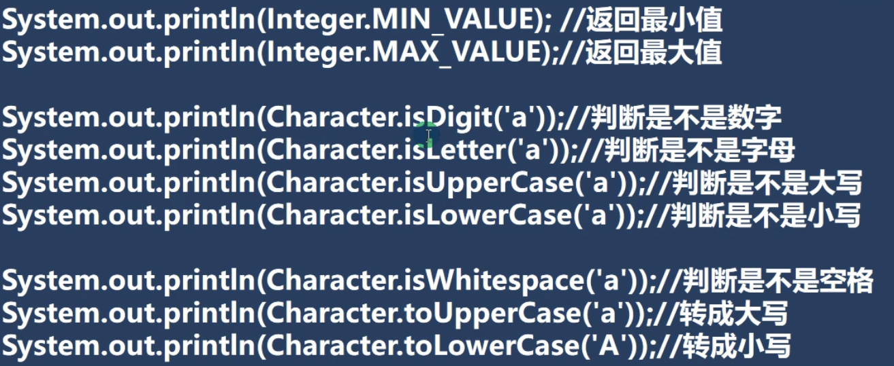

# Java 基础

## Java特性

* Java 语言是面向对象的（oop）
* Java 是健壮的，强类型机制、垃圾回收、异常处理
* Java 是跨平台的，.java->.class，.class 可在多系统下运行，由JVM实现
* Java 是解释型语言（还包括 javascript、PHP），编译型语言有 c/c++

## 易犯错误

- 找不到文件：源文件名不存在或者写错，或者当前路径错误
- 主类名与文件名不一致：声明为 `public` 的主类应与文件名一致，否则编译失败
- 缺少分号：加分号

## 转义符

* \t 一个制表位，实现对齐功能
* \r 一个回车
* \n 换行符
* \\ \ 一个\
* \\" 一个"
* \\' 一个'

## 注释

- 单行注释    //注释内容
- 多行注释    /*注释内容\*/     不允许嵌套多行注释

## 文档注释

```java
/**
 * @author ZhangNing
 * @version 1.0
 */
```


命令：`javadoc -d 路径 -xx -yy test.java`

其中的xx、yy是@后的标签。

可选标签：

@author 作者

@param 输入参数的名称 说明

@return 输出参数说明

@since JDK版本

@version 版本号

@see 链接目标

@throws 异常

@deprecated 解释

@link 链接地址

## Java 代码规范

- 类、方法的注释，要以 javadoc 的方式来书写
- 非 javadoc 的注释，往往是给代码的维护者看的，着重告诉读者为什么这样写，如何修改，注意什么问题
- 选中移动的代码，使用 TAB 整体右移，用 shift + TAB 整体左移
- 运算符和 = 两边习惯性各加一个空格
- 源文件使用 utf-8 编码
- 行宽度不要超过 80 字符
- 代码编写次行风格和行尾风格

行尾风格：

```java
public class test {
    public static void main(String[] args){
        System.out.println("Hello World!");
    }
}
```

次行风格：

```java
public class test {
    public static void main(String[] args)
    {
        System.out.println("Hello World!");
    }
}
```

## 变量

变量相当于内存中一个数据存储空间的表示

变量是程序的基本组成单位

变量的三要素：类型、名称、值

### 变量使用的步骤

- 声明变量：如 `int a`

- 赋值：`a = 60;`
- 使用 `System.out.println(a);`

前两步可合并：`int a = 10;`

### 变量使用的注意事项

- 变量表示内存中的一个存储区域 [不同的变量 类型不同 占用的空间的大小不同]
- 该区域有自己的名称 [变量名] 和类型 [数据类型]
- 变量必须先声明后使用
- 该区域的数据可以在同一类型范围内不断变化
- 变量在同一作用域内不能重名
- 变量 = 变量名 + 值 + 数据类型

### "+" 的使用

- 左右两边都是数值型时，做加法运算
- 左右两边有一方是字符串型时，做拼接运算

### 数据类型

- 基本数据类型
  - 数值型
    - 整数型：byte[1]，short[2]，int[4]，long[8]
    - 浮点型：float[4]，double[8]
  - 字符型：char[2]，存放单个字符`'a'`
  - 布尔型：boolean[1]，存放 true、 false
- 引用数据类型
  - 类：class
  - 接口：interface
  - 数组：[ ]

其中的数字代表占用字节数。

#### 整数类型

用于存放整数数值

| 类型          | 占用存储空间 | 范围                             |
| :------------ | ------------ | -------------------------------- |
| byte[字节]    | 1字节        | -128~127                         |
| short[短整型] | 2字节        | -2<sup>15</sup>~2<sup>15</sup>-1 |
| int[整型]     | 4字节        | -2<sup>31</sup>~2<sup>31</sup>-1 |
| long[长整型]  | 8字节        | -2<sup>63</sup>~2<sup>63</sup>-1 |

使用细节：

- Java 各整数类型有固定的范围和长度，不受具体 OS 的影响，以保证 Java 程序的可移植性
- Java 的整型常量默认为 int 型，声明 long 型常量须后加 'l' 或 'L'
- Java 程序中变量常声明为 int 型，除非不足以表示大数才使用 long
- bit：计算机中的最小存储单位
- byte：计算机中基本存储单元       1 byte = 8 bit

 #### 浮点类型

| 类型           | 占用存储空间 | 范围                 |
| :------------- | :----------- | :------------------- |
| 单精度 float   | 4字节        | -3.403E38~3.403E38   |
| 双精度  double | 8字节        | -1.798E308~1.798E308 |


浮点数的存放形式：浮点数 = 符号位 + 指数位 + 尾数位

尾数位可能会丢失，造成精度损失

使用细节：

- 与整数类型相似，浮点型也有固定的范围和字段长度，不是 OS 的影响
- Java 的浮点型常量默认为 double 型，声明 float 型常量，须后加 'f' 或 'F'
- 两种表达形式：
  - 十进制数形式：5.12、0.512、512.0f
  - 科学计数法：5.12e2、5.12E-2
- 通常情况下，使用 double 型
- <font color="red">浮点数使用陷阱：2.7 和 8.1/3 比较</font>

```Java
public class test {
    public static void main(String[] args)
    {
        double n1 = 2.7;
        double n2 = 8.1/3;
        System.out.println(n1);
        System.out.println(n2);
    }
}
```

结果：

2.7
2.6999999999999997		一定精度的近似值

#### 字符类型

字符串类型可以表示单个字符，字符类型是 char，char 是两个字节，可以存放汉字，多个字符使用字符串 String 

使用细节：

- 字符常量是用单引号（' '）括起来的单个字符
- Java 中还允许使用转义字符  '\\' 来将其后的字符转变为特殊字符型常量
- 在 Java 中，char 的本质是一个整数，在输出时，是 unicode 码对应的字符
- 可以给 char 赋一个整数，然后输出时，会按照 unicode字符输出
- char 类型是可以进行运算的，相当于一个整数

#### 布尔型

只允许取 true 和 false 以及 null

只占1个字节

适用于逻辑运算

不可以用 0 或非0 的整数替代 false 和 true

### 数据类型转换

#### 自动类型转换

Java 在进行赋值或运算时，精度小的类型自动转换为精度大的数据类型

数据类型按精度大小排列：

- char -> int -> long -> float -> double
- byte -> short -> int -> long -> float -> double

使用细节：

- 有多种类型的数据混合运算时，系统首先自动将所有数据转换成大容量的那种数据类型，再进行计算
- 当我们把精度大的数据类型赋值给精度小的数据时会报错，反之，则进行自动类型转换
- byte short 和 char 之间不会自动类型转换
- byte short char 他们三者可以计算，在计算时首先转为 int 型
- boolean 不参与转换
- 自动提升原则：表达式结果的类型自动提升为操作数中最大的类型

#### 强制类型转换

将容量大的数据类型转换为容量小的数据类型，需要加上强制转换符（ ），但可能造成精度损失

使用细节：

- 当进行数据从大到小转换时，就需要用到强制类型转换
- 强转符号只针对最近的操作数有效，使用小括号提升优先级
- char 类型可以保存 int 的常量值，不能保存 int 的变量值
- byte 、char、 short 在进行运算时当作 int 型处理

#### String 类型和基本数据类型的转换

基本类型转 String 类型：将基本类型的值 + ""

```java
int n3 = 1;
double n4 = 2.0;
char n5 = 'a';
boolean n6 = true;
String s1 = n3 + "";
String s2 = n4 + "";
String s3 = n5 + "";
String s4 = n6 + "";
```

String 类型转基本类型：通过基本类型的包装类调用 parseXX 方法

```java
int a = Integer.parseInt("123");
double b = Double.parseDouble("12.3");
float c = Float.parseFloat("1.2");
short d = Short.parseShort("12");
long e = Long.parseLong("23");
boolean f = Boolean.parseBoolean("true");
byte g = Byte.parseByte("1")
char h = "123123".charAt(4);
```


注意事项：

- 将 String 转为基本数据类型时，确保 Sring 类型可以转成有效的数据，如可以把 "123" 转为 int，不可以把 "Hello" 转为 int
- 如果格式不正确，会抛出异常，程序会终止

## 运算符

### 算术运算符

算术运算符是对数值类型的变量进行运算的

| 运算符 |    运算    | 范例                                         | 结果                                                |
| :----: | :--------: | -------------------------------------------- | --------------------------------------------------- |
|   +    |    正号    | +7                                           | 7                                                   |
|   -    |    负号    | b = 2; -b                                    | -2                                                  |
|   +    |     加     | 1+1                                          | 2                                                   |
|   -    |     减     | 2-1                                          | 1                                                   |
|   *    |     乘     | 1*2                                          | 2                                                   |
|   /    |     除     | 4/2                                          | 2                                                   |
|   %    |    取模    | 11%9                                         | 2                                                   |
|   ++   |    自增    | a=2;b=++a;                        a=2;b=a++; | a=3;b=3;                                   a=3;b=2; |
|   --   |    自减    | a=2;b=--a;                        a=2;b=a--; | a=1;b=1;                                  a=1;b=2;  |
|   +    | 字符串拼接 | "abc"+"def"                                  | "abcdef"                                            |

取模  a % b = a - a / b * b

a 为负数时：a % b = a - (int)a / b *b

独立使用时，前 ++ 和后 ++ 效果一样

```java
int i = 10;
i++;
++i;
//结果一样
```

作为表达式时，

- `++i`：先自增后赋值
- `i++`：先赋值再自增

```java
int i = 1;
i = i++;
//temp = i;i = i +1;i = temp;
i = ++i;
//i = i + 1;temp = i;i = temp;

```

### 关系运算符

| 运算符     | 运算               | 范例                   | 结果  |
| ---------- | ------------------ | ---------------------- | ----- |
| ==         | 相等               | 8 == 7                 | false |
| !=         | 不等               | 8 != 7                 | true  |
| <          | 小于               | 8 < 7                  | false |
| >          | 大于               | 8 > 7                  | true  |
| <=         | 小于等于           | 8 <= 7                 | false |
| >=         | 大于等于           | 8 >=7                  | true  |
| instanceof | 检查是否是类的对象 | "zn" instanceof String | true  |

### 逻辑运算符


**&& 和 & 的区别**:

1. && 短路与：如果第一个条件为 false，则第二个条件不会判断，最终结果为 false,效率高
2. & 逻辑与：不管第一个条件是否为 false,第二个条件都要判断，效率低

两种或跟与的区别相同

### 赋值运算符

基本运算符：`=`

复合运算符：`+=，-=，*=，、=，%=`

```java
a += b;//a = a + b;
```

**特点：**

1. 运算顺序从右往左，即右边给左边
2. 运算符左边只能是变量，右边可以是变量，表达式，常量
3. 复合运算符会进行类型转换

### 三元运算符

**基本语法**：`条件表达式？表达式1：表达式2;`

**规则:**条件为真，运算结果为表达式1，条件为假，结果为表达式2

表达式1和表达式2要为可以赋给接收变量的类型（或可以自动转换）

### 运算符优先级


优先级 从上往下

## 标识符命名规则和规范

1. Java对各种变量、方法和类等命名时使用的字符序列称为标识符
2. 凡是自己可以起名字的地方都叫标识符``int num1 = 90;``

#### 命名规则

1. 由26个英文字母大小写，0-9，_，或 $ 组成
2. 数字不可以开头
3. 不可以使用关键字和保留字，但可以包含
4. 严格区分大小写，长度无限制
5. 不能包含空格

#### 命名规范

1. 包名:多单词组成时所有字母都小写:aaa.bbb.ccc //

   比如com.hsp.com

2. 类名、接口名:多单词组成时，所有单词的首字母大写:XxxYyyZzz（大驼峰）
   比如:TankShotGame

3. 变量名、方法名:多单词组成时,第一个单词首字母小写,第二个单词开始每个单词首字母大写:xxxYyyZzz（小驼峰）
   比如:tankShotGame

4. 常量名:所有字母都大写。多单词时每个单词用下划线连接:XXX_YYY 77zz 

   比如:定义一个所得税率 TAX_RATE

5. 后面我们学习到类，包，接口，等时，我们的命名规范要这样遵守,更加详细的
   看文档

#### 关键字


## 键盘输入

```java
import java.util.Scanner; // x
Scanner scanner = new Scanner(System.in);
System.out.println("请输入名字：");
String name = scanner.next();
System.out.println("请输入年龄：");
int age = scanner.nextInt();
System.out.println("请输入薪水：");
double salary = scanner.nextDouble();

System.out.println(name + "年龄是" + age + "薪水是" + salary);
```

## 进制

### 进制

```java
int n1 = 0b1010; //二进制，以0b开头
int n2 = 1010; 	//十进制，不能以0开头
int n3 = 01010; //八进制,以0开头
int n4 = 0x1010; //十六进制，以0x开头
```

进制转换须掌握

### 原码，反码，补码

1. 二进制的最高位是符号位:0表示正数,1表示负数
2. 正数的原码，反码，补码都一样（三码合一)
3. 负数的反码=它的原码符号位不变,其它位取反
4. 负数的补码=它的反码+1,负数的反码=负数的补码-1
5. 0的反码，补码都是0
6. java 没有无符号数，换言之, java中的数都是有符号的
7. 在计算机运算的时候，都是以补码的方式来运算的
8. 当我们看运算结果的时候,要看他的原码

### 位运算

java 中有7个位运算(&,I、、~、>> 、<< 和 >>>)

#### 逻辑运算

分别是按位与&、按位或|、按位异或^、按位取反~

计算机先将数转换为补码，运算后，再将补码转为原码

运算规则是:

1. 按位与&，两位全为1，结果为1，否则为0
2. 按位或|，两位有一个为1，结果为1，否则为0
3. 按位异或^，两位一个为0，一个为1，结果为1，否则为0
4. 按位取反~，0->1，1->0

#### 移位运算

运算规则： 

1. 算术右移>>：低位溢出，符号位不变，并用符号位补溢出的高位
2. 算术左移<<：符号位不变，低位补0
3. `>>>`逻辑右移也叫无符号右移,运算规则是：低位溢出,高位补0
3. 特别说明：没有<<<符号

## 控制结构

### 顺序控制

程序从上到下逐行地执行，中间没有任何判断和跳转。

Java 中定义变量采用合法的前向引用


### 分支控制

#### 单分支

基本语法：

```java
if(条件表达式){
执行代码块;(可以有多条语句.)
}
```

说明：当条件表达式为ture 时,就会执行 { } 的代码。如果为false ,就不执行

特别说明，如果中只有一条语句，则可以不用 { } ，建议写上 { }


#### 双分支

基本语法

```java
if(条件表达式){
执行代码块1;}
else {
执行代码块2;
}
```

说明：

- 当条件表达式成立，即执行代码块1，否则执行代码块2

- 如果执行代码块有一条语句，则可以省略，否则，不能省略


#### 多分支

基本语法：

```java
if(条件表达式1){
执行代码块1;
} else if (条件表达式2){
执行代码块2;
}
···
else{
执行代码块n;
}
```


说明：

1. 当条件表达式1成立时，即执行代码块1
2. 如果表达式1不成立，才去判断表达式2是否成立
3. 如果表达式2成立，就执行代码块2
4. 以此类推，如果所有的表达式都不成立则执行 else 的代码块，注意,只能有一个执行入口。

特别说明：

1. 可以没有 else，若所有条件都不成立，则一个执行入口都没有
2. 有 else，若所有条件都不成立，则默认执行 else 代码块

#### 嵌套分支

在一个分支结构中又完整的嵌套了另一个完整的分支结构，里面的分支的结构称为内层分支外面的分支结构称为外层分支。规范:不要超过3度(可读性不好)
基本语法：

```java
if(){
	if(){
	//if-else....
    }else{
	//if-else
    }
}
```

#### switch 分支结构

基本语法：

```java
switch(表达式){
        case 常量1：语句块1；break;
        case 常量2：语句块2；break;
        ···
        case 常量n：语句块n；break;
    	default:语句块；break;
            
}
```

1. switch关键字，表示swtich分支
2. 表达式对应一个值
3. case常量1:当表达式的值等于常量1，就执行语句块1
4. break :表示退出swtich，若没有break，则第一条件不成立直接执行下一条件的语句，不进行判断
5. 如果和case常量1匹配，就执行语句块1，如果没有匹配，就继续匹配case常量2
6. 如果一个都没有匹配上，执行default


**细节：**

1. 表达式数据类型，应和case后的常量类型一致,或者是可以自动转成可以相互比较的类型,比如输入的是字符,而常量是int
2. switch(表达式)中表达式的返回值必须是:(byte,short,int,char.,enum,String)
3. case子句中的值必须是常量,而不能是变量
4. default子句是可选的,当没有匹配的case时，执行default
5. break语句用来在执行完一个case分支后使程序跳出switch语句块;如果没有写break,程序会顺序执行到switch结尾

**switch和if的比较**

- 如果判断的具体数值不多,而且符合byte，short，int，char，enum[枚举]，String这6种类型。虽然两个语句都可以使用，建议使用swtich语句
- 其他情况：对区间判断，对结果为boolean类型判断，使用if， if的使用范围更广

### for 循环

基本语法：

```java
for (循环变量初始化; 循环条件; 循环变量迭代){
	循环操作;
}
```


**细节：**

1. 循环条件是返回一个布尔值的表达式

2) for(;循环判断条件;)）中的初始化和变量迭代可以写到其它地方，但是两边的分号不能省略
3) 循环初始值可以有多条初始化语句，但要求类型一样，并且中间用逗号隔开,循环变量迭代也可以有多条变量迭代语句，中间用逗号隔开

### while 循环

基本语法：

```java
循环变量初始化；
while(循环条件){
	循环体；
	变量迭代；
}
```


1. 循环条件是返回一个布尔值的表达式

2. while 循环是先判断再执行语句

### do ... while 循环

基本语法：

```java
循环变量初始化；
do{
	循环体；
	变量迭代；
}while(条件);
```

1. do while 是关键字
2. 也有循环四要素，只是位置不一样
3. <font color="red">先执行，再判断，也就是说，一定至少执行一次</font>"
4. 最后有一个分号 ;
5. while和  do..while区别举例:要账


### 多重循环

1. 将一个循环放在另一个循环体内，就形成了嵌套循环。其中，for，while，do..while均可以作为外层衡环和内层循环。【建议一般使用两层，最多不要超过3层，否则，代码的可读性很差】
2. 实质上，嵌套循环就是把内层循环当成外层循环的循环体。当只有内层循环的循环条件为false时，才会完全跳出内层循环，才可结束外层的当次循环,开始下一次的循环

### 跳转控制语句

#### break

break语句用于终止某个语句块的执行，一般使用在switch或者循环[for , while , do-while]中

基本语法:

```java
{
break;
}
```

注意事项和细节说明:
break 语句出现在多层嵌套的语句块中时，可以通过标签指明要终止的是哪一层语句块	

```java
lable1:
	for(int j = o; j<4; j++){
		lable2:
            for(int i= o; i< 10; i++){
				if(i == 2){
					break lable1;
				}
			System.out.println("i = " + i);
			}
}

```

#### continue

基本介绍:
1) continue语句用于结束本次循环,继续执行下一次循环。
2) continue语句出现在多层嵌套的循环语句体中时，可以通过标签指明要跳过的是哪一层循环，这个和前面的标签的使用的规则一样.

#### return

## 数组

数组可以存放多个同一类型的数据。数组也是一种数据类型，是引用类型。即:数组就是一组数据

### 使用方式

#### 动态初始化1

定义：

```
数据类型 []	数组名	= new 数据类型[size];
```

使用：

```
数组名[下标];	//下标从0开始
```

#### 动态初始化2

先声明数组：

```
数据类型[] 数组名;
```

创建数组：

```
数组名 = new 数据类型[size] 
```

#### 静态初始化

初始化数组：

```
数据类型 []	数组名	= {元素值，元素值，元素值...}
```

### 注意事项和细节

1. 数组是多个相同类型数据的组合，实现对这些数据的统一管理，必须是相同数据类型或可自动转换的类型
2. 数组中的元素可以是任何数据类型，包括基本类型和引用类型，但是不能混用。
3. 数组创建后,如果没有赋值,有默认值int 0, short 0, byte 0, long 0, float 0.0,double 0.0,char \u0000,
   boolean false, String null
4. 使用数组的步骤：1. 声明数组并开辟空间 2. 给数组各个元素赋值 3. 使用数组
5. 数组的下标是从0开始的。
6. 数组下标必须在指定范围内使用,否则报：下标越界异常，比如int [] arr=new int[5];则有效下标为0-4
7. 数组属引用类型，数组型数据是对象(object)

### 数组赋值机制

数组默认情况下是引用传递，赋的值是地址，赋值方式为引用赋值


### 数组拷贝

先使用 new 创建一个新的数组，使用 for 循环遍历将数组元素拷贝到新数组

### 冒泡排序

冒泡排序(Bubble Sorting)的基本思想是：

​		通过对待排序序列从后向前（从下标较大的元素开始)，依次比较相邻元素的值，若发现逆序则交换，使值较大的元素逐渐从前移向后部,就象水底下的气泡一样逐渐向上冒。

```java
public class bubblesort{
    public static void main(String[] args) {

        int[] a = {24, 69, 80, 57, 13};
        for (int j = 0; j < a.length - 1; j++) {
            for (int i = 0; i < a.length - j - 1; i++) {
                int temp;
                if (a[i] > a[i + 1]) {
                    temp = a[i + 1];
                    a[i + 1] = a[i];
                    a[i] = temp;
                }
            }
        }
        for (int i = 0; i < a.length; i++) {
            System.out.print(a[i] + " ");
        }
    }
}
```

### 多维数组

```java
public class case6 {
    public static void main(String[] args) {
        int[][] a = {
                {0, 0, 0, 0, 0, 0},
                {0, 0, 1, 0, 0, 0},
                {0, 2, 0, 3, 0, 0},
                {0, 0, 0, 0, 0, 0}
        };

        for (int i = 0; i < a.length; i++) {
            for (int j = 0; j < a[i].length; j++) {
                System.out.print(a[i][j] + " ");
            }
            System.out.println();
        }
    }

}
```

#### 动态初始化

```
类型[][] 数组名 = new 类型 [size][size]

或
类型[][] 数组名;
数组名 = new 类型[size][size]
```


#### 静态初始化

```
类型[][] 数组名 = {{...}，{..}，{..}...}
```

## 面向对象编程

### 类与对象


1. 类是抽象的，概念的，代表一类事物,比如人类，猫类.….即它是数据类型
2. 对象是具体的，实际的,代表一个具体事物，即是实例
3. 类是对象的模板，对象是类的一个个体，对应一个实例


#### 属性/成员变量

基本介绍：

1. 从概念或叫法上看:成员变量=属性= field 字段 (即成员变量是用来表示属性的,授课中,统一叫属性)
2. 属性是类的一个组成部分,一般是基本数据类型,也可是引用类型(对象,数组)

注意事项和细节：

1. 属性的定义语法同变量：<font color="red">访问修饰符</font> 属性类型 属性名；
   1. 访问修饰符包括：public, private, protected, 默认
2. 属性定义类型可以为任意类型，包含基本类型和引用类型
3. 属性如果不赋值，有默认值，规则和数组一致

```java
public class case1 {
    public static void main(String[] args) {

        person p1 = new person();
        System.out.println(p1.age+ " " + p1.salary + " " + p1.name + " " + p1.isPass);
    }
}
class person {
    int age;
    String name;
    double salary;
    boolean isPass;
}
```

注意：

- p1 只是对象名，或者称为对象引用
- new person() 创建的对象空间才是真正的对象

### 创建对象

1. 先声明再创建：

   ```java
   Cat cat;
   cat = new cat();
   ```

2. 直接创建：`Cat cat = new cat();`

### ⭐类和对象的内存分配机制


Java 内存的结构分析：

1. 栈:一般存放基本数据类型(局部变量)
2. 堆:存放对象(Cat cat，数组等)
3. 方法区:常量池(常量，比如字符串),类加载信息

Java 创建对象的流程：

1. 先加载 Person 类信息（属性和方法信息，只会加载一次）
2. 在堆中分配空间，进行默认初始化，把地址赋给 p1
3. 进行指定初始化

### 成员方法

成员方法的好处：

- 提高代码的复用性
- 可以将实现的细节封装起来,然后供其他用户来调用即可

```java
class Person {
    int age;
    String name;
    public void speak(){
        System.out.println("我是好人");
    }
    public void cal01() {
        int sum = 0;
        for (int i = 1; i <= 1000; i++) {
            sum += i;
        }
        System.out.println(sum);
    }
    public void cal02(int n) {
        int sum = 0;
        for (int i = 1; i <= n; i++) {
            sum += i;
        }
        System.out.println(sum);
    }
    public void cal03(int a, int b) {
        System.out.println((a + b));
    }
}
```

1. public：表示方法是公开的
2. void：表示方法没有返回值
3. speak( )：speak 是方法名，( ) 是形参列表
4. { }：方法体

#### 方法使用

```java
public class method01 {
    public static void main(String[] args) {
        person p1 = new person();
        p1.age = 12;
        p1.name = "zhangning";
        p1.speak();
        p1.cal01();
        p1.cal02(100);
        p1.cal03(10, 123);
    }
}
```

#### ⭐方法调用机制


#### 方法的定义

```java
public 返回数据类型 方法名 (形参列表..){
	//方法体
	语句；
	reture 返回值;
}
```

1. 参数列表：表示成员方法输入
2. 数据类型（返回类型）：表示成员方法输出
3. 方法主体：代码块
4. return 不是必须的

#### 注意事项

1. 访问修饰符：public, private, protected, 默认
2. 返回数据类型
   1. 一个方法最多有一个返回值，返回多个值可以使用数组
   2. 返回值可以是任意类型，包括基本数据类型和引用类型
   3. 如果方法要求有返回数据类型，则方法体中最后的执行语句必须为return 值；而且要求返回值类型必须和return的值类型一致或兼容
   4. 如果方法是void，则方法体中可以没有return语句，或者只写return;
3. 方法名：遵循驼峰命名法，最好见名知义，表达出该功能的意思即可
4. 形参列表：
   1. 一个方法可以有0个参数，也可以有多个参数，中间用逗号隔开
   2. 参数类型可以是任意类型，包括基本数据类型和引用类型
   3. 调用带参数的方法时，一定对应着参数列表传入相同类型或兼容类型的参数
   4. 方法定义时的参数称为形式参数，简称形参；方法调用时的参数称为实际参数，简称实参，实参和形参的类型要一致或兼容，个数、顺序必须一致
5. 方法体：里面写完成功能的具体的语句，可以为输入、输出、变量、运算、分支、循环、方法调用，但里面不能再定义方法。即:方法不能嵌套定义

#### 细节

1. 同一个类中的方法可以直接调用
2. 跨类的方法需要通过对象名调用
3. 跨类的方法调用和访问修饰符有关

#### ⭐方法传参机制

##### 基本数据类型传参机制


对于基本数据类型，传递的是值（值拷贝），形参的任何改变不影响实参

##### 引用数据类型传参机制


引用类型传递的是地址（传递也是值，但是值是地址)，可以通过形参影响实参!

#### 克隆对象

```java
public Person copyPerson(Person p) {
    Person person = new Person();
    person.name = p.name;
    person.age = p.age;
    
    return person;
}
```

### 递归

#### 递归执行机制


递归从最顶层的栈返回

#### 重要规则

1. 执行一个方法时，就创建一个受保护的独立（栈）空间
2. 方法的局部变量是独立的，不会相互影响
3. 如果使用的是引用数据类型，就会共享该引用类型的数据，会相互影响
4. 递归必须向退出递归的条件逼近，否则会 StackOverFlowError
5. 当一个方法执行完毕，或者遇到 return，就会返回到调用位置，

### 方法重载(overload)

Java 中允许同一个类中，多个同名方法的存在，但要求形参列表不一致

**注意事项**

- 方法名必须相同
- 形参列表必须不同，形参类型、个数、顺序，其中之一，形参名无要求
- 返回类型无要求

### 可变参数

Java 允许将同一个类中多个同名同功能但参数个数不同的方法，封装成一个方法。

基本语法：

```java
访问修饰符 返回类型 方法名(数据类型... 形参名){
    
}
```

注意事项：

1. 可变参数的实参可以为0个或任意个
2. 实参可以为数组
3. 可变参数的本质就是数组
4. 可变参数可以和普通类型的形参一起用，但必须放在最后
5. 一个形参列表只能出现一个可变参数

### 作用域

1. 在java编程中，主要的变量就是属性(成员变量)和局部变量
2. 我们说的局部变量一般是指在成员方法中定义的变量
3. java中作用域的分类：
   全局变量：也就是属性，作用域为整个类体
   局部变量：也就是除了属性之外的其他变量，作用域为定义它的代码块中
4. 全局变量可以不赋值，直接使用，因为有默认值，局部变量必须赋值后，才能使
   用，因为没有默认值

注意事项：

1. 属性和局部变量可以重命名，访问时遵循就近原则
2. 在同一个作用域中，两个局部变量不能重名
3. 属性生命周期较长，伴随着对象的创建而创建，伴随着对象的死亡而死亡。局部变量，生命周期较短，伴随着它的代码块的执行而创建，伴随着代码块的结束而死亡。即在一次方法调用过程中
4. 作用域范围不同：
   1. 全局变量/属性：可以被本类使用，或其他类使用（通过对象调用）
   2. 局部变量：只能在本类中对应的方法中使用
5. 修饰符不同：
   1. 全局变量：可以加修饰符
   2. 局部变量：不可以加修饰符

### 构造方法/构造器

基本介绍：

构造方法又叫构造器(constructor)，是类的种特殊的方法,它的主要作用是完成对新对象的初始化。

它有几个特点:

1. 方法名和类名相同
2. 没有返回值
3. 在创建对象时，系统会自动的调用该类的构造器完成对对象的初始化

基本语法：

```java
[修饰符] 方法名(形参列表) {
    方法体;
}
```

1. 构造器的修饰符可以默认也可以是public
2. 构造器没有返回值
3. 方法名和类名字必须一样
4. 参数列表和成员方法一样的规则
5. 构造器的调用由系统完成

```java
public class case1 {
    public static void main(String[] args) {
        person p1 = new person("zhangning", 21);
    }
}
class person {
    int age;
    String name;
    //构造器
    public person(String pName, int pAge) {
        name = pName;
        age = pAge;
    }
}
```

**注意事项**：

1. 一个类可以有多个构造器，即构造器重载
2. 构造器名和类名相同
3. 构造器没有返回值
4. 构造器是完成对象的初始化，不是创建对象
5. 在创建对象时，系统自动调用该类的构造器
6. 若没有定义构造器，系统会自动给类生成一个默认无参构造方法
7. 一旦自定义了构造器，默认构造器就被覆盖了，除非显式定义

### ⭐对象创建流程


1. 方法区加载Person类
2. 在堆中创建对象，分配地址和空间
3. 完成对象初始化
   1. 默认初始化：age = 0; name = null;
   2. 显式初始化：age = 90; name = null;
   3. 构造器初始化：age = 20; name = "小倩";
4. 将对象的地址返回给 p（对象引用）

### this 关键字

Java 虚拟机会给每个对象分配 `this`，代表当前对象

简单地说：哪个对象调用，this 就代表那个对象


注意事项和使用细节：

1. this 关键字可以用来访问本类的属性、方法、构造器
2. this 用于区分当前类的属性和局部变量
3. 访问方法：`this.方法名(形参列表)`
4. 访问构造器：`this(参数列表)`，只能在构造器中使用，只能放在构造器的第一句
5. this 不能在类定义的外部使用，只能在类定义的方法中使用

### 包

作用：

1. 区分相同名字的类
2. 当类很多时，方便管理
3. 控制访问范围

基本语法：

```java
package 包名;
```

本质：

创建不同的文件夹 


#### 命名规则

1. 只能包含数字、字母、下划线、小圆点，
2. 但不能数字开头，不能是关键字或保留字

#### 命名规范

1. 一般是小字母 + 小圆点
2. com.公司名.项目名.业务模块名

#### 常用包

1. java.lang.*：基本包，默认引入
2. java.utils.*，工具包
3. java.net.*，网络包
4. java.awt.*，界面包

#### 注意事项和使用细节

1. package 的作用是声明当前类所在的包,需要放在类的最上面，一个类中最多只有一句 package

2. import 指令位置放在 package 的下面，在类定义前面，可以有多句且没有顺序要求

### ⭐访问修饰符

修饰符可以修饰类中的属性、成员方法以及类

只有默认和 public 才能修饰类

1. 公开（public）：对外公开
2. 受保护（protected）：对子类和同一个包中的类公开
3. 默认：对同一个包中的类公开
4. 私有（private）：只有类本身可以访问，不对外公开

| 访问级别 | 访问修饰符 | 同类 | 同包 | 子类 | 不同包 |
| -------- | ---------- | ---- | ---- | ---- | ------ |
| 公开     | pubic      | √    | √    | √    | √      |
| 受保护   | protected  | √    | √    | √    | ×      |
| 默认     |            | √    | √    | ×    | ×      |
| 私有     | private    | √    | ×    | ×    | ×      |

### ⭐封装（OOP的三大特征）

封装(encapsulation)就是把抽象出的数据[<font color="red">属性</font>]和对数据的操作[<font color="red">方法</font>封装在一起，数据被保护在内部，程序的其它部分只有通过被授权的操作[方法]，才能对数据进行操作。

#### 封装的实现步骤

1. 将属性私有化，不能直接修改属性

2. 提供一个公共的 set 方法，用于对属性判断并赋值

   1. 方法模板：

      ```java
      public void setXxx(类型 参数名){//验证参数
          属性 = 参数；
      }
      ```

3. 提供一个公共的 get 方法，用于获取属性值

   1. 方法模板：

      ```java
      public 类型 getXxx(){
          return xx;
      }
      ```

### ⭐继承（OOP的三大特征）

基本介绍：

继承可以解决代码复用，让我们的编程更加靠近人类思维。当多个类存在相同的属性(变量)和方法时，可以从这些类中抽象出父类，在父类中定义这些相同的属性和方法，所有的子类不需要重新定义这些属性和方法，只需要通过extends来声明继承父类即可。

示意图：


基本语法：

```java
class 子类 extends 父类 {
    
}
```

1. 子类自动拥有父类定义的方法和属性
2. 父类又称超类、基类
3. 子类又称派生类

#### 继承细节

1. 子类继承了所有的属性和方法。但私有属性不能在子类中直接访问，要通过公共方法访问
2. 子类必须调用父类的构造器，完成父类的初始化
3. 当创建子类对象时，不管使用子类的哪个构造器，默认情况下总会去调用父类的无参构造器，如果父类没有提供无参构造器，则必须在子类的构造器中用 super 去指定使用父类的哪个构造器完成对父类的初始化工作，否则编译失败
4. 如果希望指定调用父类的某个构造器，则显式的调用
5. super 在使用时，需要放在构造器的第一行
6. `super( )` 和 `this( )` 都只能放在第一行，因此不能共存于一个构造器中
7. Java 所有类都是 Object 的子类
8. 父类构造器的调用不限于父类，将一直往上追溯到 Object 类
9. 子类最多继承一个父类
10. 不能滥用继承，子类和父类之间必须满足 is-a 的逻辑关系：person is a music x

#### 继承的本质


1. 首先看子类是否有该属性
2. 如果子类有这个属性，并且可以访问，则返回信息
3. 如果子类没有这个属性，就看父类有没情这个属性(如果父类有该属性，并且可以访问，就返回信息..)
4. 如果父类没有就按照(3)的规则，继续找上级父类，直到Object...

#### super 关键字

可以用于访问父类的属性、方法、构造器

不能访问`private`修饰的属性、方法等

访问父类的构造器必须写在构造器的第一句

| No   | 区别       | this                                                   | super                                |
| ---- | ---------- | ------------------------------------------------------ | ------------------------------------ |
| 1    | 访问属性   | 访问本类中的属性，如果本类没有此属性则从父类中继续查找 | 直接访问父类中的属性                 |
| 2    | 调用方法   | 访问本类中的方法，如果本类没有此方法则从父类中继续查找 | 直接访问父类的方法                   |
| 3    | 调用构造器 | 调用本类的构造器，必须放在构造器首行                   | 调用父类的构造器，必须放在构造器首行 |
| 4    | 特殊       | 表示当前对象                                           | 子类中访问父类对象                   |

### 方法重写（override）

方法覆盖(重写)就是子类有一个方法，和父类的某个方法的名称、返回类型、参数一样，那么我们就说子类的这个方法覆盖了父类的方法

1. 子类的方法的参数，方法名称,要和父类方法的参数,方法名称完全一样
2. 子类方法的返回类型和父类方法返回类型一样，或者是父类返回类型的子类比如父类返回类型是Object,子类方法返回类型是String
3. 子类方法不能缩小父类方法的访问权限

| 名称         | 范围   | 方法名 | 形参列表                       | 返回类型                                       | 修饰符                             |
| ------------ | ------ | ------ | ------------------------------ | ---------------------------------------------- | ---------------------------------- |
| 重载overload | 本类   | 相同   | 类型、个数、顺序至少有一个不同 | 无要求                                         | 无要求                             |
| 重写override | 父子类 | 相同   | 必须相同                       | 子类重写的方法返回的类型和父类一致或是其子类型 | 子类方法不能缩小父类方法的访问权限 |

### ⭐多态（OOP的三大特征）

方法或对象具有多种形态，是面向对象的第三大特征。多态是建立在封装和继承的基础之上的

#### 方法的多态

重写和重载就体现出多态

#### ⭐对象的多态

1. 一个对象的编译类型和运行类型可以不一致
2. 编译类型在定义对象时就确定了，不能改变
3. 运行类型是可以变化的
4. 编译类型看定义时 = 号的左边，运行类型看 = 号的右边

#### 注意

多态的前提是两个对象存在继承关系

向上转型：

1. 可以调用父类中的所有成员
2. 不能调用子类中的特殊成员
3. 在编译阶段，能调用的成员由编译类型决定
4. 最终运行效果看子类的具体实现，调用方法时，按照从子类开始查找方法，然后调用，找不到再从父类查找

向下转型：

1. 子类类型  引用名  =（子类类型） 父类引用
2. 只能强转父类的引用，不能强转父类的对象
3. 要求父类的引用必须指向的是当前目标类型的对象
4. 可以调用子类类型中的所有的成员


属性不能重写，属性的值看编译类型

`instanceOf` 比较操作符，用于判断对象的运行类型是否为某类型或其子类型

#### Java 的动态绑定机制

1. 当调用对象方法的时候，该方法会和该对象的内存地址/运行类型绑定
2. 当调用对象属性时，没用动态绑定机制，哪里声明，哪里使用

#### 多态数组

数组的定义类型为父类类型，保存的元素是子类类型

```java
Person[] people = new Person[5];
people[0] = new Person("jack", 20);
people[1] = new Student("zn", 22, 99);
people[2] = new Student("zyh", 21, 98);
people[3] = new Teacher("hsp", 43, 5000);
people[4] = new Teacher("zxc", 34, 2300);
```

#### 多态参数

方法定义的形参类型为父类类型，实参类型允许为子类类型

### Object 类详解

#### equals( )

== 比较运算符：

1. 既可以判断基本类型，也可以判断引用类型
2. 判断基本类型判断的是值是否相等
3. 判断引用类型判断的是地址是否相等

equals( )方法：

1. 是Object类中的方法，只能判断引用类型
2. 默认判断的是地址是否相等，子类中重写该方法，用于判断内容是否相等

#### hashcode( )

1. 提高具有哈希结构的容器的效率
2. 两个引用，如果指向的是同一个对象，则哈希值是一样的
3. 两个引用，如果指向的不是同一个对象，则哈希值不一样
4. 哈希值主要根据地址来的，但不等同于地址

#### toString( )

返回：全类名 + @ + 哈希值的十六进制

重写：输出对象的属性

当直接输出一个对象时，方法会被默认调用

#### finalize( )

1. 当对象被回收时，系统自动调用该对象的 finalize 方法，子类可以重写该方法，做一些释放资源的操作
2. 当某个对象没有任何引用时，则 jvm 就认为该对象是一个垃圾对象，就会使用垃圾回收机制来销毁该对象，在销毁前，会调用 fianlize 方法
3. 垃圾回收机制的调用，是由系统决定的，也可以通过 System.gc( ) 主动触发垃圾回收机制

## 面向对象编程（高级部分）


### 类变量

类变量也叫静态变量/静态属性，是该类的所有对象共享的变量，任何一个该类的对象去访问它时，取到的都是相同的值，同样任何一个该类的对象去修改它时，修改的也是同一变量


定义：

访问修饰符  static  数据类型  变量名; （推荐）

static  访问修饰符  数据类型  变量名;

访问：

类名.类变量名 （推荐）

对象名.类变量名


注意事项：

1. 什么时候使用：
   1. 当我们需要让某个类的所有对象都共享一个变量时，就可以考虑使用类变量
2. 类变量与实例变量的区别：
   1. 类变量是该类多有对象共享的，实例变量是每个对象独有的
3. 类变量是在类加载时就初始化了
4. 类变量的生命周期随类的加载开始，到类消亡


### 类方法（静态方法）

定义：

访问修饰符  static  数据返回类型  方法名(){ } （推荐）

static  访问修饰符  数据返回类型  方法名(){ }


调用：

类名.类方法名

对象名.类方法名


使用场景：  

当方法中不涉及到任何和对象相关的成员时，可以定义为类方法


注意：

1. 静态方法只能访问静态变量和静态方法
2. 不能使用 this super


### main 方法

1. main 方法时 Java 虚拟机调用的
2. java 虚拟机需要调用类的 main 方法，所以访问权限是 public
3. 在执行 main 方法时不必创建对象，所以是 static
4. 该方法接收 String 类型的数组参数，该数组中保存执行 Java 命令时传递给所运行的类的参数


### 代码块

代码块又成为初始化块，属于类中的成员[即 类的一部分]，类似于方法，降逻辑语句封装在方法体中，通过 { } 围起来

但和方法不同，没有方法名，没有返回，没有参数，只有方法体，而且不用通过对象或类显式调用，而是加载类时，或创建对象时隐式调用


基本语法：

```java
[修饰符]{
    代码
};
```

1. 修饰符可选，要写就写 static
2. 使用 static 修饰的叫静态代码块，不用的成为普通代码块
3. 语句可以为任何逻辑语句(输入、输出、调用、循环、判断等)
4.  ； 可写可省略


注意事项：

1. 静态代码块随着类的加载执行，只执行一次，普通代码块，每创建一个对象执行一次
2. 加载时间：
   1. 创建对象实例时（new）
   2. 创建子类对象实例，父类也会被加载
   3. 使用类的静态成员时
3. 使用类的静态成员时，普通代码块并不会执行
4. 创建一个对象时，在一个类 调用顺序是：
   1. 调用静态代码块和静态属性初始化
   2. 调用普通代码块和普通属性的初始化
   3. 调用构造方法
5. 构造器的最前面隐含了 super() 和调用普通代码块
6. 创建子类时，调用顺序：
   1. 父类的静态代码块和静态属性
   2. 子类的静态代码块和静态属性
   3. 父类的普通代码块和普通属性初始化
   4. 父类的构造方法
   5. 子类的普通代码块和普通属性初始化
   6. 子类的构造方法
7. 静态代码块只能调用静态成员，普通代码块可以调用任意成员


### 单例设计模式

1. 采取一定的方法，保证在整个的软件系统中，对某个类只能存在一个对象实例，并且该类只提供一个取得其对象实例的方法
2. 方式：
   1. 饿汉式
   2. 懒汉式

#### 饿汉式

1. 构造器私有化
2. 类的内部创建对象
3. 向外暴露一个静态的公共方法，getInstance()

#### 懒汉式

在属性中定义对象，在 getInstance()中判断对象是否创建，未创建则创建

#### 饿汉式VS懒汉式

1. 创建对象时机不同
2. 饿汉式不存在线程安全问题，懒汉式存在线程安全问题
3. 饿汉式存在浪费资源的可能

### final 关键字

final 可以修饰类、属性、方法和局部变量

**使用场景**：

1. 不希望类被继承时
2. 不希望父类的某个方法被子类覆盖/重写时
3. 不希望类的某个属性的值被修改
4. 不希望局部变量被修改


**注意事项**：

1. final 修饰的属性又叫常量，一般用 XX_XX_XX 命名
2. final 修饰的属性定义时必须赋初值，赋值位置
   1. 定义时
   2. 构造器中
   3. 代码块中
3. 如果 final 修饰的属性是静态的，则赋值位置只能是
   1. 定义时
   2. 代码块中
4. final 类不能继承，但可以实例化对象
5. 如果类不是 final 类，但是含有 final 方法，则该方法虽然不能被重写，但可以被继承
6. final 不能修饰构造器
7. final 和 static 搭配使用，不会导致类加载
8. 包装类( Integer double float Boolean) String 都是 final


### 抽象类

当父类的一些方法不能确定时，可以用 abstract 关键字来修饰方法和类，成为抽象方法和抽象类


**注意事项：**

1. 抽象类不能被例化
2. 抽象类不一定要包含抽象方法
3. 一旦包含抽象方法就必须声明为抽象类
4. abstract 只能修饰类和方法
5. 抽象类可以有任意成员
6. 抽象方法不能有主体，即不能写 `{}`
7. 如果一个类继承了抽象类，则它必须实现抽象类的所有抽象方法，即加上`{}`


### 模板设计模式

模板设计模式，也叫模板方法模式，是一种基于抽象类的设计模式。在一个方法中定义一个算法的骨架，而将一些步骤延迟到子类中，模板方法使得子类可以在不改变算法结构的情况下，重新定义算法中的某些步骤。

通俗的说，就是你得找一个第三方（模板类），将核心算法与具体子类相分离，子类只需要覆写具体的某几步流程即可。


### 接口

接口就是给出一些没有实现的方法，封装到一起，到某个类要使用的时候，在根据具体情况写出来


语法：

```java
interface 接口名{
    //属性
    //方法（1.抽象方法 2.默认实现方法 3.静态方法）
}

class 类名 implements 接口名{
	属性
    方法
    必须实现接口的抽象方法
}
    
```

**注意事项：**

1. 接口不能被实例化
2. 接口中的方法都是 public 方法， 接口中抽象方法可以不用 abstract 修饰
3. 一个普通类实现接口，就必须将该接口的所有方法实现
4. 抽象类实现接口可以不用实现方法
5. 一个类同时可以实现多个接口
6. 接口中的属性只能是 final 的，而且是 public static final
7. 接口中的属性访问形式： 接口名.属性名
8. 一个接口不能继承其他类，但可以继承多个其他接口
9. 接口的修饰符 只能是 public 和默认


### ⭐内部类

一个类的内部又完整的嵌套了另一个类结构，被嵌套的类成为内部类(inner class)，嵌套其他类的类成为外部类(outer class)，是类的第五大成员(属性、方法、构造器、代码块、内部类)


```java
class outer{//外部类
    class inner{//内部类
        
    }
}

class other{//外部其他类
    
}
```


**分类：**

1. 定义在外部类局部位置上（比如方法内）：
   1. 局部内部类（有类名）
   2. 匿名内部类（无类名）⭐⭐⭐
2. 定义在外部类的成员位置上：
   1. 成员内部类（没有 static）
   2. 静态内部类（有 static）


#### 局部内部类

局部内部类是定义在外部类的局部位置，比如方法中，有类名

1. 可以直接访问外部类的所有成员，包含私有的
2. 不能添加访问修饰符，因为地位就是一个局部变量，但可以用 final
3. 作用域：仅在定义他的方法或代码块
4. 局部内部类访问外部类成员：直接访问
5. 外部类访问局部内部类成员：创建对象在访问（必须在作用域内）
6. 外部其他类不能访问局部内部类
7. 如果外部类和局部内部类的成员重名时，默认就近原则，如果访问外部类的成员则可以使用 `外部类名.this.成员`


#### ⭐匿名内部类

1. 本质还是类
2. 内部类
3. 没有名字，系统分配
4. 还是一个对象
5. 匿名内部类访问外部类成员：直接访问
6. 可以直接访问外部类的所有成员，包含私有的
7. 不能添加访问修饰符，因为地位就是一个局部变量，但可以用 final
8. 作用域：仅在定义他的方法或代码块
9. 外部其他类不能访问匿名内部类


```java
new 类或接口 (参数列表) {
	类体
}；
```


#### 成员内部类

1. 可以直接访问外部类的所有成员，包含私有的
2. 可以添加任意的访问修饰符
3. 作用域：和外部类的其他成员一样
4. 成员内部类访问外部类成员：直接访问
5. 外部类访问成员内部类：创建对象再访问
6. 外部其他类访问成员内部类：
   1. `new 外部类.成员内部类`
   2. 在外部类中编写一个方法，返回成员内部类对象
7. 如果外部类和成员内部类的成员重名时，默认就近原则，如果访问外部类的成员则可以使用 `外部类名.this.成员`

#### 静态内部类

1. 可以直接访问外部类的所有静态成员，包含私有的，但不能访问非静态成员
2. 可以添加任意访问修饰符
3. 作用域：同其他成员
4. 静态内部类访问外部类成员：直接访问
5. 外部类访问静态内部类：创建对象再访问
6. 外部其他类访问成员内部类：
   1. `new 外部类.成员内部类`
   2. 在外部类中编写一个方法，返回成员内部类对象
7. 如果外部类和静态内部类的成员重名时，默认就近原则，如果访问外部类的成员则可以使用 `外部类名.成员`

​	

## 枚举 注解

### 自定义枚举

1. 构造器私有化
2. 本类内部创建一组对象
3. 对外暴露对象 （`public static final `）
4. 可以提供 get 方法，但不提供 set 方法

### enmu 关键字枚举

1. 使用 enmu 关键字会默认继承 Enmu 类
2. public static final 类名 对象 = new 类名(属性); => 对象(属性);
3. 如果使用无参构造器，则实参列表和小括号都可省略
4. 多个枚举对象之前用`,`隔开，最后一个后面用`;`
5. 枚举对象必须放在枚举类的首行


### enmu 常用方法

#### toString( )

返回当前对象名，重写，返回对象的属性信息

#### name( )

返回当前对象名，不能重写

#### ordinal ( )

返回当前对象的位置号，默认从 0 开始

#### values( )

返回当前枚举类中的所有常量

#### valueOf( )

将字符串转换成枚举对象，要求字符串必须为已有的常量名

#### compareTo( )

比较两个枚举常量的位置号

### 枚举注意

1. 使用 enmu 关键字后就不能继承其他类了
2. 可以实现接口


### 注解

1. 注解(Annotation) 也被称为元数据(Metadata)，用于修饰解释 包、类、方法、属性、构造器、局部变量等信息
2. 和注释一样，注解不影响程序逻辑，但注解可以被编译或运行
3. 在 JavaSE 中，注解的使用目的比较简单，例如标记过时的功能，忽略警告等，在 JavaEE 中更重要，例如用来配置应用程序的任何切面，代替 javaEE 旧版中所遗留的繁冗代码和 XML 配置等


### 三个基本的注解

1. `@Override`：限定某个方法，重写父类方法
2. `@Deprecated`：用于表示某个程序元素已过时，即不推荐，但还可以用
3. `@SuppressWarnings`：抑制编译器警告

​	


```JAVA
1. 当我们不希望看到这些警告的时候，可以使用 SuppressWarnings 注解来抑制警告信息
2. 在{""} 中，可以写入你希望抑制(不显示)警告信息
3. 关于 SuppressWarnings 作用范围是和你放置的位置相关
比如 @SuppressWarnings 放置在 main 方法，那么抑制警告的范围就是 main
通常我们可以放置具体的语句, 方法, 类.
4. 看看 @SuppressWarnings 源码
(1) 放置的位置就是 TYPE, FIELD, METHOD, PARAMETER, CONSTRUCTOR, LOCAL_VARIABLE
(2) 该注解类有数组 String[] values() 设置一个数组比如 {"rawtypes", "unchecked", "unused"}

	@Target({TYPE, FIELD, METHOD, PARAMETER, CONSTRUCTOR, LOCAL_VARIABLE})
	@Retention(RetentionPolicy.SOURCE)
	public @interface SuppressWarnings {
		String[] value();
	}

```

可以指定的警告类型有
all，抑制所有警告
 boxing，抑制与封装/拆装作业相关的警告
cast，抑制与强制转型作业相关的警告
dep-ann，抑制与淘汰注释相关的警告
deprecation，抑制与淘汰的相关警告
fallthrough，抑制与 switch 陈述式中遗漏 break 相关的警告
finally，抑制与未传回 finally 区块相关的警告
hiding，抑制与隐藏变数的区域变数相关的警告
incomplete-switch，抑制与 switch 陈述式(enum case)中遗漏项目相关的警告
javadoc，抑制与 javadoc 相关的警告
nls，抑制与非 nls 字串文字相关的警告
null，抑制与空值分析相关的警告
rawtypes，抑制与使用 raw 类型相关的警告
resource，抑制与使用 Closeable 类型的资源相关的警告
restriction，抑制与使用不建议或禁止参照相关的警告
serial，抑制与可序列化的类别遗漏 serialVersionUID 栏位相关的警告
static-access，抑制与静态存取不正确相关的警告
static-method，抑制与可能宣告为 static 的方法相关的警告
super，抑制与置换方法相关但不含 super 呼叫的警告
synthetic-access，抑制与内部类别的存取未最佳化相关的警告
sync-override，抑制因为置换同步方法而遗漏同步化的警告
unchecked，抑制与未检查的作业相关的警告
unqualified-field-access，抑制与栏位存取不合格相关的警告
unused，抑制与未用的程式码及停用的程式码相关的警告


### 元注解(了解)


#### @Retention


#### @Target


#### @Documented


#### @Inherited 


## 异常

### 基本概念

Java中，将程序执行中发生的不正常情况成为异常

分类：

1. Error（错误）：Java 虚拟机无法解决的严重问题。如 JVM 系统内部错误、资源耗尽等
2. Exception：其他因编程错误或偶然的外在因素导致的一般性问题，可以使用针对性的代码进行处理。如 空指针访问、网络链接中断等
   1. 运行时异常：程序运行时发生的异常
   2. 编译时异常：编程时编译器发现的异常

### 异常体系图


1. 运行时异常，编译器不要求强制处置的异常，一般是指编程时的逻辑错误，是程序员应该避免其出现的异常。
2. 对于运行时异常，可以不做处理，因为这类一场很普遍，若全处理可能会对程序的可读性和运行效率产生影响
3. 编译时异常，是编译器要求必须处置的异常

### 常见运行时异常

#### NullPointerException 空指针异常

当程序试图在需要对象的地方使用 null 时，抛出该异常


#### ArithmeticException 数学运算异常

当出现异常的运算条件时，抛出该异常


#### ArrayIndexOutOfBoundsException 数组下标越界异常

用非法索引访问数组时抛出的异常，索引为负或大于等于数组大小


#### ClassCastException 类型转换异常

当试图将对象强制转换为不是实例的子类时，抛出异常


#### NumberFormatException 数字格式不正确异常

当应用程序试图将字符串转为一种数值类型，但该字符串不能转换为适当格式时，抛出异常

使用此异常确保输入是满足条件的数字


### 编译异常

1. SQLException  操作数据库时可能发生的异常
2. IOException  操作文件时发生的异常
3. FileNotFoundException  操作一个不存在的文件时发生的异常
4. ClassNotFoundException  加载类而类不存在时发生的异常
5. EOFException  操作文件到文件末尾时发生的异常
6. IllegalArgumentException  参数异常


### 异常处理机制

异常处理方式：

1. try-catch-finally：程序员在代码中捕获异常，自行处理
2. throws：将发生的异常抛出，交给调用者来处理，最顶级的是JVM


#### try-catch-finally

```java
try {
    可能异常的代码
} catch(Exception e) {
    //捕获到异常
    //1.当异常发生时，系统将异常封装成 Exception 对象 e，传递给 catch
    //2.得到异常后，程序员自行处理
    //3.如果没有发生异常，catch 代码块不执行
} finally {
    //1.不管 try 代码块是否发生异常，始终执行 finally
    //2.通常放释放资源的代码
}
```


1. 如果异常发生了，则异常后面的代码不会执行，直接进入 catch 块
2. 如果异常没有发生，则顺序执行 try ，不会进入 catch
3. 如果希望不管是否发生异常，都执行某段代码，使用 finally
4. 可以有多个 catch 语句，捕获不同的异常，要求父类异常在后，子类异常在前，指挥匹配一个 catch
5. 可以进行 try-finally 配合使用，不捕获异常，执行完 finally 直接退出程序


#### throws


1. 如果一个方法可能产生某种异常，但不能确定如何处理时，可以显示的抛出该异常，表示不对这些异常进行处理，由调用该方法的调用者负责
2. 在方法声明中，用 throws 语句可以声明抛出异常的列表，throws 后面的异常类型可以是方法中产生的异常类型，也可以是他的父类
3. 对于编译异常，程序中必须处理
4. 对于运行时异常，程序中如果没有处理，默认是 throws
5. 子类重写父类方法时，抛出的异常和父类一致或者是父类异常的子类
6. 有 try-catch 就不必使用 throws


### 自定义异常

定义类：自定义异常类名继承 Exception 或 RuntimeException

继承 Exception 属于编译异常

继承 RuntimeException 属于运行时异常


```java
package com.hspedu.customexception_;
public class CustomException {
	public static void main(String[] args) /*throws AgeException*/ {
		int age = 180;
		//要求范围在 18 – 120 之间，否则抛出一个自定义异常
		if(!(age >= 18 && age <= 120)) {
			//这里我们可以通过构造器，设置信息
			throw new AgeException("年龄需要在 18~120 之间");
		}
		System.out.println("你的年龄范围正确.");
	}
}
//自定义一个异常
//老韩解读
//1. 一般情况下，我们自定义异常是继承 RuntimeException
//2. 即把自定义异常做成 运行时异常，好处时，我们可以使用默认的处理机制
//3. 即比较方便
class AgeException extends RuntimeException {
	public AgeException(String message) {//构造器
		super(message);
	}
}

```


|        | 意义                     | 位置       | 后面跟的 |
| ------ | ------------------------ | ---------- | -------- |
| throws | 异常处理的一种方式       | 方法声明处 | 异常类型 |
| throw  | 手动生成异常对象的关键字 | 方法体中   | 异常对象 |


## 常用类

### 包装类


#### 包装类和基本数据类型的转换


#### 包装类和 String 类型转换


#### Integer 类和 Character 类常用方法




== 只要有基本数据类型比较的就是值是否相等

### 字符串相关类

#### String 类

##### String 类的理解

1. String 对象用于保存字符串，也就是一组字符序列
2. 字符串常量是用双引号括起来的字符序列
3. 字符串的字符使用 Unicode 编码，一个字符占两个字节
4. 常用构造器
   1. String s1 = new String();
   2. String s2 = new String(String);
   3. String s3 = new String(char[ ] a);
   4. String s4 = new String(char[ ] a, int startIndex, int count);
   5. String s5 = new String(byte[ ] b);
5. 实现了 Serializable 接口，String 可串行化，可在网络上传输
6. 实现了 Comparable 接口，String 对象可以比较大小
7. String 是 final 类，不可被继承
8. 有属性 private final char value [ ]; 用于存放字符串内容
9. value 是 final 类型，不可修改，地址不能修改，内容可以修改


##### 创建 String

1. 直接赋值：`String str = "asd"`
2. 调用构造器：`String str = new String("asd")`

方式一：先从常量池查看是否有 `asd`数据空间，若有，则直接指向，没有则创建并指向。最终指向的是常量池中的地址

方式二：先在堆中创建空间，里面维护了 `value`属性，指向常量池的 `asd`空间，如果没有则创建，如果有则 直接通过`value`指向。


##### 字符串特性

1. String 是一个 final 类，代表不可变字符序列
2. 字符串是不可变的，一个字符串对象一旦被分配，其内容是不可变的


##### 常见方法

1. equals：区分大小写，判断内容是否相等
2. equalsIgnoreCase：不区分大小写
3. length：获取字符的个数，字符串长度
4. indexOf：获取字符在字符串中第一次出现的索引，从0开始，找不到返回-1
5. lastIndexOf：获取字符在字符串中最后一次出现的索引，从0开始，找不到返回-1
6. substring：获取指定范围的子串
7. trim：去前后空格
8. charAt：获取某索引处的字符
9. toUpperCase：转换成大写
10. toLowerCase：转换成小写
11. concat：拼接字符串
12. replace：替换字符串中的字符
13. split：分割字符串
14. compareTo：比较字符串大小，如果前者大， 则返回正数，后者大，则返回负数，如果相等，返回0
    1. toCharArray：转换为字符数组

15. format：格式化字符串

```java
package com.hspedu.string_;
public class StringMethod02 {
    public static void main(String[] args) {
        // 1.toUpperCase转换成大写
        String s = "heLLo";
        System.out.println(s.toUpperCase());//HELLO
        // 2.toLowerCase
        System.out.println(s.toLowerCase());//hello
        // 3.concat拼接字符串
        String s1 = "宝玉";
        s1 = s1.concat("林黛玉").concat("薛宝钗").concat("together");
        System.out.println(s1);//宝玉林黛玉薛宝钗together
        // 4.replace 替换字符串中的字符
        s1 = "宝玉 and 林黛玉 林黛玉 林黛玉";
        //在s1中，将 所有的 林黛玉 替换成薛宝钗
        // 老韩解读: s1.replace() 方法执行后，返回的结果才是替换过的.
        // 注意对 s1没有任何影响
        String s11 = s1.replace("宝玉", "jack");
        System.out.println(s1);//宝玉 and 林黛玉 林黛玉 林黛玉
        System.out.println(s11);//jack and 林黛玉 林黛玉 林黛玉
        // 5.split 分割字符串, 对于某些分割字符，我们需要 转义比如 | \\等
        String poem = "锄禾日当午,汗滴禾下土,谁知盘中餐,粒粒皆辛苦";
        //老韩解读：
        // 1. 以 , 为标准对 poem 进行分割 , 返回一个数组	
        // 2. 在对字符串进行分割时，如果有特殊字符，需要加入 转义符 \
        String[] split = poem.split(",");
        poem = "E:\\aaa\\bbb";
        split = poem.split("\\\\");
        System.out.println("==分割后内容===");
        for (int i = 0; i < split.length; i++) {
            System.out.println(split[i]);
        }
        // 6.toCharArray 转换成字符数组
        s = "happy";
        char[] chs = s.toCharArray();
        for (int i = 0; i < chs.length; i++) {
            System.out.println(chs[i]);
        }
        // 7.compareTo 比较两个字符串的大小，如果前者大，
        // 则返回正数，后者大，则返回负数，如果相等，返回0
        // 老韩解读
        // (1) 如果长度相同，并且每个字符也相同，就返回 0
        // (2) 如果比较到两个字符不相等
        //     就返回 if (c1 != c2) {
        //                return c1 - c2;
        //            }
        // (3) 如果前面的部分都相同，就返回 str1.len - str2.len
        String a = "jcck";// len = 3
        String b = "jack";// len = 4
        System.out.println(a.compareTo(b)); // 返回值是 'c' - 'a' = 2的值
		// 8.format 格式字符串
        /* 占位符有:
         * %s 字符串 %c 字符 %d 整型 %.2f 浮点型
         */
        String name = "john";
        int age = 10;
        double score = 56.857;
        char gender = '男';
        //将所有的信息都拼接在一个字符串.
        String info =
                "我的姓名是" + name + "年龄是" + age + ",成绩是" + score + "性别是" + gender + "。希望大家喜欢我！";
        System.out.println(info);
        //老韩解读
        //1. %s , %d , %.2f %c 称为占位符
        //2. 这些占位符由后面变量来替换
        //3. %s 表示后面由 字符串来替换
        //4. %d 是整数来替换
        //5. %.2f 表示使用小数来替换，替换后，只会保留小数点两位, 并且进行四舍五入的处理
        //6. %c 使用char 类型来替换
        String formatStr = "我的姓名是%s 年龄是%d，成绩是%.2f 性别是%c.希望大家喜欢我！";
        String info2 = String.format(formatStr, name, age, score, gender);
        System.out.println("info2=" + info2);
    }
}

```

#### StringBuffer 类

1. StringBuffer 的直接父类是 AbstractStringBuilder
2. StringBuffer 实现了 Serializable，即 StringBuffer 的对象可串行化
3. 在父类中，AbstractStringBuilder 有属性 char[ ] value，不是 final，该数组存放字符串内容，引出存放在堆中
4. StringBuffer 是一个 final 类，不能被继承
5. 因为 StringBuffer 字符内容是存在 char[ ] value，所以在变化（增/删）时，不用每次都更换地址（即不是每次都创建对象），效率高于 String
6. String 保存的是字符串常量，里面的值不能更改，每次 String 类的更新实际上就是更改地址，效率低
7. StringBuffer 保存的是字符串变量，里面的值可以更改，每次更新实际上是更新内容，不用每次更新地址，但超出范围，会更换地址

##### 构造器

1. `StringBuffer()`构造一个其中不带字符的字符缓冲区，初始容量是 16 个字符
2. `StringBuffer(CharSequence seq)`创建一个包含 seq 字符的字符串缓冲区
3. `StringBuffer(int capacity)`构造一个其中不带字符，指定容量的字符缓冲区
4. `StringBuffer(String str)`构造一个初始化为指定字符串的字符串缓冲区

##### 和 String 转换

```java
String ————> StringBuffer
    String s = "hello";
	//方式一
	StringBuffer b1 = new StringBuffer(s);
	//方式2
	StringBuffer b2 = new StringBuffer();
	b2.append(s);

StringBuffer ————> String
    //方式1
    String s1 = b1.toString();
	String s3 = new String(b1);
```

##### 常见方法

1. append：增加
2. delete：删除
3. replace：改
4. indexOf：查
5. insert：插
6. length：长度

```java
package com.hspedu.stringbuffer_;
public class StringBufferMethod {
    public static void main(String[] args) {
        StringBuffer s = new StringBuffer("hello");
        //增
        s.append(',');// "hello,"
        s.append("张三丰");//"hello,张三丰"
        s.append("赵敏").append(100).append(true).append(10.5);//"hello,张三丰赵敏100true10.5"
        System.out.println(s);//"hello,张三丰赵敏100true10.5"
        //删
        /*
         * 删除索引为>=start && <end 处的字符
         * 解读: 删除 11~14的字符 [11, 14)
         */
        s.delete(11, 14);
        System.out.println(s);//"hello,张三丰赵敏true10.5"
        //改
        //老韩解读，使用 周芷若 替换 索引9-11的字符 [9,11)
        s.replace(9, 11, "周芷若");
        System.out.println(s);//"hello,张三丰周芷若true10.5"
        //查找指定的子串在字符串第一次出现的索引，如果找不到返回-1
        int indexOf = s.indexOf("张三丰");
        System.out.println(indexOf);//6
        //插
        //老韩解读，在索引为9的位置插入 "赵敏",原来索引为9的内容自动后移
        s.insert(9, "赵敏");
        System.out.println(s);//"hello,张三丰赵敏周芷若true10.5"
        //长度
        System.out.println(s.length());//22
        System.out.println(s);
    }
}

```

```java
import java.util.Scanner;

public class StringBuffer01 {
    public static void main(String[] args) {
        Scanner scanner = new Scanner(System.in);
        System.out.print("输入商品名:");
        String name = scanner.next();
        System.out.print("输入价格:");
        String price = scanner.next();
        StringBuffer stringBuffer = new StringBuffer(price);
        int index = stringBuffer.lastIndexOf(".");
        while (true) {
            index = index - 3;
            if (index > 0) {
                stringBuffer.insert(index, ',');
            } else {
                break;
            }
        }
        System.out.println(name + "\t" + stringBuffer);
    }
}

```

#### StringBuilder 类

1. 一个可变的字符序列，此类提供一个与 StringBuffer 兼容的 API，但不保证同步（不是线程安全）。此类是 StringBuffer 的简易替换，用在字符缓冲区被单个线程使用的时候，可以的话优先使用该类
2. 操作主要是 append 和 insert 方法
3. StringBuilder 的直接父类是 AbstractStringBuilder
4. StringBuilder 实现了 Serializable，即 StringBuffer 的对象可串行化
5. StringBuilder 是一个 final 类，不能被继承
6. StringBuilder 字符内容是存在其父类的 char[ ] value，存在于堆中
7. StringBuilder 的方法没有做互斥处理，即没有 synchronized 关键字

#### 三种字符串比较

1. StringBuffer 和 StringBuilder 类似，均代表可变的字符序列，方法也相同

2. String 不可变序列，效率低，但复用性高

3. StringBuffer 可变序列，效率较高，线程安全

4. StringBuilder 可变序列，效率最高，线程不安全

5. String 注意：

   

#### 使用原则

1. 存在大量修改操作，一般使用 StringBuffer 或 StringBuilder
   1. 单线程时，用 StringBuilder
   2. 多线程时，用 StringBuffer
2. 很少修改，并被多个对象引用，使用 String，如配置信息等


### Math 类

Math 类包含用于执行基本数学运算的方法，如初等指数、对数、平方根和三角函数。

1. abs 求绝对值
2. pow 求幂
3. ceil 向上取整
4. floor 向下取整
5. round 四舍五入
6. sqrt 求开方
7. random 求随机数
8. max 最大值
9. min 最小值

### Arrays 类

包含了一系列静态方法，用于管理或操作数组

1. toString( ) 返回数组的字符串形式
2. sort( )  排序（自然排序和定制排序）
3. binarySearch( ) 二分搜索法查找，须先进行排序
4. copyArrays( ) 数组元素复制
5. fill( ) 数组元素填充
6. equals( ) 比较两个数组元素内容是否完全一致
7. asList( ) 将一组值，转换成list 

```java
import java.util.Arrays;
import java.util.Comparator;
public class ArraysMethod01 {
    public static void main(String[] args) {
        Integer[] integers = {1, 20, 90};
        //遍历数组
//        for(int i = 0; i < integers.length; i++) {
//            System.out.println(integers[i]);
//        }
        //直接使用Arrays.toString方法，显示数组
//        System.out.println(Arrays.toString(integers));

        //演示 sort方法的使用
        Integer arr[] = {1, -1, 7, 0, 89};
        //进行排序
        //老韩解读
        //1. 可以直接使用冒泡排序 , 也可以直接使用Arrays提供的sort方法排序
        //2. 因为数组是引用类型，所以通过sort排序后，会直接影响到 实参 arr
        //3. sort重载的，也可以通过传入一个接口 Comparator 实现定制排序
        //4. 调用 定制排序 时，传入两个参数 (1) 排序的数组 arr
        //   (2) 实现了Comparator接口的匿名内部类 , 要求实现  compare方法
        //5. 先演示效果，再解释
        //6. 这里体现了接口编程的方式 , 看看源码，就明白
        //   源码分析
        //(1) Arrays.sort(arr, new Comparator()
        //(2) 最终到 TimSort类的 private static <T> void binarySort(T[] a, int lo, int hi, int start,
        //                                       Comparator<? super T> c)()
        //(3) 执行到 binarySort方法的代码, 会根据动态绑定机制 c.compare()执行我们传入的
        //    匿名内部类的 compare ()
        //     while (left < right) {
        //                int mid = (left + right) >>> 1;
        //                if (c.compare(pivot, a[mid]) < 0)
        //                    right = mid;
        //                else
        //                    left = mid + 1;
        //            }
        //(4) new Comparator() {
        //            @Override
        //            public int compare(Object o1, Object o2) {
        //                Integer i1 = (Integer) o1;
        //                Integer i2 = (Integer) o2;
        //                return i2 - i1;
        //            }
        //        }
        //(5) public int compare(Object o1, Object o2) 返回的值>0 还是 <0
        //    会影响整个排序结果, 这就充分体现了 接口编程+动态绑定+匿名内部类的综合使用
        //    将来的底层框架和源码的使用方式，会非常常见
        //Arrays.sort(arr); // 默认排序方法
        //定制排序
        Arrays.sort(arr, new Comparator() {
            @Override
            public int compare(Object o1, Object o2) {
                Integer i1 = (Integer) o1;
                Integer i2 = (Integer) o2;
                return i2 - i1;
            }
        });
        System.out.println("===排序后===");
        System.out.println(Arrays.toString(arr));//
    }
}
```

```java
import java.util.Arrays;
import java.util.Comparator;
public class ArraysSortCustom {
    public static void main(String[] args) {
        int[] arr = {1, -1, 8, 0, 20};
        //bubble01(arr);
        bubble02(arr, new Comparator() {
            @Override
            public int compare(Object o1, Object o2) {
                int i1 = (Integer) o1;
                int i2 = (Integer) o2;
                return i2 - i1;// return i2 - i1;
            }
        });
        System.out.println("==定制排序后的情况==");
        System.out.println(Arrays.toString(arr));
    }
    //使用冒泡完成排序
    public static void bubble01(int[] arr) {
        int temp = 0;
        for (int i = 0; i < arr.length - 1; i++) {
            for (int j = 0; j < arr.length - 1 - i; j++) {
                //从小到大
                if (arr[j] > arr[j + 1]) {
                    temp = arr[j];
                    arr[j] = arr[j + 1];
                    arr[j + 1] = temp;
                }
            }
        }
    }
    //结合冒泡 + 定制
    public static void bubble02(int[] arr, Comparator c) {
        int temp = 0;
        for (int i = 0; i < arr.length - 1; i++) {
            for (int j = 0; j < arr.length - 1 - i; j++) {
                //数组排序由 c.compare(arr[j], arr[j + 1])返回的值决定
                if (c.compare(arr[j], arr[j + 1]) > 0) {
                    temp = arr[j];
                    arr[j] = arr[j + 1];
                    arr[j + 1] = temp;
                }
            }
        }
    }
}
```

```java
import java.util.Arrays;
import java.util.List;
public class ArraysMethod02 {
    public static void main(String[] args) {
        Integer[] arr = {1, 2, 90, 123, 567};
        // binarySearch 通过二分搜索法进行查找，要求必须排好
        // 老韩解读
        //1. 使用 binarySearch 二叉查找
        //2. 要求该数组是有序的. 如果该数组是无序的，不能使用binarySearch
        //3. 如果数组中不存在该元素，就返回 return -(low + 1);  // key not found.
        int index = Arrays.binarySearch(arr, 567);
        System.out.println("index=" + index);

        //copyOf 数组元素的复制
        // 老韩解读
        //1. 从 arr 数组中，拷贝 arr.length个元素到 newArr数组中
        //2. 如果拷贝的长度 > arr.length 就在新数组的后面 增加 null
        //3. 如果拷贝长度 < 0 就抛出异常NegativeArraySizeException
        //4. 该方法的底层使用的是 System.arraycopy()
        Integer[] newArr = Arrays.copyOf(arr, arr.length);
        System.out.println("==拷贝执行完毕后==");
        System.out.println(Arrays.toString(newArr));

        //fill 数组元素的填充
        Integer[] num = new Integer[]{9,3,2};
        //老韩解读
        //1. 使用 99 去填充 num数组，可以理解成是替换原理的元素
        Arrays.fill(num, 99);
        System.out.println("==num数组填充后==");
        System.out.println(Arrays.toString(num));

        //equals 比较两个数组元素内容是否完全一致
        Integer[] arr2 = {1, 2, 90, 123};
        //老韩解读
        //1. 如果arr 和 arr2 数组的元素一样，则方法true;
        //2. 如果不是完全一样，就返回 false
        boolean equals = Arrays.equals(arr, arr2);
        System.out.println("equals=" + equals);

        //asList 将一组值，转换成list
        //老韩解读
        //1. asList方法，会将 (2,3,4,5,6,1)数据转成一个List集合
        //2. 返回的 asList 编译类型 List(接口)
        //3. asList 运行类型 java.util.Arrays#ArrayList, 是Arrays类的
        //   静态内部类 private static class ArrayList<E> extends AbstractList<E>
        //              implements RandomAccess, java.io.Serializable
        List asList = Arrays.asList(2,3,4,5,6,1);
        System.out.println("asList=" + asList);
        System.out.println("asList的运行类型" + asList.getClass());
    }
}
```


### System 类

1. exit( )  退出当前程序
2. arraycopy( ) 复制数组元素，适合底层调用
3. currentTimeMillens( ) 返回距离 1970.01.01的毫秒数
4. gc( ) 运行垃圾回收机制

```java 
import java.util.Arrays;
public class System_ {
    public static void main(String[] args) {
        //exit 退出当前程序
//        System.out.println("ok1");
//        //老韩解读
//        //1. exit(0) 表示程序退出
//        //2. 0 表示一个状态 , 正常的状态
//        System.exit(0);//
//        System.out.println("ok2");

        //arraycopy ：复制数组元素，比较适合底层调用，
        // 一般使用Arrays.copyOf完成复制数组
        int[] src={1,2,3};
        int[] dest = new int[3];// dest 当前是 {0,0,0}
        //老韩解读
        //1. 主要是搞清楚这五个参数的含义
        //2.
        //     源数组
        //     * @param      src      the source array.
        //     srcPos： 从源数组的哪个索引位置开始拷贝
        //     * @param      srcPos   starting position in the source array.
        //     dest : 目标数组，即把源数组的数据拷贝到哪个数组
        //     * @param      dest     the destination array.
        //     destPos: 把源数组的数据拷贝到 目标数组的哪个索引
        //     * @param      destPos  starting position in the destination data.
        //     length: 从源数组拷贝多少个数据到目标数组
        //     * @param      length   the number of array elements to be copied.
        System.arraycopy(src, 0, dest, 0, src.length);
        // int[] src={1,2,3};
        System.out.println("dest=" + Arrays.toString(dest));//[1, 2, 3]

        //currentTimeMillens:返回当前时间距离1970-1-1 的毫秒数
        // 老韩解读:
        System.out.println(System.currentTimeMillis());
    }
}
```

### BigInteger 和 BigDecimal 类

BigInteger 保存比较大的整型

BigDecimal 保存比较大的浮点型

#### 常见方法

1. add 加
2. subtract 减
3. multiply 乘
4. divide 除

```java
package com.hspedu.bignum;
import java.math.BigDecimal;
public class BigDecimal_ {
    public static void main(String[] args) {
        //当我们需要保存一个精度很高的数时，double 不够用
        //可以是 BigDecimal
//        double d = 1999.11111111111999999999999977788d;
//        System.out.println(d);
        BigDecimal bigDecimal = new BigDecimal("1999.11");
        BigDecimal bigDecimal2 = new BigDecimal("3");
        System.out.println(bigDecimal);
        //老韩解读
        //1. 如果对 BigDecimal进行运算，比如加减乘除，需要使用对应的方法
        //2. 创建一个需要操作的 BigDecimal 然后调用相应的方法即可
        System.out.println(bigDecimal.add(bigDecimal2));
        System.out.println(bigDecimal.subtract(bigDecimal2));
        System.out.println(bigDecimal.multiply(bigDecimal2));
        //System.out.println(bigDecimal.divide(bigDecimal2));//可能抛出异常ArithmeticException
        //在调用divide 方法时，指定精度即可. BigDecimal.ROUND_CEILING
        //如果有无限循环小数，就会保留 分子 的精度
        System.out.println(bigDecimal.divide(bigDecimal2, BigDecimal.ROUND_CEILING));
    }
}

```

```java
package com.hspedu.bignum;
import java.math.BigInteger;
public class BigInteger_ {
    public static void main(String[] args) {
        //当我们编程中，需要处理很大的整数，long 不够用
        //可以使用BigInteger的类来搞定
//        long l = 23788888899999999999999999999l;
//        System.out.println("l=" + l);
        BigInteger bigInteger = new BigInteger("23788888899999999999999999999");
        BigInteger bigInteger2 = new BigInteger("10099999999999999999999999999999999999999999999999999999999999999999999999999999999");
        System.out.println(bigInteger);
        //老韩解读
        //1. 在对 BigInteger 进行加减乘除的时候，需要使用对应的方法，不能直接进行 + - * /
        //2. 可以创建一个 要操作的 BigInteger 然后进行相应操作
        BigInteger add = bigInteger.add(bigInteger2);
        System.out.println(add);//
        BigInteger subtract = bigInteger.subtract(bigInteger2);
        System.out.println(subtract);//减
        BigInteger multiply = bigInteger.multiply(bigInteger2);
        System.out.println(multiply);//乘
        BigInteger divide = bigInteger.divide(bigInteger2);
        System.out.println(divide);//除
    }
}

```

### 日期类

#### Date 类

精确到毫秒，代表特定的瞬间

simpleDateFormat 格式化日期 


```java
package com.hspedu.date_;
import java.text.ParseException;
import java.text.SimpleDateFormat;
import java.util.Date;
public class Date01 {
    public static void main(String[] args) throws ParseException {
        //老韩解读
        //1. 获取当前系统时间
        //2. 这里的Date 类是在java.util包
        //3. 默认输出的日期格式是国外的方式, 因此通常需要对格式进行转换
        Date d1 = new Date(); //获取当前系统时间
        System.out.println("当前日期=" + d1);
        Date d2 = new Date(9234567); //通过指定毫秒数得到时间
        System.out.println("d2=" + d2); //获取某个时间对应的毫秒数

        //老韩解读
        //1. 创建 SimpleDateFormat对象，可以指定相应的格式
        //2. 这里的格式使用的字母是规定好，不能乱写
        SimpleDateFormat sdf = new SimpleDateFormat("yyyy年MM月dd日 hh:mm:ss E");
        String format = sdf.format(d1); // format:将日期转换成指定格式的字符串
        System.out.println("当前日期=" + format);

        //老韩解读
        //1. 可以把一个格式化的String 转成对应的 Date
        //2. 得到Date 仍然在输出时，还是按照国外的形式，如果希望指定格式输出，需要转换
        //3. 在把String -> Date ， 使用的 sdf 格式需要和你给的String的格式一样，否则会抛出转换异常
        String s = "1996年01月01日 10:20:30 星期一";
         Date parse = sdf.parse(s);
        System.out.println("parse=" + sdf.format(parse));
    }
}

```


#### Calendar 类 

是一个抽象类，为特定瞬间与 YEAR MONTH 等日历字段之间的转换提供了方法，并为操作日历字段提供了方法

存在问题：

1. 可变性：日期和时间的类应该是不可变的
2. 偏移性：Date 的年份从1900 开始的，月份是从 0 开始的
3. 格式化：格式化只对 Date 有效，Calendar 不行
4. 不是线程安全，不能处理闰秒

```java
package com.hspedu.date_;
import java.util.Calendar;
public class Calendar_ {
    public static void main(String[] args) {
        //老韩解读
        //1. Calendar是一个抽象类， 并且构造器是private
        //2. 可以通过 getInstance() 来获取实例
        //3. 提供大量的方法和字段提供给程序员
        //4. Calendar没有提供对应的格式化的类，因此需要程序员自己组合来输出(灵活)
        //5. 如果我们需要按照 24小时进制来获取时间， Calendar.HOUR ==改成=> Calendar.HOUR_OF_DAY
        Calendar c = Calendar.getInstance(); //创建日历类对象//比较简单，自由
        System.out.println("c=" + c);
        //2.获取日历对象的某个日历字段
        System.out.println("年：" + c.get(Calendar.YEAR));
        // 这里为什么要 + 1, 因为Calendar 返回月时候，是按照 0 开始编号
        System.out.println("月：" + (c.get(Calendar.MONTH) + 1));
        System.out.println("日：" + c.get(Calendar.DAY_OF_MONTH));
        System.out.println("小时：" + c.get(Calendar.HOUR));
        System.out.println("分钟：" + c.get(Calendar.MINUTE));
        System.out.println("秒：" + c.get(Calendar.SECOND));
        //Calender 没有专门的格式化方法，所以需要程序员自己来组合显示
        System.out.println(c.get(Calendar.YEAR) + "-" + (c.get(Calendar.MONTH) + 1) + "-" + c.get(Calendar.DAY_OF_MONTH) +
                " " + c.get(Calendar.HOUR_OF_DAY) + ":" + c.get(Calendar.MINUTE) + ":" + c.get(Calendar.SECOND) );
    }
}

```

#### Local 类

LocalDate （日期/年月日）

LocalTime（时间/时分秒）

LocalDateTime （日期时间/年月日时分秒）

##### DateTimeFormatter 格式日期类

类似于 SimpleDateFormat

```java
DateTimeFormat dtf = DateTimeFormatter.ofPattern(格式);
String str = dtf.format(日期对象);

```


##### Instance 时间戳

类似于 Date

提供了一系列和Date类转换的方式

```java
lnstant—>Date:
Date date = Date.from(instant);
Date->lnstant:
Instant instant = date.tolnstant();
```

案例演示:

```java
Instant now = Instant.now0;
System.out.println(now);
Date date = Date.from(now);
Instant instant = date.tolnstant();
```

##### 更多方法

- LocalDateTime类
- MonthDay类:检查重复事件是否是闰年
- 增加日期的某个部分
- 使用plus方法测试增加时间的某个部分
- 使用minus方法测试查看一年前和一年后的日期
  

```java
package com.hspedu.date_;
import java.time.Instant;
import java.time.LocalDate;
import java.time.LocalDateTime;
import java.time.LocalTime;
import java.time.format.DateTimeFormatter;
import java.util.ArrayList;
import java.util.Collection;
public class LocalDate_ {
    public static void main(String[] args) {
        //第三代日期
        //老韩解读
        //1. 使用now() 返回表示当前日期时间的 对象
        LocalDateTime ldt = LocalDateTime.now(); //LocalDate.now();//LocalTime.now()
        System.out.println(ldt);
        
        //2. 使用DateTimeFormatter 对象来进行格式化
        // 创建 DateTimeFormatter对象
        DateTimeFormatter dateTimeFormatter = DateTimeFormatter.ofPattern("yyyy-MM-dd HH:mm:ss");
        String format = dateTimeFormatter.format(ldt);
        System.out.println("格式化的日期=" + format);
        System.out.println("年=" + ldt.getYear());
        System.out.println("月=" + ldt.getMonth());
        System.out.println("月=" + ldt.getMonthValue());
        System.out.println("日=" + ldt.getDayOfMonth());
        System.out.println("时=" + ldt.getHour());
        System.out.println("分=" + ldt.getMinute());
        System.out.println("秒=" + ldt.getSecond());

        LocalDate now = LocalDate.now(); //可以获取年月日
        LocalTime now2 = LocalTime.now();//获取到时分秒

        //提供 plus 和 minus方法可以对当前时间进行加或者减
        //看看890天后，是什么时候 把 年月日-时分秒
        LocalDateTime localDateTime = ldt.plusDays(890);
        System.out.println("890天后=" + dateTimeFormatter.format(localDateTime));

        //看看在 3456分钟前是什么时候，把 年月日-时分秒输出
        LocalDateTime localDateTime2 = ldt.minusMinutes(3456);
        System.out.println("3456分钟前 日期=" + dateTimeFormatter.format(localDateTime2));
    }
}

```

## 集合


- 可以动态保存任意多个对象,使用比较方便!
- 提供了一系列方便的操作对象的方法:add、remove、set、get等
- 使用集合添加,删除新元素的示意代码-简洁了

### 集合的框架体系


1. 集合主要是两组(单列集合，双列集合)
2. Collection 接口有两个重要的子接口 List Set，他们的实现子类都是单列集合
3. Map 接口的实现子类是双列集合，存放的 K-V

### Collection 接口

1. collection 实现子类可以存放多个元素，每个元素可以是Object
2. 有些 Collection 的实现类，可以存放重复的元素，有些不可以
3. 有些 Collection 的实现类，有些是有序的 (List)，有些不是有序(Set)
4. Collection 接口没有直接的实现子类，是通过它的子接口 Set  和 List 来实现的


#### 常用方法

1. add:添加单个元素
2. remove:删除指定元素
3. contains:查找元素是否存在
4. size:获取元素个数
5. isEmpty:判断是否为空
6. clear:清空
7. addAll:添加多个元素
8. containsAll:查找多个元素是否都存在
9. removeAll:删除多个元素

```java
package com.hspedu.collection_;
import java.util.ArrayList;
import java.util.List;
public class CollectionMethod {
    @SuppressWarnings({"all"})
    public static void main(String[] args) {
        List list = new ArrayList();
//        add:添加单个元素
        list.add("jack");
        list.add(10);//list.add(new Integer(10))
        list.add(true);
        System.out.println("list=" + list);
//        remove:删除指定元素
        //list.remove(0);//删除第一个元素
        list.remove(true);//指定删除某个元素
        System.out.println("list=" + list);
//        contains:查找元素是否存在
        System.out.println(list.contains("jack"));//T
//        size:获取元素个数
        System.out.println(list.size());//2
//        isEmpty:判断是否为空
        System.out.println(list.isEmpty());//F
//        clear:清空
        list.clear();
        System.out.println("list=" + list);
//        addAll:添加多个元素
        ArrayList list2 = new ArrayList();
        list2.add("红楼梦");
        list2.add("三国演义");
        list.addAll(list2);
        System.out.println("list=" + list);
//        containsAll:查找多个元素是否都存在
        System.out.println(list.containsAll(list2));//T
//        removeAll：删除多个元素
        list.add("聊斋");
        list.removeAll(list2);
        System.out.println("list=" + list);//[聊斋]
//        说明：以ArrayList实现类来演示.
    }
}
```

#### Iterator 迭代器

- Iterator对象称为迭代器,主要用于遍历Collection集合中的元素。
- 所有实现了Collection接口的集合类都有一个iterator()方法，用以返回一个实现了lterator接口的对象，即可以返回一个迭代器。
- Iterator仅用于遍历集合，Iterator本身并不存放对象。
- 在调用 it.next( ) 之前需要调用 it.hasnext( ) 进行检测，若不调用，且后面没有元素，则会抛出 NoSuchElementException 异常


##### Iterator 方法

1. hasnext( ) 如果迭代具有更多的元素，则返回true
2. next( ) 返回迭代中的下一个元素
3. remove( ) 从底层集合中删除此迭代器返回的最后一个元素（可选操作）。此方法只能调用一次next( )。如果底层集合在迭代过程中以任何方式进行修改而不是通过调用此方法，则迭代器的行为是未指定的


```java
package com.hspedu.collection_;
import java.util.ArrayList;
import java.util.Collection;
import java.util.Iterator;
public class CollectionIterator {
    @SuppressWarnings({"all"})
    public static void main(String[] args) {
        Collection col = new ArrayList();
        col.add(new Book("三国演义", "罗贯中", 10.1));
        col.add(new Book("小李飞刀", "古龙", 5.1));
        col.add(new Book("红楼梦", "曹雪芹", 34.6));
        //System.out.println("col=" + col);
        //现在老师希望能够遍历 col集合
        //1. 先得到 col 对应的 迭代器
        Iterator iterator = col.iterator();
        //2. 使用while循环遍历
//        while (iterator.hasNext()) {//判断是否还有数据
//            //返回下一个元素，类型是Object
//            Object obj = iterator.next();
//            System.out.println("obj=" + obj);
//        }
        //老师教大家一个快捷键，快速生成 while => itit
        //显示所有的快捷键的的快捷键 ctrl + j
        //即Ctrl +J  显示  所有 liveTemplate快捷输入列表
        while (iterator.hasNext()) {
            Object obj = iterator.next();
            System.out.println("obj=" + obj);
        }
        //3. 当退出while循环后 , 这时iterator迭代器，指向最后的元素
        //   iterator.next();//NoSuchElementException
        //4. 如果希望再次遍历，需要重置我们的迭代器
        iterator = col.iterator();
        System.out.println("===第二次遍历===");
        while (iterator.hasNext()) {
            Object obj = iterator.next();
            System.out.println("obj=" + obj);
        }
    }
}
class Book {
    private String name;
    private String author;
    private double price;
    public Book(String name, String author, double price) {
        this.name = name;
        this.author = author;
        this.price = price;
    }
    public String getName() {
        return name;
    }
    public void setName(String name) {
        this.name = name;
    }
    public String getAuthor() {
        return author;
    }
    public void setAuthor(String author) {
        this.author = author;
    }
    public double getPrice() {
        return price;
    }
    public void setPrice(double price) {
        this.price = price;
    }
    @Override
    public String toString() {
        return "Book{" +
                "name='" + name + '\'' +
                ", author='" + author + '\'' +
                ", price=" + price +
                '}';
    }
}

```


#### 集合增强 for

代替迭代器，只能用于遍历集合或数组

```java
//基本语法
for(元素类型 元素名: 集合或数组名){
    访问元素;
}

package com.hspedu.collection_;
import java.util.ArrayList;
import java.util.Collection;
public class CollectionFor {
    @SuppressWarnings({"all"})
    public static void main(String[] args) {
        Collection col = new ArrayList();
        col.add(new Book("三国演义", "罗贯中", 10.1));
        col.add(new Book("小李飞刀", "古龙", 5.1));
        col.add(new Book("红楼梦", "曹雪芹", 34.6));

        //1. 使用增强for, 在Collection集合
        //2. 增强for， 底层仍然是迭代器
        //3. 增强for可以理解成就是简化版本的 迭代器遍历
        //4. 快捷键方式 I
//        for (Object book : col) {
//            System.out.println("book=" + book);
//        }
        for (Object o : col) {
            System.out.println("book=" + o);
        }
        //增强for，也可以直接在数组使用
//        int[] nums = {1, 8, 10, 90};
//        for (int i : nums) {
//            System.out.println("i=" + i);
//        }
    }
}

```

#### List 接口

- List集合类中元素有序(即添加顺序和取出顺序一致)、且可重复
- List集合中的每个元素都有其对应的顺序索引，即支持索引
- List容器中的元素都对应一个整数型的序号记载其在容器中的位置,可以根据序号存取容器的元素


##### 常用方法（以ArrayList为例）

1. void add(int index, Object ele)：在index位置插入 ele 元素
2. boolean addAll(int index, Collection eles)：从 index 位置开始将 eles 中的所有元素添加进来
3. Object get(int index)：获取指定 index 位置的元素
4. int indexOf(Object obj)：返回 obj 在集合中首次出现的位置
5. int lastIndexOf(Object obj)：返回 obj 在当前集合中末次出现的位置
6. Object remove(int index)：移除指定 index 位置的元素，并返回此元素
7. Object set(int index, Object ele)：设置指定 index 位置的元素为ele相当于是替换.
8. List subList(int fromlndex, int tolndex)：返回从 fromIndex 到 tolndex 位置的子集合

```java
package com.hspedu.list_;
import java.util.ArrayList;
import java.util.List;
public class ListMethod {
    @SuppressWarnings({"all"})
    public static void main(String[] args) {
        List list = new ArrayList();
        list.add("张三丰");
        list.add("贾宝玉");
//        void add(int index, Object ele):在index位置插入ele元素
        //在index = 1的位置插入一个对象
        list.add(1, "韩顺平");
        System.out.println("list=" + list);
//        boolean addAll(int index, Collection eles):从index位置开始将eles中的所有元素添加进来
        List list2 = new ArrayList();
        list2.add("jack");
        list2.add("tom");
        list.addAll(1, list2);
        System.out.println("list=" + list);
//        Object get(int index):获取指定index位置的元素
        //说过不再讲
//        int indexOf(Object obj):返回obj在集合中首次出现的位置
        System.out.println(list.indexOf("tom"));//2
//        int lastIndexOf(Object obj):返回obj在当前集合中末次出现的位置
        list.add("韩顺平");
        System.out.println("list=" + list);
        System.out.println(list.lastIndexOf("韩顺平"));
//        Object remove(int index):移除指定index位置的元素，并返回此元素
        list.remove(0);
        System.out.println("list=" + list);
//        Object set(int index, Object ele):设置指定index位置的元素为ele , 相当于是替换.
        list.set(1, "玛丽");
        System.out.println("list=" + list);
//        List subList(int fromIndex, int toIndex):返回从fromIndex到toIndex位置的子集合
        // 注意返回的子集合 fromIndex <= subList < toIndex
        List returnlist = list.subList(0, 2);
        System.out.println("returnlist=" + returnlist);
    }
}

```

subList 方法用的时候小心，对它返回的子集合操作或对原集合操作，两个集合会互相影响，还容易出异常，谨慎使用。

##### 遍历

方式一：使用iterator

```java
lterator iter = col.iterator();
while(iter.hasNext()) {
	Object o = iter.next();
}
```


方式二：使用增强for

```java
for(Object o:col){
    
}
```

方式三:使用普通for

```java
for(int i=O;i<list.size();i++) {
    Object object = list.get(i);
	System.out.println(object);
}
```

说明:使用LinkedList完成使用方式和ArrayList一样

##### 底层结构

###### 注意事项

- permits all elements，including null，ArrayList 可以加入 null，并且多个 ArrayList 是由数组来实现数据存储的
- ArrayList 基本等同于Vector，除了 ArrayList 是线程不安全(执行效率高)。在多线程情况下，不建议使用 ArrayList

###### 源码分析

1. ArrayList 中维护了一个 Object 类型的数组 elementData. transient Object[ ] elementData; //transient 表示瞬间,短暂的，表示该属性不会被序列号
2. 当创建ArrayList对象时，如果使用的是无参构造器，则初始elementData容量为0，第1次添加，则扩容elementData 10，如需要再次扩容，则扩容 elementData 为1.5倍。
3. 如果使用的是指定大小的构造器，则初始 elementData 容量为指定大小，如果需要扩容,则直接扩容 elementData为1.5倍。

```java
package com.hspedu.list_;
import java.util.ArrayList;
@SuppressWarnings({"all"})
public class ArrayListSource {
    public static void main(String[] args) {
        //老韩解读源码
        //注意，注意，注意，Idea 默认情况下，Debug 显示的数据是简化后的，如果希望看到完整的数据
        //需要做设置.
        //使用无参构造器创建ArrayList对象
        //ArrayList list = new ArrayList();
        ArrayList list = new ArrayList(8);
        //使用for给list集合添加 1-10数据
        for (int i = 1; i <= 10; i++) {
            list.add(i);
        }
        //使用for给list集合添加 11-15数据
        for (int i = 11; i <= 15; i++) {
            list.add(i);
        }
        list.add(100);
        list.add(200);
        list.add(null);
    }
}
```


##### Vector

1. Vector 底层也是一个对象数组 protected Object[ ] elementData;
2. 是 线程同步的，即线程安全

```java
package com.hspedu.list_;
import java.util.Vector;
@SuppressWarnings({"all"})
public class Vector_ {
    public static void main(String[] args) {
        //无参构造器
        //有参数的构造
        Vector vector = new Vector(8);
        for (int i = 0; i < 10; i++) {
            vector.add(i);
        }
        vector.add(100);
        System.out.println("vector=" + vector);
        //老韩解读源码
        //1. new Vector() 底层
        /*
            public Vector() {
                this(10);
            }
         补充：如果是  Vector vector = new Vector(8);
            走的方法:
            public Vector(int initialCapacity) {
                this(initialCapacity, 0);
            }
         2. vector.add(i)
         2.1  //下面这个方法就添加数据到vector集合
            public synchronized boolean add(E e) {
                modCount++;
                ensureCapacityHelper(elementCount + 1);
                elementData[elementCount++] = e;
                return true;
            }
          2.2  //确定是否需要扩容 条件 ： minCapacity - elementData.length>0
            private void ensureCapacityHelper(int minCapacity) {
                // overflow-conscious code
                if (minCapacity - elementData.length > 0)
                    grow(minCapacity);
            }
          2.3 //如果 需要的数组大小 不够用，就扩容 , 扩容的算法
              //newCapacity = oldCapacity + ((capacityIncrement > 0) ?
              //                             capacityIncrement : oldCapacity);
              //就是扩容两倍.
            private void grow(int minCapacity) {
                // overflow-conscious code
                int oldCapacity = elementData.length;
                int newCapacity = oldCapacity + ((capacityIncrement > 0) ?
                                                 capacityIncrement : oldCapacity);
                if (newCapacity - minCapacity < 0)
                    newCapacity = minCapacity;
                if (newCapacity - MAX_ARRAY_SIZE > 0)
                    newCapacity = hugeCapacity(minCapacity);
                elementData = Arrays.copyOf(elementData, newCapacity);
            }
         */
    }
}

```


|           | 底层结构 | 版本   | 线程           | 扩容                                         |
| --------- | -------- | ------ | -------------- | -------------------------------------------- |
| ArrayList | 可变数组 | jdk1.2 | 不安全，效率高 | 有参，1.5倍增长；无参，第一次10，第二次1.5倍 |
| Vector    | 可变数组 | jdk1.0 | 安全，效率不高 | 无参，默认10，然后2倍；指定大小，2倍         |

##### LinkedList

- LinkedList实现了双向链表和双端队列特点
- 可以添加任意元素(元素可以重复)，包括null
- 线程不安全，没有实现同步

###### 底层操作机制

- LinkedList底层维护了一个双向链表.
- LinkedList中维护了两个属性first和last分别指向首节点和尾节点
- 每个节点(Node对象)，里面又维护了prev、next、item三个属性，其中通过prev指向前一个，通过next指向后一个节点。最终实现双向链表.
- 所以LinkedList的元素的添加和删除，不是通过数组完成的，相对来说效率较高。

```JAVA
package com.hspedu.list_;
import java.util.Iterator;
import java.util.LinkedList;
@SuppressWarnings({"all"})
public class LinkedListCRUD {
    public static void main(String[] args) {
        LinkedList linkedList = new LinkedList();
        linkedList.add(1);
        linkedList.add(2);
        linkedList.add(3);
        System.out.println("linkedList=" + linkedList);

        //演示一个删除结点的
        linkedList.remove(); // 这里默认删除的是第一个结点
        //linkedList.remove(2);
        System.out.println("linkedList=" + linkedList);

        //修改某个结点对象
        linkedList.set(1, 999);
        System.out.println("linkedList=" + linkedList);

        //得到某个结点对象
        //get(1) 是得到双向链表的第二个对象
        Object o = linkedList.get(1);
        System.out.println(o);//999

        //因为LinkedList 是 实现了List接口, 遍历方式
        System.out.println("===LinkeList遍历迭代器====");
        Iterator iterator = linkedList.iterator();
        while (iterator.hasNext()) {
            Object next =  iterator.next();
            System.out.println("next=" + next);
        }
        System.out.println("===LinkeList遍历增强for====");
        for (Object o1 : linkedList) {
            System.out.println("o1=" + o1);
        }
        System.out.println("===LinkeList遍历普通for====");
        for (int i = 0; i < linkedList.size(); i++) {
            System.out.println(linkedList.get(i));
        }
        //老韩源码阅读.
        /* 1. LinkedList linkedList = new LinkedList();
              public LinkedList() {}
           2. 这时 linkeList 的属性 first = null  last = null
           3. 执行 添加
               public boolean add(E e) {
                    linkLast(e);
                    return true;
                }
            4.将新的结点，加入到双向链表的最后
             void linkLast(E e) {
                final Node<E> l = last;
                final Node<E> newNode = new Node<>(l, e, null);
                last = newNode;
                if (l == null)
                    first = newNode;
                else
                    l.next = newNode;
                size++;
                modCount++;
            }
         */
        /*
          老韩读源码 linkedList.remove(); // 这里默认删除的是第一个结点
          1. 执行 removeFirst
            public E remove() {
                return removeFirst();
            }
         2. 执行
            public E removeFirst() {
                final Node<E> f = first;
                if (f == null)
                    throw new NoSuchElementException();
                return unlinkFirst(f);
            }
          3. 执行 unlinkFirst, 将 f 指向的双向链表的第一个结点拿掉
            private E unlinkFirst(Node<E> f) {
                // assert f == first && f != null;
                final E element = f.item;
                final Node<E> next = f.next;
                f.item = null;
                f.next = null; // help GC
                first = next;
                if (next == null)
                    last = null;
                else
                    next.prev = null;
                size--;
                modCount++;
                return element;
            }
         */
    }
}

```

###### 比较


|            | 底层结构 | 增删           | 改查 |
| ---------- | -------- | -------------- | ---- |
| ArrayList  | 可变数组 | 较低，数组扩容 | 较高 |
| LinkedList | 双向链表 | 较高，链表追加 | 较低 |

如何选择ArrayList和LinkedList：

1. 如果我们改查的操作多，选择ArrayList
2. 如果我们增删的操作多，选择LinkedList
3. 一般来说，在程序中，80%-90%都是查询，因此大部分情况下会选择ArrayList
4. 在一个项目中，根据业务灵活选择，也可能这样，一个模块使用的是ArrayList,另外一个模块是LinkedList.

#### Set 接口

##### 常用方法

是 Collection 的子接口，常用方法和 Collection 一样

##### 遍历方式

1. 使用迭代器
2. 增强 for
3. 不能使用索引方式


```java
package com.hspedu.set_;
import java.util.HashSet;
import java.util.Iterator;
import java.util.Set;
@SuppressWarnings({"all"})
public class SetMethod {
    public static void main(String[] args) {
        //老韩解读
        //1. 以Set 接口的实现类 HashSet 来讲解Set 接口的方法
        //2. set 接口的实现类的对象(Set接口对象，即实现了Set接口的类的对象), 不能存放重复的元素, 可以添加一个null
        //3. set 接口对象存放数据是无序(即添加的顺序和取出的顺序不一致)
        //4. 注意：取出的顺序的顺序虽然不是添加的顺序，但它也是固定的顺序.
        Set set = new HashSet();
        set.add("john");
        set.add("lucy");
        set.add("john");//重复
        set.add("jack");
        set.add("hsp");
        set.add("mary");
        set.add(null);//
        set.add(null);//再次添加null
        for(int i = 0; i <10;i ++) {
            System.out.println("set=" + set);
        }
        //遍历
        //方式1： 使用迭代器
        System.out.println("=====使用迭代器====");
        Iterator iterator = set.iterator();
        while (iterator.hasNext()) {
            Object obj =  iterator.next();
            System.out.println("obj=" + obj);
        }
        set.remove(null);
        //方式2: 增强for
        System.out.println("=====增强for====");
        for (Object o : set) {
            System.out.println("o=" + o);
        }
        //set 接口对象，不能通过索引来获取
    }
}

```

##### HashSet 类

- HashSet 实现了 Set 接口

- HashSet 实际上是 HashMap

- 可以存放 null 值，但只能有一个 null

- HashSet 不保证元素是有序的，取决于 hash 后，在确定索引的结果

- 不能有重复元素、对象

```java
package com.hspedu.set_;
import java.util.HashSet;
@SuppressWarnings({"all"})
public class HashSet01 {
    public static void main(String[] args) {
        HashSet set = new HashSet();
        //说明
        //1. 在执行add方法后，会返回一个boolean值
        //2. 如果添加成功，返回 true, 否则返回false
        //3. 可以通过 remove 指定删除哪个对象
        System.out.println(set.add("john"));//T
        System.out.println(set.add("lucy"));//T
        System.out.println(set.add("john"));//F
        System.out.println(set.add("jack"));//T
        System.out.println(set.add("Rose"));//T

        set.remove("john");
        System.out.println("set=" + set);//3个
        
        set  = new HashSet();
        System.out.println("set=" + set);//0
        //4 Hashset 不能添加相同的元素/数据?
        set.add("lucy");//添加成功
        set.add("lucy");//加入不了
        set.add(new Dog("tom"));//OK
        set.add(new Dog("tom"));//Ok
        System.out.println("set=" + set);

        //再加深一下. 非常经典的面试题.
        //看源码，做分析， 先给小伙伴留一个坑，以后讲完源码，你就了然
        //去看他的源码，即 add 到底发生了什么?=> 底层机制.
        set.add(new String("hsp"));//ok
        set.add(new String("hsp"));//加入不了.即不会有两个hsp
        System.out.println("set=" + set);
    }
}
class Dog { //定义了Dog类
    private String name;
    public Dog(String name) {
        this.name = name;
    }
    @Override
    public String toString() {
        return "Dog{" +
                "name='" + name + '\'' +
                '}';
    }
}

```

###### 底层机制

HashSet 底层是 HashMap，HashMap 底层是 数组+链表+红黑树 

```java
//模拟数组+链表
public class HashSetStruct {
    public static void main(String[] args) {
        //1.创建一个 Node 数组, 称为表
        Node[] table = new Node[16];
        Node john = new Node("john", null);
        table[2] = john;
        Node jack = new Node("jack", null);
        john.next = jack;   //挂载
        Node rose = new Node("rose", null);
        jack.next = rose;
        Node lucy = new Node("lucy", null);
        table[3] = lucy;
    }
}

class Node {
    public Object item;
    public Node next;
    public Node pre;

    public Node(Object item, Node next) {
        this.item = item;
        this.next = next;
    }
}
```

1. HashSet 底层是 HashMap
2. 添加一个元素时，先得到hash值  --> 转成索引值  `(n - 1) & hash`
3. 找到存储数据表 table，看这个索引位置是否已经存放的有元素
4. 如果没有，直接加入
5. 如果有，调用 equals 比较，如果相同，就放弃添加，如果不相同，则添加到最后 其中equals 由类的重写决定
6. 在 Java8 中，如果一条链表的元素个数到达 TREEIFY_THRESHOLD (默认是8)，并且 table 的大小 >= MIN_ TREEIFY_CAPACITY (默认64),就会进行树化(红黑树)

```java
import java.util.HashSet;

@SuppressWarnings({"ALL"})
public class HashSetSource {
    public static void main(String[] args) {
            HashSet hashSet = new HashSet();
            hashSet.add("java");//到此位置，第1次add分析完毕.
            hashSet.add("php");//到此位置，第2次add分析完毕
            hashSet.add("java");
            System.out.println("set=" + hashSet);
        /*
        老韩对HashSet 的源码解读
        1. 执行 HashSet()
            public HashSet() {
                map = new HashMap<>();
            }
        2. 执行 add()
           public boolean add(E e) {//e = "java"
                return map.put(e, PRESENT)==null;//(static) PRESENT = new Object();
           }
         3.执行 put() , 该方法会执行 hash(key) 得到key对应的hash值 算法h = key.hashCode()) ^ (h >>> 16)
             public V put(K key, V value) {//key = "java" value = PRESENT 共享
                return putVal(hash(key), key, value, false, true);
            }
         4.执行 putVal
         final V putVal(int hash, K key, V value, boolean onlyIfAbsent,
                   boolean evict) {
                Node<K,V>[] tab; Node<K,V> p; int n, i; //定义了辅助变量
                //table 就是 HashMap 的一个数组，类型是 Node[]
                //if 语句表示如果当前table 是null, 或者 大小=0
                //就是第一次扩容，到16个空间.
                if ((tab = table) == null || (n = tab.length) == 0)
                    n = (tab = resize()).length;

                //(1)根据key，得到hash 去计算该key应该存放到table表的哪个索引位置
                //并把这个位置的对象，赋给 p
                //(2)判断p 是否为null
                //(2.1) 如果p 为null, 表示还没有存放元素, 就创建一个Node (key="java",value=PRESENT)
                //(2.2) 就放在该位置 tab[i] = newNode(hash, key, value, null)

                if ((p = tab[i = (n - 1) & hash]) == null)
                    tab[i] = newNode(hash, key, value, null);
                else {
                    //一个开发技巧提示： 在需要局部变量(辅助变量)时候，在创建
                    Node<K,V> e; K k; //
                    //如果当前索引位置对应的链表的第一个元素和准备添加的key的hash值一样
                    //并且满足 下面两个条件之一:
                    //(1) 准备加入的key 和 p 指向的Node 结点的 key 是同一个对象
                    //(2)  p 指向的Node 结点的 key 的equals() 和准备加入的key比较后相同
                    //就不能加入
                    if (p.hash == hash &&
                        ((k = p.key) == key || (key != null && key.equals(k))))
                        e = p;
                    //再判断 p 是不是一颗红黑树,
                    //如果是一颗红黑树，就调用 putTreeVal , 来进行添加
                    else if (p instanceof TreeNode)
                        e = ((TreeNode<K,V>)p).putTreeVal(this, tab, hash, key, value);
                    else {//如果table对应索引位置，已经是一个链表, 就使用for循环比较
                          //(1) 依次和该链表的每一个元素比较后，都不相同, 则加入到该链表的最后
                          //    注意在把元素添加到链表后，立即判断 该链表是否已经达到8个结点
                          //    , 就调用 treeifyBin() 对当前这个链表进行树化(转成红黑树)
                          //    注意，在转成红黑树时，要进行判断, 判断条件
                          //    if (tab == null || (n = tab.length) < MIN_TREEIFY_CAPACITY(64))
                          //            resize();
                          //    如果上面条件成立，先table扩容.
                          //    只有上面条件不成立时，才进行转成红黑树
                          //(2) 依次和该链表的每一个元素比较过程中，如果有相同情况,就直接break

                        for (int binCount = 0; ; ++binCount) {
                            if ((e = p.next) == null) {
                                p.next = newNode(hash, key, value, null);
                                if (binCount >= TREEIFY_THRESHOLD(8) - 1) // -1 for 1st
                                    treeifyBin(tab, hash);
                                break;
                            }
                            if (e.hash == hash &&
                                ((k = e.key) == key || (key != null && key.equals(k))))
                                break;
                            p = e;
                        }
                    }
                    if (e != null) { // existing mapping for key
                        V oldValue = e.value;
                        if (!onlyIfAbsent || oldValue == null)
                            e.value = value;
                        afterNodeAccess(e);
                        return oldValue;
                    }
                }
                ++modCount;
                //size 就是我们每加入一个结点Node(k,v,h,next), size++
                if (++size > threshold)
                    resize();//扩容
                afterNodeInsertion(evict);
                return null;
            }
         */
    }
}


```

1. HashSet 底层是 HashMap，第一次添加时，table 数组扩容到16，临界值(threshold)是 `16x0.75(loadFactor)= 12`
2. 如果 table 数组使用到了临界值 12，就会扩容到`16x2=32`，新的临界值就是`32x0.75 = 24`，依次类推
3. 在 Java8 中，如果一条链表的元素个数到达 TREEIFY_THRESHOLD (默认是8)，并且 table 的大小 >=
   MIN_TREEIFY_CAPACITY(默认64)，就会进行树化(红黑树)，否则仍然采用数组扩容机制

扩容分两种情况，第一种情况是在长度大于等于8的链表后面加结点，如果数组大小没到64，则继续扩容，并且将此结点添加到链表尾（单条链表没有数量限制，别认为hashset一条链表限制8个元素）；

第二种情况是看临界值扩容，当我们向 hashset 增加一个元素，-> Node -> 加入 table , 就算是增加了一个 size++，当到了临界值12，再添加一个元素到13的时候，就会触发扩容机制，而不是看table数组有没有用了12个不同的索引。

```java
import java.util.HashSet;
import java.util.Objects;

public class HashSetExercise {
    public static void main(String[] args) {
        HashSet hashSet = new HashSet();
        hashSet.add(new Employee("zn", 23));
        hashSet.add(new Employee("zn", 22));
        hashSet.add(new Employee("zn", 23));

        System.out.println(hashSet);
    }
}

class Employee {
    private String name;
    private int age;

    public Employee(String name, int age) {
        this.name = name;
        this.age = age;
    }

    public String getName() {
        return name;
    }

    public void setName(String name) {
        this.name = name;
    }

    public int getAge() {
        return age;
    }

    public void setAge(int age) {
        this.age = age;
    }

    @Override
    public boolean equals(Object o) {
        if (this == o) return true;
        if (!(o instanceof Employee)) return false;
        Employee employee = (Employee) o;
        return age == employee.age && Objects.equals(name, employee.name);
    }

    @Override
    public int hashCode() {
        return Objects.hash(name, age);
    }

    @Override
    public String toString() {
        return "Employee{" +
                "name='" + name + '\'' +
                ", age=" + age +
                '}';
    }
}

```

##### LinkedHashSet 类

1) LinkedHashSet是 HashSet的子类
2) LinkedHashSet 底层是一个 LinkedHashMap，底层维护了一个数组+双向链表
3) LinkedHashSet根据元素的hashCode值来决定元素的存储位置,同时使用链表维护元素的次序(图)，这使得元素看起来是以插入顺序保存的。
4) LinkedHashSet 不允许添重复元素


1. 在 LinkedHastSet 中维护了一个 hash 表和双向链表（LinkedHashSet 有 head 和 tail ）
2. 每一个节点有 before 和 after 属性，这样可以形成双向链表
3. 在添加一个元素时，先求 hash 值，在求索引，确定该元素在 table 的位置，然后将添加的元素加入到双向链表(如果已经存在，不添加（原则和 hashset 一样））
   1. tail.next = newElement
   2. newElement.pre = tail
   3. tail = newEelment;
4. 这样的话，我们遍历 LinkedHashSet 也能确保插入顺序和遍历顺序一致

​	

```java
package com.hspedu.set_;
import java.util.LinkedHashSet;
import java.util.Set;
@SuppressWarnings({"all"})
public class LinkedHashSetSource {
    public static void main(String[] args) {
        //分析一下LinkedHashSet的底层机制
        Set set = new LinkedHashSet();
        set.add(new String("AA"));
        set.add(456);
        set.add(456);
        set.add(new Customer("刘", 1001));
        set.add(123);
        set.add("HSP");
        System.out.println("set=" + set);
        //老韩解读
        //1. LinkedHashSet 加入顺序和取出元素/数据的顺序一致
        //2. LinkedHashSet 底层维护的是一个LinkedHashMap(是HashMap的子类)
        //3. LinkedHashSet 底层结构 (数组table+双向链表)
        //4. 添加第一次时，直接将 数组table 扩容到 16 ,存放的结点类型是 LinkedHashMap$Entry
        //5. 数组是 HashMap$Node[] 存放的元素/数据是 LinkedHashMap$Entry类型
        /*
                //继承关系是在内部类完成.
                static class Entry<K,V> extends HashMap.Node<K,V> {
                    Entry<K,V> before, after;
                    Entry(int hash, K key, V value, Node<K,V> next) {
                        super(hash, key, value, next);
                    }
                }
         */
    }
}
class Customer {
    private String name;
    private int no;
    public Customer(String name, int no) {
        this.name = name;
        this.no = no;
    }
}

```

##### TreeSet 类

```java
package com.hspedu.set_;
import java.util.Comparator;
import java.util.TreeSet;
@SuppressWarnings({"all"})
public class TreeSet_ {
    public static void main(String[] args) {
        //老韩解读
        //1. 当我们使用无参构造器，创建TreeSet时，默认按照字母升序排序
        //2. 老师希望添加的元素，按照字符串大小来排序
        //3. 使用TreeSet 提供的一个构造器，可以传入一个比较器(匿名内部类)
        //   并指定排序规则
        //4. 简单看看源码
        //老韩解读
        /*
        1. 构造器把传入的比较器对象，赋给了 TreeSet的底层的 TreeMap的属性this.comparator
         public TreeMap(Comparator<? super K> comparator) {
                this.comparator = comparator;
            }
         2. 在 调用 treeSet.add("tom"), 在底层会执行到
             if (cpr != null) {//cpr 就是我们的匿名内部类(对象)
                do {
                    parent = t;
                    //动态绑定到我们的匿名内部类(对象)compare
                    cmp = cpr.compare(key, t.key);
                    if (cmp < 0)
                        t = t.left;
                    else if (cmp > 0)
                        t = t.right;
                    else //如果相等，即返回0,这个Key就没有加入，即不会替换key的值
                        return t.setValue(value);
                } while (t != null);
            }
         */
//        TreeSet treeSet = new TreeSet();
        TreeSet treeSet = new TreeSet(new Comparator() {
            @Override
            public int compare(Object o1, Object o2) {
                //下面 调用String的 compareTo方法进行字符串大小比较
                //如果老韩要求加入的元素，按照长度大小排序
                //return ((String) o2).compareTo((String) o1);
                return ((String) o1).length() - ((String) o2).length();
            }
        });
        //添加数据.
        treeSet.add("jack");
        treeSet.add("tom");//3
        treeSet.add("sp");
        treeSet.add("a");
        treeSet.add("abc");//3
        System.out.println("treeSet=" + treeSet);
    }
}

```


### Map 接口

1) Map 与 Collection 并列存在，用于保存具有映射关系的数据：Key-Value
2) Map 中的 key 和 value 可以是任何引用类型的数据，会封装到 HashMap$Node 对象中
3) Map 中的 key 不允许重复，原因和HashSet一样，前面分析过源码
3) Map 中的 value 可以重复
5) Map 的 key 可以为 null, value 也可以为 null，注意 key 为 null ，只能有一个，value为 null ，可以多个
6) 常用 String 类作为 Map 的 key
7) key 和 value 之间存在单向一对一关系，即通过指定的 key 总能找到对应的 value
7) Map 存放数据的 key-value 示意图，一对 k-v 是放在一个 HashMap$Node 中的，有因为 Node 实现了 Entry 接口，有些书上也说一对 k-v 就是一个 Entry


```java
package com.hspedu.map_;
import java.util.HashMap;
import java.util.Map;
@SuppressWarnings({"all"})
public class Map_ {
    public static void main(String[] args) {
        //老韩解读Map 接口实现类的特点, 使用实现类HashMap
        //1. Map与Collection并列存在。用于保存具有映射关系的数据:Key-Value(双列元素)
        //2. Map 中的 key 和  value 可以是任何引用类型的数据，会封装到HashMap$Node 对象中
        //3. Map 中的 key 不允许重复，原因和HashSet 一样，前面分析过源码.
        //4. Map 中的 value 可以重复
        //5. Map 的key 可以为 null, value 也可以为null ，注意 key 为null,
        //   只能有一个，value 为null ,可以多个
        //6. 常用String类作为Map的 key
        //7. key 和 value 之间存在单向一对一关系，即通过指定的 key 总能找到对应的 value
        Map map = new HashMap();
        map.put("no1", "韩顺平");//k-v
        map.put("no2", "张无忌");//k-v
        map.put("no1", "张三丰");//当有相同的k , 就等价于替换.
        map.put("no3", "张三丰");//k-v
        map.put(null, null); //k-v
        map.put(null, "abc"); //等价替换
        map.put("no4", null); //k-v
        map.put("no5", null); //k-v
        map.put(1, "赵敏");//k-v
        map.put(new Object(), "金毛狮王");//k-v
        // 通过get 方法，传入 key ,会返回对应的value
        System.out.println(map.get("no2"));//张无忌
        System.out.println("map=" + map);
    }
}

```

```java
import java.util.Collection;
import java.util.HashMap;
import java.util.Map;
import java.util.Set;
@SuppressWarnings({"all"})
public class MapSource_ {
    public static void main(String[] args) {
        Map map = new HashMap();
        map.put("no1", "韩顺平");//k-v
        map.put("no2", "张无忌");//k-v
        map.put(new Car(), new Person());//k-v
        //老韩解读
        //1. k-v 最后是 HashMap$Node node = newNode(hash, key, value, null)
        //2. k-v 为了方便程序员的遍历，还会 创建 EntrySet 集合 ，该集合存放的元素的类型 Entry, 而一个Entry
        //   对象就有k,v EntrySet<Entry<K,V>> 即： transient Set<Map.Entry<K,V>> entrySet;
        //3. entrySet 中， 定义的类型是 Map.Entry ，但是实际上存放的还是 HashMap$Node
        //   这时因为 static class Node<K,V> implements Map.Entry<K,V>
        //4. 当把 HashMap$Node 对象 存放到 entrySet 就方便我们的遍历, 因为 Map.Entry 提供了重要方法
        //   K getKey(); V getValue();
        
        Set set = map.entrySet();
        System.out.println(set.getClass());// HashMap$EntrySet
        for (Object obj : set) {
            //System.out.println(obj.getClass()); //HashMap$Node
            //为了从 HashMap$Node 取出k-v
            //1. 先做一个向下转型
            Map.Entry entry = (Map.Entry) obj;
            System.out.println(entry.getKey() + "-" + entry.getValue() );
        }
        Set set1 = map.keySet();
        System.out.println(set1.getClass());//class java.util.HashMap$KeySet
        Collection values = map.values();
        System.out.println(values.getClass());//class java.util.HashMap$Values
    }
}
class Car {}
class Person{}

```

#### 常用方法

1) put：添加
2) remove：根据键删除映射关系
2) get：根据键获取值
4) size：获取元素个数
5) isEmpty：判断个数是否为
5) clear：清除
7) containsKey：查找键是否存在

```java
import java.util.HashMap;
import java.util.Map;
@SuppressWarnings({"all"})
public class MapMethod {
    public static void main(String[] args) {
        //演示map接口常用方法
        Map map = new HashMap();
        map.put("邓超", new Book("", 100));//OK
        map.put("邓超", "孙俪");//替换-> 一会分析源码
        map.put("王宝强", "马蓉");//OK
        map.put("宋喆", "马蓉");//OK
        map.put("刘令博", null);//OK
        map.put(null, "刘亦菲");//OK
        map.put("鹿晗", "关晓彤");//OK
        map.put("hsp", "hsp的老婆");
        System.out.println("map=" + map);

//        remove:根据键删除映射关系
        map.remove(null);
        System.out.println("map=" + map);
//        get：根据键获取值
        Object val = map.get("鹿晗");
        System.out.println("val=" + val);
//        size:获取元素个数
        System.out.println("k-v=" + map.size());
//        isEmpty:判断个数是否为0
        System.out.println(map.isEmpty());//F
//        clear:清除k-v
        //map.clear();
        System.out.println("map=" + map);
//        containsKey:查找键是否存在
        System.out.println("结果=" + map.containsKey("hsp"));//T
    }
}
class Book {
    private String name;
    private int num;
    public Book(String name, int num) {
        this.name = name;
        this.num = num;
    }
}

```

#### 遍历

```java
package com.hspedu.map_;
import java.util.*;
@SuppressWarnings({"all"})
public class MapFor {
    public static void main(String[] args) {
        Map map = new HashMap();
        map.put("邓超", "孙俪");
        map.put("王宝强", "马蓉");
        map.put("宋喆", "马蓉");
        map.put("刘令博", null);
        map.put(null, "刘亦菲");
        map.put("鹿晗", "关晓彤");
        //第一组: 先取出 所有的Key , 通过Key 取出对应的Value
        Set keyset = map.keySet();
        //(1) 增强for
        System.out.println("-----第一种方式-------");
        for (Object key : keyset) {
            System.out.println(key + "-" + map.get(key));
        }
        //(2) 迭代器
        System.out.println("----第二种方式--------");
        Iterator iterator = keyset.iterator();
        while (iterator.hasNext()) {
            Object key =  iterator.next();
            System.out.println(key + "-" + map.get(key));
        }

        //第二组: 把所有的values取出
        Collection values = map.values();
        //这里可以使用所有的Collections使用的遍历方法
        //(1) 增强for
        System.out.println("---取出所有的value 增强for----");
        for (Object value : values) {
            System.out.println(value);
        }
        //(2) 迭代器
        System.out.println("---取出所有的value 迭代器----");
        Iterator iterator2 = values.iterator();
        while (iterator2.hasNext()) {
            Object value =  iterator2.next();
            System.out.println(value);
        }

        //第三组: 通过EntrySet 来获取 k-v
        Set entrySet = map.entrySet();// EntrySet<Map.Entry<K,V>	>
        //(1) 增强for
        System.out.println("----使用EntrySet 的 for增强(第3种)----");
        for (Object entry : entrySet) {
            //将entry 转成 Map.Entry
            Map.Entry m = (Map.Entry) entry;
            System.out.println(m.getKey() + "-" + m.getValue());
        }
        //(2) 迭代器
        System.out.println("----使用EntrySet 的 迭代器(第4种)----");
        Iterator iterator3 = entrySet.iterator();
        while (iterator3.hasNext()) {
            Object entry =  iterator3.next();
            //System.out.println(next.getClass());//HashMap$Node -实现-> Map.Entry (getKey,getValue)
            //向下转型 Map.Entry
            Map.Entry m = (Map.Entry) entry;
            System.out.println(m.getKey() + "-" + m.getValue());
        }
    }
}

```

```java
import java.util.HashMap;
import java.util.Iterator;
import java.util.Map;
import java.util.Set;
@SuppressWarnings({"all"})
public class MapExercise01 {
    public static void main(String[] args) {
        HashMap hashMap = new HashMap();
        hashMap.put(1, new Employee02("zn", 1, 20000));
        hashMap.put(2, new Employee02("zyh", 2, 30000));
        hashMap.put(3, new Employee02("cxy", 3, 10000));

        //第一种
        Set set = hashMap.keySet();
        for (Object key : set) {
            Employee02 e = (Employee02) hashMap.get(key);
            if (e.getSal() > 18000) {
                System.out.println(e);
            }
        }
        
        //第二种
        Set EntrySet = hashMap.entrySet();
        Iterator iterator = EntrySet.iterator();
        while (iterator.hasNext()) {
            Object entry =  iterator.next();
            Map.Entry m = (Map.Entry) entry;
            Employee02 e = (Employee02) m.getValue();
            if (e.getSal() > 18000) {
                System.out.println(e);
            }
            
        }
    }
}

class Employee02 {
    private String name;
    private int id;
    private double sal;

    public Employee02(String name, int id, double sal) {
        this.name = name;
        this.id = id;
        this.sal = sal;
    }

    public String getName() {
        return name;
    }

    public void setName(String name) {
        this.name = name;
    }

    public int getId() {
        return id;
    }

    public void setId(int id) {
        this.id = id;
    }

    public double getSal() {
        return sal;
    }

    public void setSal(double sal) {
        this.sal = sal;
    }

    @Override
    public String toString() {
        return "Employee02{" +
                "name='" + name + '\'' +
                ", id=" + id +
                ", sal=" + sal +
                '}';
    }
}

```

#### 小结

1) Map 接口的常用实现类：HashMap、Hashtable 和 Properties。
1)  HashMap 是 Map 接口使用频率最高的实现类。
3) HashMap 是以 key-val 对的方式来存储数据（HashMap$Node 类型）
4) key 不能重复，但是值可以重复,允许使用 null 键和 null 值。
5) 如果添加相同的 key，则会覆盖原来的 key-val ,等同于修改(key 不会替换，val 会替换6)与 HashSet 一样，不保证映射的顺序，因为底层是以 hash 表的方式来存储的.（jdk8 的 hashMap 底层数组+链表+红黑树）
6) HashMap 没有实现同步，因此是线程不安全的,方法没有做同步互斥的操作,没有 synchronized


#### HashMap 类


##### 扩容机制

1. HashMap 底层维护了 Node 类型的数组 table，默认为 null
2. 当创建对象时，将加载因子(loadfactor)初始化为0.75.
3. 当添加 key-val 时，通过 key 的哈希值得到在 table 的索引。然后判断该索引处是否有元素，如果没有元素直接添加。如果该索引处有元素，继续判断该元素的 key 和准备加入的 key 相是否等，如果相等，则直接替换 val；如果不相等需要判断是树结构还是链表结构，做出相应处理。如果添加时发现容量不够，则需要扩容。
4. 第1次添加，则需要扩容table容量为16，临界值(threshold)为12(16*0.75)
5. 以后再扩容，则需要扩容 table 容量为原来的2倍(32)，临界值为原来的2倍，即24，依次类推
6. 在 Java8 中，如果一条链表的元素个数超过 TREEIFY_THRESHOLD(默认是8)，并且table的大小>= MIN_ TREEIFY_CAPACITY(默认64)就会进行树化(红黑树)

```java
package com.hspedu.map_;
import java.util.HashMap;
@SuppressWarnings({"all"})
public class HashMapSource1 {
    public static void main(String[] args) {
        HashMap map = new HashMap();
        map.put("java", 10);//ok
        map.put("php", 10);//ok
        map.put("java", 20);//替换value
        System.out.println("map=" + map);//

        /*老韩解读HashMap的源码+图解
        1. 执行构造器 new HashMap()
           初始化加载因子 loadfactor = 0.75
           HashMap$Node[] table = null
        2. 执行put 调用 hash方法，计算 key的 hash值 (h = key.hashCode()) ^ (h >>> 16)
            public V put(K key, V value) {//K = "java" value = 10
                return putVal(hash(key), key, value, false, true);
            }
         3. 执行 putVal
         final V putVal(int hash, K key, V value, boolean onlyIfAbsent,
                   boolean evict) {
                Node<K,V>[] tab; Node<K,V> p; int n, i;//辅助变量
                //如果底层的table 数组为null, 或者 length =0 , 就扩容到16
                if ((tab = table) == null || (n = tab.length) == 0)
                    n = (tab = resize()).length;
                //取出hash值对应的table的索引位置的Node, 如果为null, 就直接把加入的k-v
                //, 创建成一个 Node ,加入该位置即可
                if ((p = tab[i = (n - 1) & hash]) == null)
                    tab[i] = newNode(hash, key, value, null);
                else {
                    Node<K,V> e; K k;//辅助变量
                // 如果table的索引位置的key的hash相同和新的key的hash值相同，
                 // 并 满足(table现有的结点的key和准备添加的key是同一个对象  || equals返回真)
                 // 就认为不能加入新的k-v
                    if (p.hash == hash &&
                        ((k = p.key) == key || (key != null && key.equals(k))))
                        e = p;
                    else if (p instanceof TreeNode)//如果当前的table的已有的Node 是红黑树，就按照红黑树的方式处理
                        e = ((TreeNode<K,V>)p).putTreeVal(this, tab, hash, key, value);
                    else {
                        //如果找到的结点，后面是链表，就循环比较
                        for (int binCount = 0; ; ++binCount) {//死循环
                            if ((e = p.next) == null) {//如果整个链表，没有和他相同,就加到该链表的最后
                                p.next = newNode(hash, key, value, null);
                                //加入后，判断当前链表的个数，是否已经到8个，到8个，后
                                //就调用 treeifyBin 方法进行红黑树的转换
                                if (binCount >= TREEIFY_THRESHOLD - 1) // -1 for 1st
                                    treeifyBin(tab, hash);
                                break;
                            }
                            if (e.hash == hash && //如果在循环比较过程中，发现有相同,就break,就只是替换value
                                ((k = e.key) == key || (key != null && key.equals(k))))
                                break;
                            p = e;
                        }
                    }
                    if (e != null) { // existing mapping for key
                        V oldValue = e.value;
                        if (!onlyIfAbsent || oldValue == null)
                            e.value = value; //替换，key对应value
                        afterNodeAccess(e);
                        return oldValue;
                    }
                }
                ++modCount;//每增加一个Node ,就size++
                if (++size > threshold[12-24-48])//如size > 临界值，就扩容
                    resize();
                afterNodeInsertion(evict);
                return null;
            }
              5. 关于树化(转成红黑树)
              //如果table 为null ,或者大小还没有到 64，暂时不树化，而是进行扩容.
              //否则才会真正的树化 -> 剪枝
              final void treeifyBin(Node<K,V>[] tab, int hash) {
                int n, index; Node<K,V> e;
                if (tab == null || (n = tab.length) < MIN_TREEIFY_CAPACITY)
                    resize();
            }
         */
    }
}

```


#### HashTable 类

1. 存放的元素是键值对：即 K-V
2. hashtable 的键和值都不能为 null，否则会抛出 NullPointerException
3. hashTable 使用方法基本上和 HashMap 一样

4) hashTable 是线程安全的(synchronized)，hashMap 是线程不安全的


##### 底层

1. 底层有数组 Hashtable$Entry[ ] 初始化大小为11
2. 临界值 threshold 8 = 11 * 0.75
3. 扩容：按照自己的扩容机制来进行即可。
4. 执行方法 addEntry(hashT key,value,index)；添加 K-V 封装到 Entry
5. 当 if (count >= threshold) 满足时，就进行扩容
6. 按照 int newCapacity = (oldCapacity <<1) +1 的大小扩容。


#### TreeMap 类

```java
package com.hspedu.map_;
import java.util.Comparator;
import java.util.TreeMap;
@SuppressWarnings({"all"})
public class TreeMap_ {
    public static void main(String[] args) {
        //使用默认的构造器，创建TreeMap, 是无序的(也没有排序)
        /*
            老韩要求：按照传入的 k(String) 的大小进行排序
         */
//        TreeMap treeMap = new TreeMap();
        TreeMap treeMap = new TreeMap(new Comparator() {
            @Override
            public int compare(Object o1, Object o2) {
                //按照传入的 k(String) 的大小进行排序
                //按照K(String) 的长度大小排序
                //return ((String) o2).compareTo((String) o1);
                return ((String) o2).length() - ((String) o1).length();
            }
        });
        treeMap.put("jack", "杰克");
        treeMap.put("tom", "汤姆");
        treeMap.put("kristina", "克瑞斯提诺");
        treeMap.put("smith", "斯密斯");
        treeMap.put("hsp", "韩顺平");//加入不了
        System.out.println("treemap=" + treeMap);
        /*
            老韩解读源码：
            1. 构造器. 把传入的实现了 Comparator接口的匿名内部类(对象)，传给给TreeMap的comparator
             public TreeMap(Comparator<? super K> comparator) {
                this.comparator = comparator;
            }
            2. 调用put方法
            2.1 第一次添加, 把k-v 封装到 Entry对象，放入root
            Entry<K,V> t = root;
            if (t == null) {
                compare(key, key); // type (and possibly null) check

                root = new Entry<>(key, value, null);
                size = 1;
                modCount++;
                return null;
            }
            2.2 以后添加
            Comparator<? super K> cpr = comparator;
            if (cpr != null) {
                do { //遍历所有的key , 给当前key找到适当位置
                    parent = t;
                    cmp = cpr.compare(key, t.key);//动态绑定到我们的匿名内部类的compare
                    if (cmp < 0)
                        t = t.left;
                    else if (cmp > 0)
                        t = t.right;
                    else  //如果遍历过程中，发现准备添加Key 和当前已有的Key 相等，就不添加，但value会被替换
                        return t.setValue(value);
                } while (t != null);
            }
         */
    }
}
```

#### Properties 类

1. Properties 类继承自 Hashtable 类并且实现了 Map 接口，也是使用一种键值对的形式来保存数据。
2. 他的使用特点和 Hashtable 类似
3. Properties 还可以用于从 xxx.properties 文件中，加载数据到 Properties 类对象，并进行读取和修改
   说明：工作后 xxx.properties 文件通常作为配置文件，这个知识点在 IO 流举例,有兴趣可先看文章

```java
package com.hspedu.map_;
import java.util.Properties;
@SuppressWarnings({"all"})
public class Properties_ {
    public static void main(String[] args) {
        //老韩解读
        //1. Properties 继承  Hashtable
        //2. 可以通过 k-v 存放数据，当然key 和 value 不能为 null
        //增加
        Properties properties = new Properties();
        //properties.put(null, "abc");//抛出 空指针异常
        //properties.put("abc", null); //抛出 空指针异常
        properties.put("john", 100);//k-v
        properties.put("lucy", 100);
        properties.put("lic", 100);
        properties.put("lic", 88);//如果有相同的key ， value被替换
        System.out.println("properties=" + properties);
        
        //删除
        properties.remove("lic");
        System.out.println("properties=" + properties);

        //修改
        properties.put("john", "约翰");
        System.out.println("properties=" + properties);

		//查找，通过k 获取对应值
        System.out.println(properties.get("lic"));//88
        System.out.println(properties.getProperty("lic"));//注意，getProperty如果value类型不为 String，则返回 null
    }
}

```

### 集合选型

1. 先判断存储的类型(一组对象或一组键值对)
2. 一组对象：Collection 接口
   1. 允许重复：List
      1. 增删多：LinkedList [底层维护了一个双向链表]
      2. 改查多：ArrayList [底层维护 Object 类型的可变数组]
   2. 不允许重复：Set
      1. 无序：HashSet [底层是HashMap，维护了一个哈希表即(数组+链表+红黑树)]
      2. 排序：TreeSet
      3. 插入和取出顺序一致：LinkedHashSet，维护数组+双向链表
3. 一组键值对：Map
   1. 键无序：HashMap [底层是:哈希表 jdk7：数组+链表，jdk8：数组+链表+红黑树]
   2. 键排序：TreeMap
   3. 键插入和取出顺序一致：LinkedHashMap
   4. 读取文件：Properties

### Collections 工具类

#### 排序

1. reverse(List)：反正 List 中的元素顺序
2. shuffle(List)：对 List 中元素进行随机排序
3. sort(List)：根据元素的自然顺序对指定 List 集合元素按升序排序
4. sort(List, Comparator)：根据指定的 Comparator 产生的顺序对 List 元素进行排序
5. swap(List，int， int)：将两个位置元素交换

#### 查找，替换

1. Object max(Collection)：根据元素的自然顺序，返回集合中的最大元素
2. Object max(Collection，Compatator)：根据指定顺序，返回集合中的最大元素
3. Object min(Collection)：根据元素的自然顺序，返回集合中的最小元素
4. Object min(Collection，Compatator)：根据指定顺序，返回集合中的最小元素
5. int frequency(Collection, Object)：返回指定元素在集合中出现的次数
6. void copy(List dest, List src)：将 src 中的内容复制到 dest 中
7. boolean replaceAll(List list, Object oldVal, Object newVal)：使用新值替换所有的旧值

```java
package com.hspedu.collections_;
import java.util.*;
@SuppressWarnings({"all"})
public class Collections_ {
    public static void main(String[] args) {
        //创建ArrayList 集合，用于测试.
        List list = new ArrayList();
        list.add("tom");
        list.add("smith");
        list.add("king");
        list.add("milan");
        list.add("tom");
        
//        reverse(List)：反转 List 中元素的顺序
        Collections.reverse(list);
        System.out.println("list=" + list);
//        shuffle(List)：对 List 集合元素进行随机排序
//        for (int i = 0; i < 5; i++) {
//            Collections.shuffle(list);
//            System.out.println("list=" + list);
//        }

//        sort(List)：根据元素的自然顺序对指定 List 集合元素按升序排序
        Collections.sort(list);
        System.out.println("自然排序后");
        System.out.println("list=" + list);
//        sort(List，Comparator)：根据指定的 Comparator 产生的顺序对 List 集合元素进行排序
        //我们希望按照 字符串的长度大小排序
        Collections.sort(list, new Comparator() {
            @Override
            public int compare(Object o1, Object o2) {
                //可以加入校验代码.
                return ((String) o2).length() - ((String) o1).length();//List允许重复，所以能同时有两个长度相同的
            }
        });
        System.out.println("字符串长度大小排序=" + list);
//        swap(List，int， int)：将指定 list 集合中的 i 处元素和 j 处元素进行交换
        //比如
        Collections.swap(list, 0, 1);
        System.out.println("交换后的情况");
        System.out.println("list=" + list);

        //Object max(Collection)：根据元素的自然顺序，返回给定集合中的最大元素
        System.out.println("自然顺序最大元素=" + Collections.max(list));
        //Object max(Collection，Comparator)：根据 Comparator 指定的顺序，返回给定集合中的最大元素
        //比如，我们要返回长度最大的元素
        Object maxObject = Collections.max(list, new Comparator() {
            @Override
            public int compare(Object o1, Object o2) {
                return ((String)o1).length() - ((String)o2).length();
            }
        });
        System.out.println("长度最大的元素=" + maxObject);

        //Object min(Collection)
        //Object min(Collection，Comparator)
        //上面的两个方法，参考max即可

        //int frequency(Collection，Object)：返回指定集合中指定元素的出现次数
        System.out.println("tom出现的次数=" + Collections.frequency(list, "tom"));

        //void copy(List dest,List src)：将src中的内容复制到dest中
        ArrayList dest = new ArrayList();
        //为了完成一个完整拷贝，我们需要先给dest 赋值，大小和list.size()一样
        for(int i = 0; i < list.size(); i++) {
            dest.add("");
        }
        //注意：size是指元素个数，而length是数组长度，构造器是不会改变size的。不能通过初始化集合来给定大小，因为这并不会改变size，底层是用两个集合的size比较的，size 和 length 不能等同，size 表示 当前集合的元素个数， 随着元素的增加而增加。
        
        //拷贝
        Collections.copy(dest, list);
        System.out.println("dest=" + dest);

        //boolean replaceAll(List list，Object oldVal，Object newVal)：使用新值替换 List 对象的所有旧值
        //如果list中，有tom 就替换成 汤姆
        Collections.replaceAll(list, "tom", "汤姆");
        System.out.println("list替换后=" + list);
    }
}

```

## 泛型

### 引出泛型

```java
package com.hspedu.generic.improve;
import java.util.ArrayList;
@SuppressWarnings({"all"})
/*
1.请编写程序，在ArrayList 中，添加3个Dog对象
2.Dog对象含有name 和 age, 并输出name 和 age (要求使用getXxx())
3.老师使用泛型来完成代码
 */
public class Generic02 {
    public static void main(String[] args) {
        //使用传统的方法来解决===> 使用泛型
        //老韩解读
        //1. 当我们 ArrayList<Dog> 表示存放到 ArrayList 集合中的元素是Dog类型 (细节后面说...)
        //2. 如果编译器发现添加的类型，不满足要求，就会报错
        //3. 在遍历的时候，可以直接取出 Dog 类型而不是 Object
        //4. public class ArrayList<E> {} E称为泛型,那么 Dog->E
        ArrayList<Dog> arrayList = new ArrayList<Dog>();
        arrayList.add(new Dog("旺财", 10));
        arrayList.add(new Dog("发财", 1));
        arrayList.add(new Dog("小黄", 5));
        //假如我们的程序员，不小心，添加了一只猫
        //arrayList.add(new Cat("招财猫", 8));
        System.out.println("===使用泛型====");
        for (Dog dog : arrayList) {
            System.out.println(dog.getName() + "-" + dog.getAge());
        }
    }
}
class Dog {
    private String name;
    private int age;
    public Dog(String name, int age) {
        this.name = name;
        this.age = age;
    }
   //省略getter、setter方法
}

class Cat { //Cat类
    private String name;
    private int age;
    public Cat(String name, int age) {
        this.name = name;
        this.age = age;
    }
	//省略getter、setter方法
}

```


1. 泛型又称参数化类型，是 Jdk5.0 出现的新特性，解决数据类型的安全性问题
2. 在类声明或实例化时只要指定好需要的具体的类型即可

3) Java泛型可以保证如果程序在编译时没有发出警告，运行时就不会产生  ClassCastException异常。同时，代码更加简洁、健壮
4) 泛型的作用是：可以在类声明时通过一个标识表示类中某个属性的类型，或者是某个方法的返回值的类型，或者是参数类型

```java
package com.hspedu.generic;
import java.util.List;
public class Generic03 {
    public static void main(String[] args) {
        //注意，特别强调： E具体的数据类型在定义Person对象的时候指定,即在编译期间，就确定E是什么类型
        Person<String> person = new Person<String>("韩顺平教育");
        person.show(); //String
        /*
            你可以这样理解，上面的Person类
            class Person {
                String s ;//E表示 s的数据类型, 该数据类型在定义Person对象的时候指定,即在编译期间，就确定E是什么类型
                public Person(String s) {//E也可以是参数类型
                    this.s = s;
                }
                public String f() {//返回类型使用E
                    return s;
                }
            }
         */
    }
}
//泛型的作用是：可以在类声明时通过一个标识表示类中某个属性的类型，
// 或者是某个方法的返回值的类型，或者是参数类型
class Person<E> {
    E s ;//E表示 s的数据类型, 该数据类型在定义Person对象的时候指定,即在编译期间，就确定E是什么类型
    public Person(E s) {//E也可以是参数类型
        this.s = s;
    }
    public E f() {//返回类型使用E
        return s;
    }
    public void show() {
        System.out.println(s.getClass());//显示s的运行类型
    }
}

```

### 泛型语法

**声明：**

```java
interface 接口 <T> {} 
class 类 <K, V> {}

其中 T K V 不代表值，而是类型
任意字母都可以，常用 T(Type)表示
```

**实例化：**

```java
List <String> strlist = new ArrayList<String>();
Iterator <Customer> iterator = customers.iterator();
```


```java
package com.hspedu.generic;
import java.util.*;
@SuppressWarnings({"all"})
public class GenericExercise {
    public static void main(String[] args) {
        //使用泛型方式给HashSet 放入3个学生对象
        HashSet<Student> students = new HashSet<Student>();
        students.add(new Student("jack", 18));
        students.add(new Student("tom", 28));
        students.add(new Student("mary", 19));

        //遍历
        for (Student student : students) {
            System.out.println(student);
        }

        //使用泛型方式给HashMap 放入3个学生对象
        //K -> String V->Student
        HashMap<String, Student> hm = new HashMap<String, Student>();
        /*
            public class HashMap<K,V>  {}
         */
        hm.put("milan", new Student("milan", 38));
        hm.put("smith", new Student("smith", 48));
        hm.put("hsp", new Student("hsp", 28));

        //迭代器 EntrySet
        /*
        public Set<Map.Entry<K,V>> entrySet() {
            Set<Map.Entry<K,V>> es;
            return (es = entrySet) == null ? (entrySet = new EntrySet()) : es;
        }
         */
        Set<Map.Entry<String, Student>> entries = hm.entrySet();
        /*
            public final Iterator<Map.Entry<K,V>> iterator() {
                return new EntryIterator();
            }
         */
        Iterator<Map.Entry<String, Student>> iterator = entries.iterator();
        System.out.println("==============================");
        while (iterator.hasNext()) {
            Map.Entry<String, Student> next =  iterator.next();
            System.out.println(next.getKey() + "-" + next.getValue());
        }
    }
}
class Student {
    private String name;
    private int age;
    public Student(String name, int age) {
        this.name = name;
        this.age = age;
    }
	//省略getter、setter、toString方法
}

```

### 使用细节

```java
package com.hspedu.generic;
import java.util.ArrayList;
import java.util.List;
@SuppressWarnings({"all"})
public class GenericDetail {
    public static void main(String[] args) {
        //1.给泛型指向数据类型是，要求是引用类型，不能是基本数据类型
        List<Integer> list = new ArrayList<Integer>(); //OK
        //List<int> list2 = new ArrayList<int>();//错误

        //2. 说明
        //因为 E 指定了 A 类型, 构造器传入了 new A()
        //在给泛型指定具体类型后，可以传入该类型或者其子类类型
        Pig<A> aPig = new Pig<A>(new A());
        aPig.f();
        Pig<A> aPig2 = new Pig<A>(new B());
        aPig2.f();

        //3. 泛型的使用形式
        ArrayList<Integer> list1 = new ArrayList<Integer>();
        List<Integer> list2 = new ArrayList<Integer>();
        //在实际开发中，我们往往简写
        //编译器会进行类型推断, 老师推荐使用下面写法
        ArrayList<Integer> list3 = new ArrayList<>();
        List<Integer> list4 = new ArrayList<>();
        ArrayList<Pig> pigs = new ArrayList<>();

        //4. 如果是这样写 泛型默认是 Object
        ArrayList arrayList = new ArrayList();//等价 ArrayList<Object> arrayList = new ArrayList<Object>();
        /*
            public boolean add(Object e) {
                ensureCapacityInternal(size + 1);  // Increments modCount!!
                elementData[size++] = e;
                return true;
            }
         */
        Tiger tiger = new Tiger();
        /*
            class Tiger {//类
                Object e;
                public Tiger() {}
                public Tiger(Object e) {
                    this.e = e;
                }
            }
         */
    }
}
class Tiger<E> {//类
    E e;
    public Tiger() {}
    public Tiger(E e) {
        this.e = e;
    }
}
class A {}
class B extends A {}
class Pig<E> {//
    E e;
    public Pig(E e) {
        this.e = e;
    }
    public void f() {
        System.out.println(e.getClass()); //运行类型
    }
}

```


### 自定义泛型

#### 泛型类

1. 普通成员可以使用泛型(属性、方法)
2. 使用泛型的数组，不能初始化
3. 静态方法中不能使用类的泛型
4. 泛型类的类型，是在创建对象时确定的(因为创建对象时，需要指定确定类型）
5. 如果在创建对象时，没有指定类型，默认为 Object

```java
package com.hspedu.customgeneric;
import java.util.Arrays;
@SuppressWarnings({"all"})
public class CustomGeneric_ {
    public static void main(String[] args) {
        //T=Double, R=String, M=Integer
        Tiger<Double,String,Integer> g = new Tiger<>("john");
        g.setT(10.9); //OK
        //g.setT("yy"); //错误，类型不对
        System.out.println(g);
        Tiger g2 = new Tiger("john~~");//OK T=Object R=Object M=Object
        g2.setT("yy"); //OK ,因为 T=Object "yy"=String 是Object子类
        System.out.println("g2=" + g2);
    }
}
//老韩解读
//1. Tiger 后面泛型，所以我们把 Tiger 就称为自定义泛型类
//2, T, R, M 泛型的标识符, 一般是单个大写字母
//3. 泛型标识符可以有多个.
//4. 普通成员可以使用泛型 (属性、方法)
//5. 使用泛型的数组，不能初始化
//6. 静态方法中不能使用类的泛型
class Tiger<T, R, M> {
    String name;
    R r; //属性使用到泛型
    M m;
    T t;
    //因为数组在new 不能确定T的类型，就无法在内存开空间
    T[] ts;
    public Tiger(String name) {
        this.name = name;
    }
    public Tiger(R r, M m, T t) {//构造器使用泛型
        this.r = r;
        this.m = m;
        this.t = t;
    }
    public Tiger(String name, R r, M m, T t) {//构造器使用泛型
        this.name = name;
        this.r = r;
        this.m = m;
        this.t = t;
    }
    //因为静态是和类相关的，在类加载时，对象还没有创建
    //所以，如果静态方法和静态属性使用了泛型，JVM就无法完成初始化
//    static R r2;
//    public static void m1(M m) {
//
//    }

    //方法使用泛型
    public String getName() {
        return name;
    }
    public void setName(String name) {
        this.name = name;
    }
    public R getR() {
        return r;
    }
    public void setR(R r) {//方法使用到泛型
        this.r = r;
    }
    public M getM() {//返回类型可以使用泛型.
        return m;
    }
    public void setM(M m) {
        this.m = m;
    }
    public T getT() {
        return t;
    }
    public void setT(T t) {
        this.t = t;
    }
    @Override
    public String toString() {
        return "Tiger{" +
                "name='" + name + '\'' +
                ", r=" + r +
                ", m=" + m +
                ", t=" + t +
                ", ts=" + Arrays.toString(ts) +
                '}';
    }
}

```


#### 泛型接口

1. 接口中，静态成员也不能使用泛型(这个和泛型类规定一样)
2. 泛型接口的类型,在继承接口或者实现接口时确定
3. 没有指定类型，默认为Object

```java
package com.hspedu.customgeneric;
public class CustomInterfaceGeneric {
    public static void main(String[] args) {
    }
}
//在继承接口 指定泛型接口的类型
interface IA extends IUsb<String, Double> {
}
//当我们去实现IA接口时，因为IA在继承IUsu 接口时，指定了U 为String R为Double
//，在实现IUsu接口的方法时，使用String替换U, 是Double替换R
class AA implements IA {
    @Override
    public Double get(String s) {
        return null;
    }
    @Override
    public void hi(Double aDouble) {}
    @Override
    public void run(Double r1, Double r2, String u1, String u2) {}
}
//实现接口时，直接指定泛型接口的类型
//给U 指定Integer 给 R 指定了 Float
//所以，当我们实现IUsb方法时，会使用Integer替换U, 使用Float替换R
class BB implements IUsb<Integer, Float> {
    @Override
    public Float get(Integer integer) {
        return null;
    }
    @Override
    public void hi(Float aFloat) {}
    @Override
    public void run(Float r1, Float r2, Integer u1, Integer u2) {}
}
//没有指定类型，默认为Object
//建议直接写成 IUsb<Object,Object>
class CC implements IUsb { //等价 class CC implements IUsb<Object,Object> {
    @Override
    public Object get(Object o) {
        return null;
    }
    @Override
    public void hi(Object o) {}
    @Override
    public void run(Object r1, Object r2, Object u1, Object u2) {}
}
interface IUsb<U, R> {
    int n = 10;
    //U name; 不能这样使用
    //普通方法中，可以使用接口泛型
    R get(U u);
    void hi(R r);
    void run(R r1, R r2, U u1, U u2);
    //在jdk8 中，可以在接口中，使用默认方法, 也是可以使用泛型
    default R method(U u) {
        return null;
    }
}

```

	#### 泛型方法

1. 泛型方法，可以定义在普通类中，也可以定义在泛型类中
2. 当泛型方法被调用时，类型会确定

3. public void eat(E e){ }，修饰符后没有<T,R..> eat 方法不是泛型方法，而是使用了泛型

```java
package com.hspedu.customgeneric;
import java.util.ArrayList;
@SuppressWarnings({"all"})
public class CustomMethodGeneric {
    public static void main(String[] args) {
        Car car = new Car();
        car.fly("宝马", 100);//当调用方法时，传入参数，编译器，就会确定类型
        System.out.println("=======");
        car.fly(300, 100.1);//当调用方法时，传入参数，编译器，就会确定类型

        //测试
        //T->String, R-> ArrayList
        Fish<String, ArrayList> fish = new Fish<>();
        fish.hello(new ArrayList(), 11.3f);
    }
}
//泛型方法，可以定义在普通类中, 也可以定义在泛型类中
class Car {//普通类
    public void run() {//普通方法}
    //说明 泛型方法
    //1. <T,R> 就是泛型
    //2. 是提供给 fly使用的
    public <T, R> void fly(T t, R r) {//泛型方法
        System.out.println(t.getClass());//String
        System.out.println(r.getClass());//Integer
    }
}
class Fish<T, R> {//泛型类
    public void run() {//普通方法}
    public<U,M> void eat(U u, M m) {//泛型方法}
    //说明
    //1. 下面hi方法不是泛型方法
    //2. 是hi方法使用了类声明的 泛型
    public void hi(T t) {}
    //泛型方法，可以使用类声明的泛型，也可以使用自己声明泛型
    public<K> void hello(R r, K k) {
        System.out.println(r.getClass());//ArrayList
        System.out.println(k.getClass());//Float
    }
}

```

### 泛型的继承和通配符

1. 泛型不具备继承性	List<Object> list = new ArrayList<String>( ); /对吗? X
2. <?>:支持任意泛型类型
3. <? extends A>：支持A类以及A类的子类，规定了泛型的上限
4. <? super A>：支持A类以及A类的父类，不限于直接父类，规定了泛型的下限

```java
package com.hspedu;
import java.util.ArrayList;
import java.util.List;
public class GenericExtends {
    public static void main(String[] args) {
        Object o = new String("xx");
        //泛型没有继承性
        //List<Object> list = new ArrayList<String>();

        //举例说明下面三个方法的使用
        List<Object> list1 = new ArrayList<>();
        List<String> list2 = new ArrayList<>();
        List<AA> list3 = new ArrayList<>();
        List<BB> list4 = new ArrayList<>();
        List<CC> list5 = new ArrayList<>();

        //如果是 List<?> c ，可以接受任意的泛型类型
        printCollection1(list1);
        printCollection1(list2);
        printCollection1(list3);
        printCollection1(list4);
        printCollection1(list5);

        //List<? extends AA> c： 表示 上限，可以接受 AA或者AA子类
//        printCollection2(list1);//×
//        printCollection2(list2);//×
        printCollection2(list3);//√
        printCollection2(list4);//√
        printCollection2(list5);//√

        //List<? super AA> c: 支持AA类以及AA类的父类，不限于直接父类
        printCollection3(list1);//√
        //printCollection3(list2);//×
        printCollection3(list3);//√
        //printCollection3(list4);//×
        //printCollection3(list5);//×

        //冒泡排序

        //插入排序

        //....
    }
    // ? extends AA 表示 上限，可以接受 AA或者AA子类
    public static void printCollection2(List<? extends AA> c) {
        for (Object object : c) {
            System.out.println(object);
        }
    }

    //说明: List<?> 表示 任意的泛型类型都可以接受
    public static void printCollection1(List<?> c) {
        for (Object object : c) { // 通配符，取出时，就是Object
            System.out.println(object);
        }
    }

    // ? super 子类类名AA:支持AA类以及AA类的父类，不限于直接父类，
    //规定了泛型的下限
    public static void printCollection3(List<? super AA> c) {
        for (Object object : c) {
            System.out.println(object);
        }
    }
}
class AA {}
class BB extends AA {}
class CC extends BB {}

```


## JUnit

1. 一个类有很多功能代码需要测试，为了测试，就需要写入到main方法中
2. 如果有多个功能代码测试，就需要来回注销,切换很麻烦
3. 如果可以直接运行一个方法，就方便很多，并且可以给出相关信息，就好了-> JUnit

## 线程

### 程序

是为完成特定任务、用某种语言编写的一组指令的集合。

简单的说：就是我们写的代码

### 进程

1. 进程是指运行中的程序，比如我们使用QQ，就启动了一个进程，操作系统就会为该进程分配内存空间。当我们使用迅雷，又启动了一个进程,操作系统将为迅雷分配新的内存空间。
2. 进程是程序的一次执行过程，或是正在运行的一个程序。是动态过程:有它自身的产生、存在和消亡的过程

### 线程

1. 线程由进程创建的,是进程的一个实体
2. 一个进程可以拥有多个线程


单线程：同一时刻只允许执行一个进程

多线程：同一时刻可以执行多个线程

并发：同一个时刻，多个任务交替执行，造成一种“貌似同时”的错觉，简单的说，单核cpu实现的多任务就是并发。

并行：同一个时刻，多个任务同时执行。多核cpu可以实现并行。


### 创建线程

1. 继承 Thread 类，重写 run 方法
2. 实现 Runnable 接口，重写 run 方法


#### 继承 Thread 类

```java
package com.hspedu.threaduse;
public class Thread01 {
    public static void main(String[] args) throws InterruptedException {
        //创建Cat对象，可以当做线程使用
        Cat cat = new Cat();
        //老韩读源码
        /*
            (1)
            public synchronized void start() {
                start0();
            }
            (2)
            //start0() 是本地方法，是JVM调用, 底层是c/c++实现
            //真正实现多线程的效果， 是start0(), 而不是 run
            private native void start0();
         */
        cat.start();//启动线程-> 最终会执行cat的run方法

        //cat.run();//run方法就是一个普通的方法, 没有真正的启动一个线程，就会把run方法执行完毕，才向下执行
        //说明: 当main线程启动一个子线程 Thread-0, 主线程不会阻塞, 会继续执行
        //这时 主线程和子线程是交替执行..
        System.out.println("主线程继续执行" + Thread.currentThread().getName());//名字main
        for(int i = 0; i < 60; i++) {
            System.out.println("主线程 i=" + i);
            //让主线程休眠
            Thread.sleep(1000);
        }
    }
}
//老韩说明
//1. 当一个类继承了 Thread 类， 该类就可以当做线程使用
//2. 我们会重写 run方法，写上自己的业务代码
//3. run Thread 类 实现了 Runnable 接口的run方法
/*
    @Override
    public void run() {
        if (target != null) {
            target.run();
        }
    }
 */
class Cat extends Thread {
    int times = 0;
    @Override
    public void run() {//重写run方法，写上自己的业务逻辑
        while (true) {
            //该线程每隔1秒。在控制台输出 “喵喵, 我是小猫咪”
            System.out.println("喵喵, 我是小猫咪" + (++times) + " 线程名=" + Thread.currentThread().getName());
            //让该线程休眠1秒 ctrl+alt+t
            try {
                Thread.sleep(1000);
            } catch (InterruptedException e) {
                e.printStackTrace();
            }
            if(times == 80) {
                break;//当times 到80, 退出while, 这时线程也就退出..
            }
        }
    }
}

```


#### 实现 Runnable 接口


