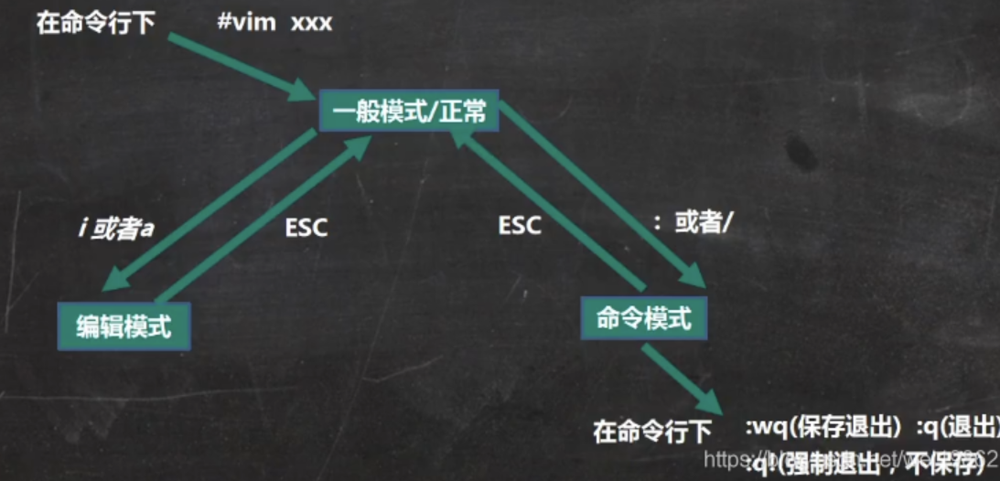
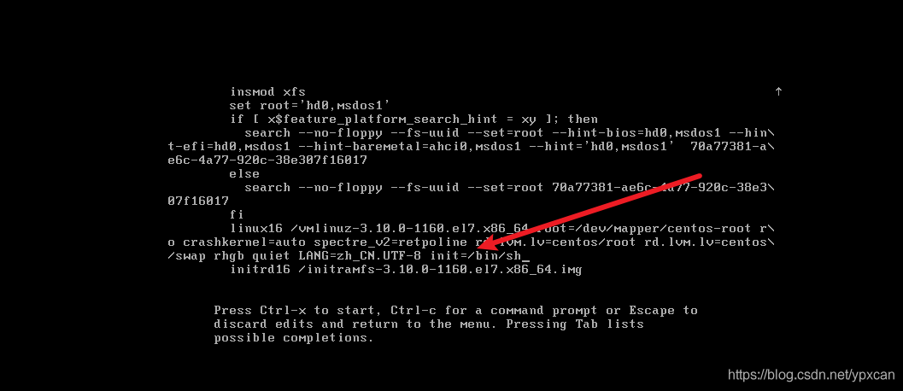
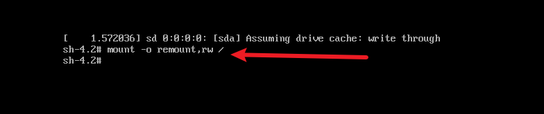
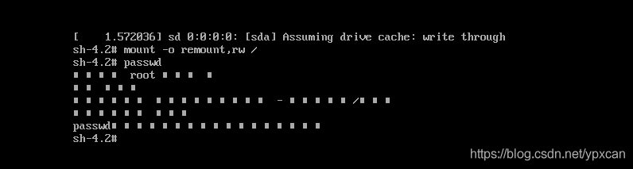
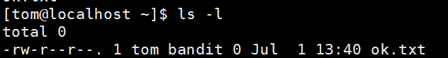

# Linux 目录结构

Linux 的文件系统是才用级层式的树状目录，在此结构的最上层是根目录 `/`，然后在此目录下创建其他目录

/bin [常用] (/usr/bin、/usr/local/bin)：是 Binary 的缩写，存放最常用使用的命令

/sbin (/usr/sbin、/usr/local/sbin)：存放系统管理员使用的系统程序

/home [常用] ：存放普通用户的主目录，每个账户都有一个以账户名命名的目录

/root [常用] ：系统管理员主目录

/lib ：系统开机所需要最基本的动态连接共享库

/lost+found：一般是空的，非法关机后会出现文件

/etc：系统管理所需要的配置文件和子目录

/usr：存放用户的程序和文件，类似 program files

/boot：存放启动 Linux 的相关文件

/proc：系统内存的映射，不能动

/srv：存放一些服务启动之后需要提取的数据 ，不能动

/sys：不能动

/tmp：存放临时文件

/dev：把所有的硬件用文件形式存储

/media：识别设备挂载到此目录

/mnt：让用户临时挂载别的文件系统

/opt：安装软件存放的目录

/usr/local：安装软件安装目录

/var：存放不断扩充的东西，如日志等

/selinux：安全子系统

# Vim编辑器

正常模式：以 vim 打开一个文件就直接进入一般模式，可以使用上下按键控制光标，可以删除字符、删除整行，可以复制、粘贴

插入模式：输入 I i O o A a R r，任意一个字母进入

命令行模式：可以读取，存盘，替换，退出，显示行号

yy：复制当前行，5yy，复制一下5行，输入 p 粘贴

dd：删除当前行，5dd

查找：在命令行模式下输入  /关键字，输入 n 查找下一个

:set nu ：显示行号

:set nonu ：关闭显示行号

G：一般模式下，跳转到最末行

gg：最首行

u：撤销

20 shift+g：一般模式下，跳转到20行

# 关机&重启

- shutdown -h now：表示立即关机
- shutdown -h 1：表示1分钟后关机
- shutdown -r now：立即重启
- halt：直接使用，关机
- reboot：重启
- sync：把内存的数据同步到磁盘上，**当我们关机或者重启时，都应该先执行一下sync，防止数据丢失**。
- logout：注销用户，**在图形运行级别无效，在运行级别3有效**。

# 用户管理

## 命令

- 添加用户：useradd [选项] 用户名。
- cd：表示change directory，切换目录。
- 当创建用户成功后，会自动的创建和用户同名的家目录。
- 也可以通过useradd -d 指定目录 新的用户名。
- 指定/修改密码：passwd 用户名
- 删除用户，保留家目录：userdel 用户名，**一般保留家目录，因为干过的活要留着**。
- 删除用户以及家目录：userdel -r 用户名
- 查询用户信息：id 用户名
- 切换用户：su - 切换用户名，**从权限高切换到权限低的用户不需要输密码**。
- 返回切换前的用户：exit
- 查看当前用户/登录用户：who am i
- 用户组：类似于角色，系统可以对有共性的多个用户进行统一的管理。
- 增加组：groupadd 组名
- 删除组：groupdel 组名
- 增加用户时直接加上组：useradd -g 用户组 用户名
- 修改用户组：usermod -g 用户组 用户名

## 用户相关文件

1. /etc/passwd 文件
   1. 用户（user）的配置文件，记录用户的各种信息。
   2. 每行的含义：用户名：口令：用户标识号：注释性描述：主目录：登录shell
2. /etc/shadow 文件
   1. 口令配置文件
   2. 每行的含义：登录名：加密口令：最后一次修改时间：最小时间间隔：最大时间间隔：警告时间：不活动时间：失效时间：标志
3. /etc/group 文件
   1. 组（group）的配置文件，记录Linux包含的组的信息。
   2. 每行含义：组名：口令：组标识号：组内用户列表

# 实用指令

## 运行级别

指定运行级别（7个级别）

0 关机

1 单用户【找回丢失密码】

2 多用户状态没有网络服务

3 多用户状态有网络服务

4 系统未使用保留给用户

5 图形界面

6 系统重启

系统的运行级别配置文件：/etc/inittab

切换到指定运行级别的指令：init [012356]

## 找回 root 密码

1.首先，启动系统，进入开机界面，在界面中按“e”进入编辑界面，如图

2.进入编辑界面，使用键盘上的上下键把[光标](https://so.csdn.net/so/search?q=光标&spm=1001.2101.3001.7020)往下移动，找到以“Linux16”开头内容所在的行数，在行的最后面输入：init=/bin/sh，如图

3.输入完成后，直接按快捷键：Ctrl+x 进入单用户模式

4.接着，在光标闪烁的位置输入：mount -o remount,rw/ (注意：各个单词之间有空格),完成后按键盘间的回车。如图

5.passwd,完成后按键盘的回车键。输入密码，然后再次确认密码即可（密码最好是8位以上，但不是必须的），密码修改完成后，会显示passwd.....的样式，说明密码修改成功

6.接着，在鼠标闪烁的位置，输入：touch/ .autorelabel（注意：touch与 /后面有一个空格），完成后按键盘的回车键

7.继续在光标闪烁的位置中，输入：exec/sbin/init（注意：exec与/之间有一个空格），完成后按键盘的回车键，等待系统自动修改密码（时间可能有点长），完成后，系统会自动重启，新的密码生效。

## 帮助指令

- man [命令或配置文件]
- help

## 文件目录

- pwd：Print Working Directory，显示当前工作目录的绝对路径。
- ls：-a：显示当前目录所有的文件和目录，包括隐藏的；-l：以列表的方式显示信息。
- cd：cd ~：回到自己的家目录；cd ..：回到当前目录的上一级目录。
- mkdir：创建目录；-p：创建多级目录。
- rmdir：删除空目录。rmdir不能删除非空的目录。如果需要删除非空的目录，需要使用rm -rf。
- touch：创建空文件。可以一次性创建多个文件
- cp：拷贝文件到指定目录；-r：递归复制整个文件夹。强制覆盖不提示的方法：cp命令改为\cp
- rm：移除文件或目录；-r：递归删除整个文件夹；-f：强制删除不提示。
- mv：移动文件与目录或重命名，两种功能！
  - mv oldNameFile newNameFile
  - mv /temp/movefile /targetfolder
- cat：查看文件内容。只能浏览文件，而不能修改文件。-n：显示行号。结尾加上 | more：分页显示，不会全部一下显示完。
- more：是一个基于VI编辑器的文本过滤器，它以全屏幕的方式按页显示文本文件的内容。more还内置了很多快捷键：

| 操作            | 功能说明                         |
| :-------------- | :------------------------------- |
| 空白键（Space） | 向下翻一页                       |
| Enter           | 向下翻一行                       |
| q               | 立刻离开more，不再显示该文件内容 |
| Ctrl + F        | 向下滚动一屏                     |
| Ctrl + B        | 返回上一屏                       |
| =               | 输出当前行的行号                 |
| ：f             | 输出文件名和当前行的行号         |

- less：用来分屏查看文件内容，与more相似，但是更强大，支持各种显示终端。less指令在显示文件内容时，并不是一次将整个文件加载之后才显示，而是根据显示需要加载内容。**对于显示大型文件具有较高的效率。**
- `>`指令：输出重定向。如果不存在会创建文件，否则会将原来的文件内容覆盖。
- `>>`指令：追加。如果不存在会创建文件，否则不会覆盖原来的文件内容，而是追加到文件的尾部。
- cat是查看，echo是写入，echo （内容） >> 文件
- cal：显示当前月日历。
- echo：输出内容到控制台。
- head：显示文件的开头部分。-n 5：看前面5行内容。
- tail：输出文件中尾部的内容。-n 5：看后面5行内容。-f：时事追踪该文档的所有更新

- ln：符号链接，类似于快捷方式。
  - ln -s [原文件或目录] [软连接名]  给源文件创建一个软连接

## 时间日期

- date：显示当前日期和时间
- date +%Y：显示当前年份
- date +%d：显示当前月份
- date +%Y-%m-%d %H:%M:%S：显示年-月-日 时：分：秒
- 设置日期：date -s 字符串时间
- cal：查看日历指令；cal 年份：显示某一年一整年的日历

## 搜索查找

- find：从指定目录向下递归的遍历其各个子目录，将满足条件的文件或者目录显示在终端。
  - find (搜索范围) -name (文件名)：按照指定的文件名查找模式查找文件。
  - find (搜索范围) -user (用户名)：按照指定的用户名查找模式查找文件。
  - find (搜索范围) -size (+多少/-多少/多少)：按照指定的文件大小查找模式查找文件（大于多少/小于多少/等于多少）
  - **查询 /目录下所有.txt的文件**：find / -name *.txt
- locate：locate (搜索文件)
  - 可以快速定位文件路径。locate指令利用事先建立的系统中所有文件名称及路径的locate数据库实现快速定位给定的文件。locate指令无需遍历整个文件系统，查询速度较快。为了保证查询结果的准确度，管理员必须定期更新locate时刻。
  - 在第一次运行之前，必须使用 updatedb 指令创建locate数据库。
- grep：过滤查找，表示将前一个命令的处理结果输出传递给后面的命令处理。经常跟管道一起使用。
  - grep [选项] 查找内容 源文件
  - -n：显示匹配行及行号。
  - -i：忽略大小写字母。
  - `cat hello.txt | grep yes`

## 压缩解压

- gzip/gunzip：压缩文件/解压
  - gzip (文件)：压缩为.gz文件，原来文件不保留。
  - gunzip (文件)：解压缩，同样也不保留源文件。
- zip/unzip：压缩文件/解压
  - zip [选项] (压缩后文件xxx.zip) (将要压缩的文件)
  - unzip [选项] (要解压的文件xxx.zip)
  - zip -r：递归压缩，即压缩目录
  - unzip -d (目录)：指定解压后的文件的存放目录
- tar：打包指令，最后打包后的文件是.tar.gz的文件
  - tar [选项] xxx.tar.gz (打包的内容)
  - -c：产生.tar打包文件
  - -v：显示详细信息
  - -f：指定压缩后的文件名
  - -z：打包同时压缩
  - -x：解压.tar文件
  - 压缩：tar -zcvf (压缩后文件名) (要压缩的文件)
  - 解压：tar -zxvf (要解压的文件)
  - 解压到指定目录：tar -zxvf (要解压的文件) -C (指定目录)，指定解压到的目录要存在。

# 组管理和权限管理

## 文件

1. 所有者
2. 所在组
3. 其他组
4. 改变用户所在组

所有者：

- 一般为文件的创建者，谁创建了该文件，就自然的称为该文件的所有者。

- 查看文件所有者：`ls -ahl`

- 修改文件所有者：chown (用户名) (文件名)

- 文件所在组不一定是文件所有者。

## 组

### 组的创建

`groupadd (组名)`

### 文件、目录所在组

创建文件时，文件默认属于创建者所在组

`chgrp (组名) (文件名/目录名)` 修改所在组

### 其他组

除文件的所有者和所在组的用户外，系统的其他用户都是文件的其他组

### 改变用户所在组

在添加用户时，可以指定将该用户添加到哪个组中，同样的用root的管理权限可以改变某个用户所在的组

改变用户所在组：usermod -g 组名 用户名

改变用户登录的初始目录：usermod -d 目录名 用户名

## 权限

### 文件类型：

- -：普通类型
- d：目录
- l：软连接
- c：字符设备【键盘、鼠标等】
- b：块文件【硬盘】

### ls -l

- rw-：表示文件所有者权限（rw，读写）
- r--：表示文件所在组的用户的权限（r，只有读的权限）
- r--：表示文件其他组的用户的权限（r，只有读的权限）
- 1：如果是文件，表示硬连接的数；如果是目录则表示该目录的子目录个数
- tom：文件所有者
- bandit：文件所在组
- 0：文件的大小，0个字节；如果是目录，则统一为4096
- July 1 13：40：文件最后的修改时间
- ok.txt：文件名

### rwx 权限

rwx作用到文件：

- r：read，可读。读取查看。
- w：write，可以修改。但不代表可以删除该文件。删除一个文件的前提条件是对该文件所在的目录有写权限，才能删除该文件。
- x：execute，可执行。可以被执行。

rwx作用到目录：

- r：可以读取，ls查看目录内容。
- w：可以修改，目录内创建+删除+重命名目录。
- x：可执行，可以进入该目录。

### 修改权限 chmod

- 修改文件或者目录的权限
- u：所有者；g：所在组；o：其他人；a：所有人（u、g、o的总和）
- chmod u=rwx，g=rx，o=x 文件/目录名：分别权限
- chmod o+w 文件/目录名：给其他人都增加写的权限
- chmod a-x 文件/目录名：给所有的用户都减掉执行权限

### 通过数字变更权限

- 规则：r=4 w=2 x=1 rwx=4+2+1=7
- chmod u=rwx，g=rx，o=x 文件目录名 **等价于** chmod 751 文件目录名

### 	修改文件所有者 chown

- chown newowner file：改变文件的所有者
- chown newowner：newgroup file：改变用户的所有者和所在组
- -R：如果是目录，则使其下所有子文件或目录递归生效

### 修改文件所在组 chgrp

- chgrp newgroup file：改变文件的所有组
- -R：如果是目录，则使其下所有子文件或目录递归生效

# 定时任务调度

