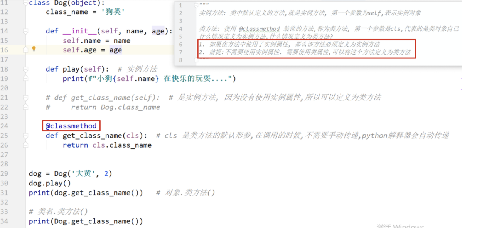
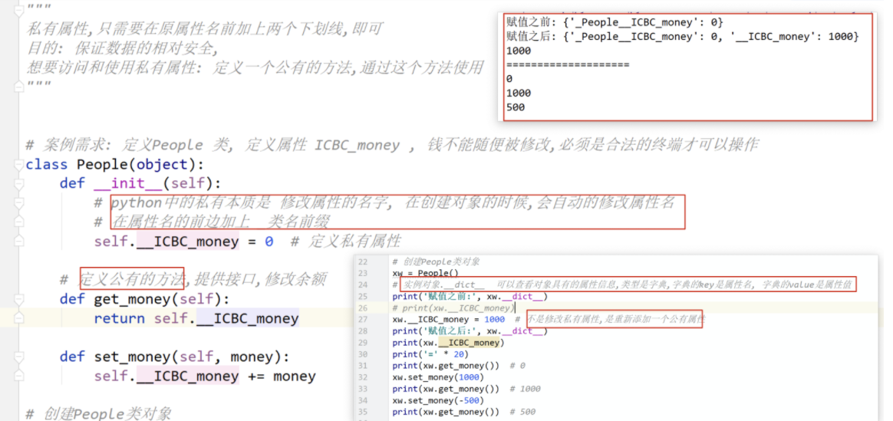

# PYTHON 基础

## 注释

- 单行注释：以 # 开头，后面的内容为注释的内容，# 后跟一个空格，如果在代码后面注释，# 与代码之间距离两个空格
- 多行注释：一对连续的三个引号（单引号或双引号）''' '''   """ """
- 头部注释：
  - 写在 python 程序第一行的以 # 开头的表示的信息是头注释
  - 作用：被系统或解释器所调用
  - 结构：注释符号 + 注释内容
    - `#coding:utf-8`常用
    - `#!/usr/bin/env`不常用

## 内置函数 

### print ( )

- 输出的内容：可数字、字符串或含有运算式的表达式

- 输出的目的地：显示器、文件

  - ```python
    file1 = open('C:/Users/张宁/Documents/test1.txt', 'a+')  
    # a+:如果文件不存在，就创建，如果存在，就继续添加
    print('123', file=file1)
    file1.close()
    ```

- 输出形式：换行、不换行

  - 不换行使用 `,` 连接各字符
  
- 输出内容太多，可在最后`\n`后加一个`\`，也可用一对三个单引号`'''`或一对三个双引号`"""`引起来，就不用每一行后加`\`

### input( )

- 接收一个标准输入数据、返回为 string 类型
- 在命令行输入一行信息，会将这行信息返沪成字符串

用法：

```python
result: str = input("请输入：")
```

括号内的内容用于提示

### type( )

返回变量的类型

```python
type(abc)  
```

### id( )

返回变量的内存地址

数字地址 = id(变量)

### len( )

返回字符串的长度

返回值 = len (字符串)

### in( )

判断数据中是否存在想要的成员

返回值：true / false

```python
print('ASD' in 'ASDFGHJ')
```

### max( )

返回数据中最大的成员

```python
print(max('今天是9月15日'))
```

中文符号>字母>数字>英文符号

中文按照拼音首字母排序

### min( )

返回数据中最小的成员

### ord( )

将字符串转换为Unicode编码

## 转义字符

* \t 一个制表位，实现对齐功能
* \r 一个回车
* \n 换行符
* \b 退格
* \\ \ 一个\
* \\" 一个"
* \\' 一个'

输出字符时，若不想转义，可在""外加一个r

`print(r"D:\ABC")`

## 导入位置

### 导入是什么

- 导入是将 python 的一些功能函数放到当前的脚本中使用
- 不导入的功能无法直接在当前脚本中使用

### 导入语法

`import os`其中 import 是内置导入函数，os 是被导入的模块

要在使用的函数之前导入


## 程序执行顺序

自上而下，逐行执行

### python 脚本的执行入口

#### 1、什么是入口

代码执行的入口叫做主函数 main

#### 2、代码写法

```python
if __name__ == '__main__':
    print('Hello')
```

不一定需要入口


## 变量

### 变量的命名规则

-  组成：必须是数字，字母，下划线组成
- 长度：任意，20字符以内
- 要求：开头必须是字母或下划线
- 注意：区分大小写、有意义


## 关键字

python 内部自带的用于处理业务逻辑的特殊单词

变量名不能使用关键字

- 强关键字：完全不能定义为变量
- 弱关键字：可以定义为变量，会失去原有的功能

|       |      |        |          |        |          |
| ----- | ---- | ------ | -------- | ------ | -------- |
| and   | as   | assert | break    | class  | continue |
| def   | del  | elif   | else     | except | finally  |
| for   | from | False  | global   | if     | import   |
| in    | is   | lambda | nonlocal | not    | None     |
| or    | pass | raise  | return   | try    | True     |
| while | with | yield  |          |        |          |

## 切片

切片是指对操作的对象截取其中一部分的操作，字符串、列表、元组都支持切片

```py
切片的语法：
	[起始：步长：结束]
```

注意：选取的区间从“起始”位开始，到“结束”位的前一位结束（不包含结束位），步长表示间隔

 

## 数据类型

- 数字类型
- 字符串类型
- 布尔类型
- 空类型
- 列表类型
- 元组类型
- 字典类型

### 数字类型

#### 整型 int

int 既是整型的代表，又是定义整型的内置函数

#### 浮点型 float

float 既是整型的代表，又是定义整型的内置函数

浮点数值不相等有误差

0.3 ！= 0.2 + 0.1

复数：1+2j		a.real（实部）a.imag（虚部）

#### 运算符


### 字符串类型

- 字符串类型的变量不可改变
- 字符串不能做减法、乘除法
- 使用`+`拼接

### 布尔类型

- 使用`bool()`函数可返回括号内的布尔值
- False的情况：
  - 定义为False的对象：None和False
  - 值为0的数字类型：0，0.0，0j，decimal(0)
  - 空的序列和集合：""，()，[]，{}，set()，range(0)
- 运算符：
  - and
  - or
  - not
  - 优先级


### 类型转换

#### 转为整数型 int()

1. float类型转为int
2. 整数类型的字符串

#### 转为浮点型 float()

1. 整数型 int
2. 数字类型字符串

#### eval()

还原原来的数据类型，去掉字符串引号

## 分支和循环

- **if**

  ```python
  if condition:
  	statement
  else:
  	statement
  ```

  

- **while**

  ```python
  while condition:
  	statement(s)
  ```

  - 可以使用`break`跳出循环
  - 使用`continue`跳出本次循环

- **for**

  - `in`后面的是可迭代对象，有list、tuple、dict、set、str等类型

  - 整数型需使用`range()`函数，有`range(stop)`、`range(start,stop)`、`range(start,stop,step)`

    

```python
for var in var:
	statement(s)

for i in range(5)
```


## 容器

### 列表list

创建列表：`list1 = [1, 2, 3, 4, "ad"]`

访问：`list1[0]   list1[3]   list1[0:3]  list1[3:]  list1[1:4:2](2是间隔)`也支持负数

#### 增

- `append()`，`list1.append("asd")` ，加到最后面
- `extend()`，`list1.extend(["2sa", "sda"])`，参数必须是**可迭代对象**，新加内容加到原列表后面
- 切片，`list1[len(list1):] = [3]   list1[len(list1):] = [3, 5, "as"]`
- `insert(position, paramater)`，在指定位置插入指定元素

#### 删

- `remove()`，若存在重复的，删除第一个
- `pop(index)`，删除指定位置处的元素，默认删除最后一个，并返回删除的元素
- `clear()`，清空列表
- `del    del list1[2]`，删除指定下标

#### 改

- 直接使用下标，`list1[4] = "adaf"`，多个替换，`list1[3:6] = ["ad", "43f", "ad"]`
- 整型列表可直接使用`sort()`函数进行从小到大排序，`sort(reverse = true)`可以倒序
  - `sorted(list)`，会产生一个新的列表

- `reverse()`，调转顺序，第一和最后，第二和倒数第二 .......

#### 查

- `count()`，查找参数的个数
- `index(x,start,end)`，查找元素的索引值，相同的返回第一个，没有会报错
- `copy()`，浅拷贝，将列表拷贝到新的列表，新列表不会随原列表变化而变化

#### 加法和乘法

`list1 + list2`，将两个列表拼接为一个新的列表

`list1 * 3`，将列表的内容复制三份，拼接为一个新列表，三个新子列表其实是同一个

#### 嵌套列表

```python
matrix = [[1, 2, 3],
          [4, 5, 6],
          [7, 8, 9]]
```

访问

```python
for i in matrix:
    for j in i:
        print(j, end=" ")
    print()

matrix[1][2]
```

`is`运算符：同一性运算符，可以判断两个对象是否相同，判断的是对象间的唯一身份标识（id）

#### enumerate()

遍历列表，返回下标和元素的元组

#### 浅拷贝和深拷贝

浅拷贝是拷贝的引用，类似于指针

深拷贝既拷贝引用，也拷贝对象

```python
import copy
x = [[1, 2, 3], [4, 5, 6], [7, 8, 9]]
y = copy.copy(x)        # 浅拷贝，结果随x变化
z = copy.deepcopy(x)    # 深拷贝，不随x变化
x[1][1] = 0
print(x)
print(y)
print(z)
# 结果
[[1, 2, 3], [4, 0, 6], [7, 8, 9]]
[[1, 2, 3], [4, 0, 6], [7, 8, 9]]
[[1, 2, 3], [4, 5, 6], [7, 8, 9]]
```

#### 列表推导式

`[expression for target in iterable if condition`

`for target in iterable if condition`							

`for target in iterable if condition`

`for target in iterable if condition]`

```python
x = [[1, 2, 3],
     [4, 5, 6],
     [7, 8, 9]]
length = len(x)
a = [x[i][length - i - 1] for i in range(length)]
b = [x[i][i] for i in range(length)]
print(a)
print(b)
#结果
[3, 5, 7]
[1, 5, 9]
```


```python
words = ["Great", "FishC", "Brilliant", "Excellent", "Fantastic"]
F_words = [i for i in words if "F" in i]
print(F_words)
# 结果
['FishC', 'Fantastic']
```


### 元组

创建元组：`rhyme = (1, 2, 3, "asd")`

元组不支持修改，但元组中元素若是列表，就可以修改

也可使用下标和切片方式访问

第一个元素下标是0，最后一个是 -1

不能使用推导式

可以省略括号，但最好加上

#### 查

- `count()`
- `index()`

两种方法同列表

#### 嵌套

`a = b, c`

使用循环进行访问

#### 生成只有一个元素的元组

`a = (123,)`，注意要加逗号

#### 打包和解包

创建元组就成为打包

`a = (1, 2, 3, "asd")`

把元素赋给变量就称为解包，变量数量必须一致，列表、字符串也可

`q, w, e, r = a`

### 字符串

 #### 大小写

- `capitalize()`，将首字母大写
- `casefold()`，将所有字母转为小写，除了英文字母，其他字符也可以
- `title()`，将每个单词的首字母大写，其他字母小写
- `swapcase()`，将大小写反转
- `upper()`，将所有字母大写
- `lower()`，将所有字母小写，只能英文字母

#### 对齐

- `center(width, fillchar='')`，在指定宽度下使字符串居中
- `ljust(width, fillchar='')`，左对齐
- `rjust(width, fillchar='')`，右对齐
- `zfill(width)`，用`0`填充左侧

其中`fillchar=''`用来指定用什么字符填充

#### 查

- `count(sub[,start[,end]])`，查找指定字符出现的次数
- `find(sub[,start[,end]])`，从左往右查找下标，找不到返回`-1`
- `rfind(sub[,start[,end]])`，从右往左
- `index(sub[,start[,end]])`，从左往右查找下标，但找不到会异常
- `rindex(sub[,start[,end]])`，从右往左


#### 替换

- `expandtabs([tabsize=8])`，修改table键是多少个空格
- `replace(old, new, count=-1)`，将old字符替换为new字符，count设置替换多少次
- `translate(table)`，将字符串按照table的规则进行转换，可以使用`str.maketrans()`创建规则

#### 判断

- `startswith(prefix[,start[,end]])`，判断参数的字符串是否出现在字符串起始位置
- `endswith(suffix[,start[,end]])`，判断参数的字符串是否出现在字符串末尾位置
- `istitle()`，判断字符串中所有单词是否首字母大写，其余均为小写
- `isupper()`，判断是否全为大写
- `islower()`，判断是否全为小写
- `isalpha()`，判断是否全为字母，中文也可
- `isspace()`，判断是否为空白字符串
- `isprintable()`，判断是否都可打印，如转义字符就不可打印
- `isdecimal()`，`isdigit()`，`isnumeric()`，判断是否为数字，但范围和尺度不同
- `isalnum() = isalpha() + isdecimal() + isdigit() + isnumeric()`，其中一个为true就是true
- `isidentifier()`，判断是否是一个合法的python标识符
- 若要判断是否为python的关键字，可以调用`keyword`包中的`keyword.iskeyword()`判断

#### 截取

- `strip(chars=None)`，清除空白（None），可以更改chars参数来改变清除的字符
- `lstrip(chars=None)`，清除左侧空白（None），可以更改chars参数来改变清除的字符
- `rstrip(chars=None)`，清除右侧空白（None），可以更改chars参数来改变清除的字符，匹配的是单个字符
- `removeprefix(prefix)`，删除`prefix`前缀，整个`prefix`字符串
- `removesuffix(suffix)`，删除`suffix`后缀，整个`suffix`字符串（需要python3.9）

#### 拆分和拼接

- `partition(sep)`，`rpartition(sep)`，以参数为分隔符进行切割，返回一个三元组
- `split(sep=None, maxsplit=-1)`，`rsplit(sep=None, maxsplit=-1)`，以指定次数和字符切割

- `splitlines(keepend=true/false)`，以换行进行切割，keepend表示是否把换行符保留
- `join(iterable)`，将括号内的元组或列表的字符串，使用调用`join()`函数的字符串进行拼接

#### 格式化字符串

`str.format()`，具有很多参数，具体查文档

字符串中使用`{}`占位，`format()`函数进行替换

#### f 字符串

在字符串引号前加f，即可在字符串中的{ }里使用format

### 序列

- 可变序列：列表
- 不可变序列：元组、字符串

#### 运算符

- `+`：序列拼接
- `*`：序列重复
- `is`、`is not`，同一性运算符，判断id值
- `in`、`not in`，判断某个元素是否在序列中
- `del`，用于删除一个或多个指定的对象        `del x, y, z`

#### 函数

##### 转换函数

- `list()`，将元组或字符串转换为列表
- `tuple()`，将列表或字符串转换为元组
- `str()`，将列表或元组转为字符串

##### min、max

- `min(iterable, *[, key, default])`，`min(arg1,  arg2, *arg[, key])`
- `max(iterable, *[, key, default])`，`max(arg1,  arg2, *arg[, key])`

##### len、sum、sorted

- `len()`，长度，承受范围(2^63-1)
- `sum(, start)`，求和，start是初始值
- `sorted(, reverse=True, key=len)`，排序，返回的是新列表，`list.sort()`是改变原列表
- `reversed()`，将参数反向排列，返回的是反向迭代器

##### all、any

- `all()`，判断所有对象是否全为真
- `any()`，判断是否有真

##### enumerate、zip、map、filter

- `enumerate(,start)`，返回一个枚举对象，将可迭代兑现中的每个元素及从 0 开始的序号共同构成一个二元组的列表
- `zip()`，用于创建一个聚合多个可迭代对象的迭代器
- `map()`，根据提供的函数对指定的可迭代对象的每个元素进行运算，并将返回运算结果的迭代器
- `filter()`，根据提供的函数对指定的可迭代对象的每个元素进行运算，并将运算结果为真的元素，以迭代器的形式返回。

### 字典

```python
info = {'name':'zn', 'id':21, 'sex':'m', 'address':'CN'}
```

- 字典和列表一样，能够存储多个数据
- 列表查找元素时是根据下标来的，字典是根据`key`
- 字典的每个元素由两部分组成，`key:value`
- key的`int`和`float`视为一个

#### 增 改

使用`字典[key] = 值`

如果key存在就修改，不存在就添加

#### 删

- `del dict(key)`，根据 key 值删除
  - `del dict`，删除字典这个变量
- `dict.pop(key)`，根据 key 值删除，返回删除的元素
- `dict.clear()`，删除所有键值对

#### 遍历

1. 使用 for 循环直接遍历字典，遍历的是 key 
2. `dict.keys()`，获取所有的 key 值
3. `dict.values()`，获取所有的 value 
4. `dict.items()`，将每个键值对存储为元组


### 公共方法

#### 运算符

- `+`，支持字符串、列表、元组进行操作，得到一个新的容器
- `* 整数`，复制，支持字符串、列表、元组进行操作，得到一个新容器
- `in / not in`，判断是否存在，支持字符串、列表、元组进行操作，字典查找的是 key

#### 内置函数

- `len()`，返回元素个数
- `max()`，返回元素最大值
- `min()`，返回元素最小值
- `del()`，删除变量

`max/min`，比较字典时，比较的是 key 值

## 函数


### 函数的定义和调用

#### 定义

```python
def 函数名():
    函数体
```

#### 调用

```python
函数名()
```

#### 注意

- 每次调用函数时，函数都会从头开始执行，当函数中的代码执行完毕，调用完成
- 如果执行到 return 也会结束调用

```python
def print_info():
    print("姓名：张宁 年龄：22")

print_info()
```

### 函数参数

#### 定义带有参数的函数

函数调用，如果在定义时有形参，那么在调用的时候，必须传递参数值，称为实参

```python
def add(a, b):
    c = a + b
    return c
```


### 局部变量

定义在函数内的变量

只能在函数内部使用，不能在函数外部使用

### 全局变量


### 返回值

在函数中定义的局部变量，或者通过计算得到的局部变量，想要在函数外部访问和使用，使用 return 关键字返回结果

作用：

- 将 return 后面的数据返回
- 程序遇到 return 会终止执行

```python
返回多个数据
return c, d # 默认是组成元组
return [c, d]
return {'c':c, 'd':d}
```


### 传参形式

```python
def func(a, b, c):
	print(a, b, c)
```


#### 位置传参

```
func(1, 2, 3)
```

#### 关键字传参

```python 
func(a = 1, b = 2, c = 3)
```

#### 混合使用

先使用位置传参，再使用关键字传参

```python
func(10, b = 20, c = 30)
```

### 缺省参数

形参在定义的时候，给形参一个默认值，这个形参就是缺省参数

缺省参数要写在普通参数的后边

调用时，如果传递实参，则用实参，不传递则用默认值

### 不定长参数

在形参前加一个 *  ，该形参变为不定长元组参数，可以接受所有位置传参，类型是元组

在形参前加两个 * ， 该形参变为不定长字典参数，可以接受所有关键字传参，类型是字典

### 拆包

指将容器中的数据给到多个变量，数据的个数和变量的个数一致

```python
a = [1, 2, 3]
b, c, d = a
aa = {'a':1, 'b':2}
bb, cc = aa  # 得到的是 key 值
```

  ### 引用


### 类型的可变与不可变

在不改变变量引用的前提下，能否改变变量中引用中的数据

能改变是可变类型，不能改变是不可变类型

不可变：

- int
- float
- bool
- 字符串
- 元组

可变：

- 列表
- 字典

### 引用做参数

函数传参传递的是引用

## 文件

### 读操作

#### read()


#### 按行读取 readline() readlines()


#### 文件、文件夹操作 

以下操作需要 `import os`

- 文件重命名：`os.rename("a.txt", "b.txt")`
- 删除文件：`os.remove("a.txt")`
- 创建文件夹：`os.mkdir("abc")`
- 获取当前目录：`os.getcwd()`
- 改变默认目录：`os.chdir("../")`
- 获取目录列表：`os.listdir("./")`
- 删除文件夹：`os.rmdir("abc")`


## 面向对象

### 类

#### 类的构成

- 类的名称：类名
- 类的属性：一组数据
- 类的方法：操作的方法

```python
# 新式类
class Dog(object):

    
# 旧式类
class Dog():

    
class Dog:
    
```

#### 魔法方法

在python的类中，有一类方法，这类方法以`两个下划线开头`和`两个下划线结尾`并且在`满足某个特定条件的情况下会自动调用`这类方法，称为魔法方法

##### `__init__`

调用：创建对象后会立即调用

作用：

- 用来给对象添加属性，给对象属性一个初始值
- 每创建一个对象需要执行的代码都可以写在这部分


##### `__str__`

调用：

- `print(对象)`，会自动调用，打印的是`__str__`的返回值
- `str(对象)`类型转换，将自定义对象转换为字符串的时候，会自动调用

作用：

- 打印对象的时候，输出一些属性信息
- 需要将对象转换为字符串的时候

注意：

- 方法必须返回一个字符串
- 只有`self`一个参数

#### 私有属性，方法

在属性方法前加上两个下划线`__`

#### 类属性


#### 类方法



### 继承

#### 基本语法

```python
x 继承: 描述的类与类之间所属关系.
基本语法:
class 类B(类A):    
	pass
称为类 B 继承类 A
特点: B类的对象可以使用 A类的属性和方法
优点: 代码复用.重复相同的代码不用多次书写.
名词:     
    类A: 父类      基类    
    类B: 子类      派生类
```


#### 单继承和多继承


#### 子类重写父类的同名方法

```
重写: 子类定义和父类名字相同的方法.
为什么重写: 父类中的方法,不能满足子类对象的需求,所以要重写.
重写之后的特点: 子类对象调用子类自己的方法,不再调用的方法,父类对象调用父类自己的方法.
```


#### 子类调用父类的同名方法


#### 继承中的 init


#### 多继承


#### 私有权限

```bash
访问权限控制: 在什么地方可以使用和操作.
私有权限: 
	定义: 在方法和属性前加上两个下划线, 就变为私有.
	1. 不能在类外部通过对象直接访问和使用, 只能在类内部访问和使用
	2. 不能被子类继承,
公有: 不是私有的,就是公有的.
```




#### 静态方法


### 多态


## 异常

### 概念

```bash
异常的组成:
`异常类型`: `异常具体的描述信息`
```


### 捕获异常

#### 单个异常


#### 多个异常

```python
try:
    可能发生异常的代码
except (异常类型1, 异常类型2, ...):
	发生异常执行的代码
    
    
try:
    可能发生异常的代码
except 异常类型1:
    发生异常1执行的代码
except 异常类型2:
    发生异常2执行的代码
```

### 打印异常信息

```python
try:
    可能发生异常的代码
except (异常类型1, 异常类型2, ...) as e:
	发生异常执行的代码
    print(e)
```

### 捕获所有的异常

```python
try:
    可能发生异常的代码
except:
	发生异常执行的代码
 


try:
    可能发生异常的代码
except Exception as e:
	发生异常执行的代码
    print(e)
```

### 异常的完整结构

```python
try:
    可能发生异常的代码
except Exception as e:
    发生异常执行的代码
    print(e)
else:
    代码没有发生异常,会执行
finally:
    不管有没有发生异常,都会执行
```


### 异常的传递

```pyhton
是 python 异常处理的底层机制,是原理层面上的,不需要我们自己写代码实现,是 python 已经实现好的.

异常传递: 当一行代码发生异常之后,会向外层将这个异常进行传递,指导被捕获或者程序报错为止.
1. try 嵌套
2. 函数嵌套
```

### 抛出自定义异常

```python
程序代码为什么会报错?
因为不符合语法, 因为 python 的作者在代码中使用了 if 判断,如果除数为 0 ,就会在代码中抛出异常错误,
抛出异常:
    raise 异常对象  # 当程序代码遇到 raise 的时候,程序就报错了
    
异常对象 = 异常类(参数)  

抛出自定义异常:
    1. 自定义异常类,继承 Exception 或者 BaseException 
    2. 选择书写,定义 __init__方法,定义__str__ 方法
    3. 在合适的时机抛出异常对象即可
```


## 模块

### 模块中的变量 `__all__`


### 模块中的变量 `__name__`


## 包


