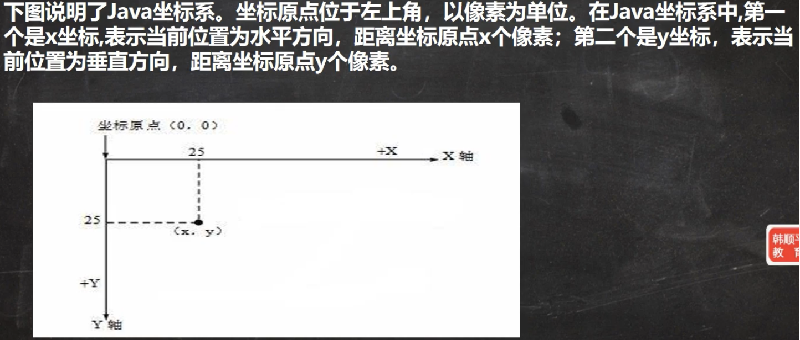
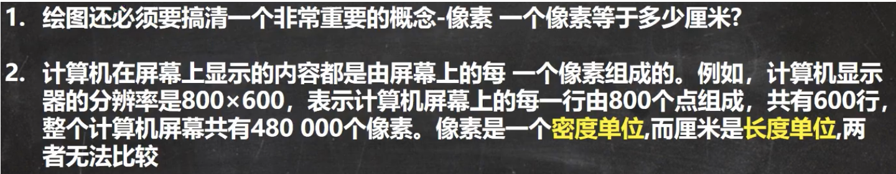
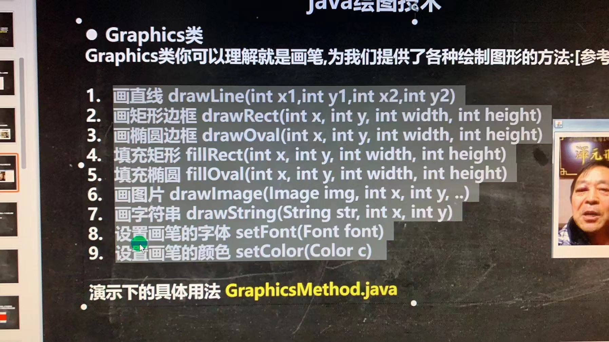

# 坐标系

绘图原理：
Component类提供了两个和绘图相关最重要的方法：

1. paint(Graphics g) 绘制组件的外观
2. repaint() 刷新组件的外观。

当组件第一次在屏幕显示的时候,程序会自动的调用paint0方法来绘制组件。
在以下情况paint0将会被调用：

1. 窗口最小化,再最大化
2. 窗口的大小发生变化
3. repaint函数被调用
   

