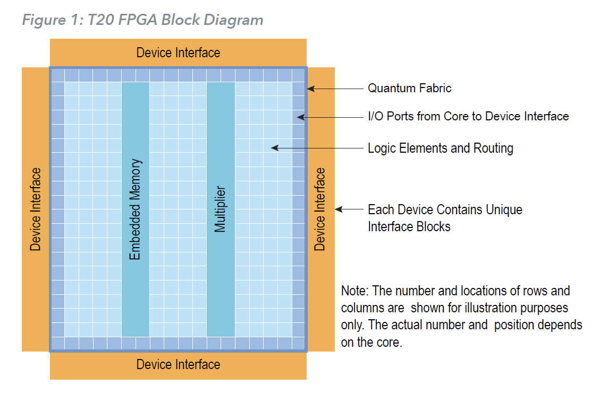

# 介绍

T20 FPGA 采用高密度、低功耗易灵思 QuantumTM 架构，并带有 I/O 接口，便于集成。 

凭借高 I/O 与逻辑比率和差分 I/O 支持，T20 FPGA 支持各种需要宽 I/O 连接的应用。 

T20 还包括一个带有内置免版税CSI-2 控制器的 MIPI D-PHY，这是移动行业中最流行的相机接口。

此外，T20 FPGA 支持带内存的 DDR3、LPDDR3、LPDDR2 PHY 控制器硬 IP，可更快地访问存储在内存中的数据。

 精心定制的核心资源和 I/O 组合为嵌入式视觉、语音和手势识别、智能传感器集线器、电源管理和 LED 驱动器等应用提供了增强的功能。

# 特性

- 高密度、低功耗的Quantum TM 架构
- 基于中芯国际40纳米工艺
- 内核漏电流低至6.8 mA
- FPGA接口块
  - GPIO
  - PLL
  - LVDS 800 Mbps每通道，最多 20 对 TX 和 26 对 RX 
  - MIPI DPHY，带 CSI-2 控制器硬核 IP，每通道 1.5 Gbps
  - DDR3、LPDDR3、LPDDR2 x16 PHY，带内存控制器硬 IP，12.8 Gbps总带宽
- 可编程高性能 I/O
  - 支持 1.8、2.5 和 3.3 v 单端 I/O 标准和接口
- 灵活的片上时钟
  - 16 个低偏移全局时钟信号可以由片外外部时钟信号驱动，或者PLL 合成时钟信号
  - PLL 支持
- 灵活的设备配置
  - 标准 SPI 接口（有源、无源和菊花链）
  - JTAG 接口
  - 可选掩模可编程存储器 (MPM) 功能
- 完全支持 Efinity 软件，RTL-to-bitstream 编译器

## T20 FPGA 资源

| LE    | 全局时钟网络 | 全局控制网络 | 嵌入式内存(kbits) | 嵌入式内存块(5kbits) | 嵌入式乘法器 |
| ----- | ------------ | ------------ | ----------------- | -------------------- | ------------ |
| 19728 | 最高16       | 最高16       | 1044.48           | 204                  | 36           |

| 资源                                                         | BGA169           | BGA256           | BGA324                      | BGA400                      |
| ------------------------------------------------------------ | ---------------- | ---------------- | --------------------------- | --------------------------- |
| 可用GPIO                                                     | 73               | 195              | 130                         | 230                         |
| 来自 GPIO 引脚的全局时钟                                     | 4                | 16               | 5                           | 16                          |
| 来自 GPIO 引脚的全局控制                                     | 3                | 16               | 5                           | 16                          |
| PLL                                                          | 5                | 5                | 7                           | 7                           |
| LVDS                                                         | 8 TX 对12 RX 对  | 13 TX 对13 RX 对 | 20 TX 对26 RX 对            | 20 TX 对26 RX 对            |
| 带 CSI-2 控制器的 MIPI DPHY （4 个数据通道，1 个时钟通道） | 2TX 实例2RX 实例 | -                | 2TX 实例2RX 实例            | -                           |
| 带内存控制器的 DDR3/LPDDR3/LPDDR2 PHY                        | -                | -                | 1 个块（x8 或 x16 DQ 宽度） | 1 个块（x8 或 x16 DQ 宽度） |

| 封装    | 尺寸(mm x mm) | 间距(mm) |
| ------- | ------------- | -------- |
| 169FBGA | 9 x 9         | 0.65     |
| 256FBGA | 13 x 13       | 0.8      |
| 324FBGA | 12 x 12       | 0.65     |
| 400FBGA | 16 x 16       | 0.8      |

# 设备核心功能描述

T20 FPGA 具有可交换逻辑和路由 (XLR) 单元，易灵思针对各种应用进行了优化。 

TrionR FPGA 包含由 XLR 单元构成的三个构建块：LE、嵌入式存储器块和乘法器。 

TrionR 系列中的每个 FPGA 都具有自定义数量的构建块，以满足特定的应用需求。 

如下图所示，FPGA 包括所有四个侧面的 L/O 端口，以及 LE、存储器和乘法器的列。 FPGA 内的控制块处理配置。

## XLR 单元

可交换逻辑和路由 (XLR) 单元是 Quantum 架构的基本构建块。

易灵思 XLR 单元结合了逻辑和路由，可互换地支持这两种功能。 

这种独特的创新极大地提高了晶体管的灵活性和利用率，从而显着减少了晶体管数量和硅面积。

## 逻辑单元

LE 包括一个 4 输入 LUT 或一个全加器加上一个寄存器（触发器）。 

您可以将每个 LUT 编程为具有四个输入的任何组合逻辑功能。 

您可以配置多个LE 来实现算术功能，例如加法器、减法器和计数器。

## 嵌入式内存

该内核具有 5-kbit 高速、同步、嵌入式 SRAM 存储器块。 内存块可以作为单端口 RAM、简单双端口 RAM、真正的双端口 RAM、FIFO 或 ROM 运行。您可以在配置期间初始化内存内容。 Efinity 软件包括内存级联功能，可自动连接多个模块以形成更大的阵列。 此功能使您能够实例化更深或更宽的内存模块。

存储器读写端口有以下寻址存储器的模式（深度 x 宽度）：

读取和写入端口支持独立配置的数据宽度。

## 乘法器

FPGA 具有支持 18 x 18 定点乘法的高性能乘法器。

每个乘法器采用两个带符号的 18 位输入操作数并生成一个带符号的 36 位输出乘积。

 乘法器在输入和输出端口上有可选寄存器。

## 全局时钟网络

Quantum™ 核心架构支持多达 16 个全局时钟 (GCLK) 信号，为 16 个预构建的全局时钟网络供电。 全局时钟管脚 (GPIO)、PLL 输出和内核生成的时钟可以驱动全局时钟网络。
全局时钟网络是为所有 FPGA 模块供电的平衡时钟树。 每个网络都有专用的时钟使能逻辑，通过禁用根处的时钟树来节省功耗。 该逻辑动态启用/禁用网络并保证输出没有故障。

# 设备接口功能说明

器件接口包裹内核并通过信号接口在内核和器件 I/O 焊盘之间路由信号。 由于它们使用灵活的 Quantum™ 架构，Trion® 系列中的设备支持各种接口以满足不同应用的需求。

## 接口块连接

FPGA 内核架构通过信号接口连接到接口模块。 然后接口块连接到封装引脚。 内核使用三种类型的信号连接到接口模块：

- 输入——输入数据或时钟到 FPGA 内核
- 输出——来自 FPGA 内核的输出
- 时钟输出——来自核心时钟树的时钟信号

GPIO 模块是一种特殊情况，因为它们可以在多种模式下运行。 例如，在交替模式下，GPIO 信号可以绕过信号接口并直接馈送到另一个接口模块。 因此，配置为备用输入的 GPIO 可用作 PLL 参考时钟，而无需通过信号接口连接到内核。

在设计 Trion® FPGA 时，您可以为内核创建 RTL 设计并配置接口块。 从内核的角度来看，内核的输出是接口块的输入，内核的输入是接口块的输出。 Efinity 网表始终从内核的角度显示信号，因此某些信号不会出现在网表中：

- 用作参考时钟的 GPIO 在 RTL 设计中不存在，它们仅在接口模块配置中可见。
- FPGA 时钟树直接连接到接口模块。 因此，从内核到接口的时钟输出在 RTL 设计中不存在，它们只是接口配置的一部分（这包括配置为输出时钟的 GPIO）

以下部分描述了 T20 接口块。 信号和框图是从接口的角度显示的，而不是核心。

## 通用 I/O 逻辑和缓冲器

GPIO 支持 3.3 V LVTTL 和1.8 V、2.5 V 和3.3 V LVCMOS I/O 标准。GPIO分组为 bank。每个组都有自己的 VCCIO，用于设置 I/O 标准的组电压。

每个 GPIO 由 I/O 逻辑和 I/O 缓冲区组成。I/O 逻辑将核心逻辑连接到 I/O 缓冲区。I/O 缓冲器位于设备的外围。

I/O 逻辑包括三种寄存器类型：

- 在传输到核心逻辑之前从 I/O 输入捕获接口信号
- 在传输到 I/O 缓冲区之前从核心逻辑输出寄存器信号
- 当 I/O 用作输出时，输出启用和禁用 I/O 缓冲区

GPIO  模式：

| GPIO 模式 | 描述                                                         |
| --------- | ------------------------------------------------------------ |
| 输入      | 仅启用输入路径；可选注册。如果已注册，则输入路径使用输入时钟控制寄存器（正触发或负触发）。选择备用输入路径以驱动GPIO的备用功能。无法注册备用路径。在DDIO模式下，两个寄存器对输入时钟的正边缘和负边缘上的数据进行采样，从而创建两个数据流。 |
| 输出      | 仅启用输出路径；可选注册。如果已注册，则输出路径使用输出时钟控制寄存器（正触发或负触发）。输出寄存器可以反转。在DDIO模式下，两个寄存器捕获输出时钟正边缘和负边缘上的数据，将它们多路复用到一个数据流中。 |
| 双向      | 启用输入、输出和OE路径；可选注册。如果已注册，则输入时钟控制输入寄存器，输出时钟控制输出和OE寄存器。所有寄存器都可以正触发或负触发。此外，可以独立注册输入和输出路径。输出寄存器可以反转。 |
| 时钟输出  | 时钟输出路径已启用                                           |

GPIO 和 LVDS 作为 GPIO 的功能：

作为 GPIO 的 LVDS 是充当 GPIO 而不是 LVDS 功能的 LVDS 引脚。

| 封装              | 支持的功能                                                   |                                    |
| ----------------- | ------------------------------------------------------------ | ---------------------------------- |
|                   | GPIO                                                         | LVDS as GPIO                       |
| BGA169 BGA256 | DDIO 施密特触发器 可变驱动强度 上拉 下拉 转换率 | 上拉                               |
| BGA324 BGA400 | DDIO 施密特触发器 可变驱动强度 上拉 下拉 转换率 | 可变驱动强度 上拉 回转率 |

在配置期间，所有 GPIO 引脚不包括LVDS 作为 GPIO 在弱上拉模式下配置。

在用户模式下，未使用的 GPIO 引脚为三态，并在弱上拉模式下配置。可以在界面设计器中将默认模式更改为弱下拉。

GPIO 信号：

| 信号     | 方向 | 描述                                                         |
| -------- | ---- | ------------------------------------------------------------ |
| IN[1:0]  | 输出 | 将数据从GPIO板输入核心结构。IN0是核心的正常输入。 在DDIO模式下，IN0是在正时钟边缘上捕获的数据（接口设计器中的HI引脚名称），IN1是在负时钟边缘上捕获的数据（接口设计器中的LO引脚名称）。 |
| ALT      | 输出 | 可选输入连接（在接口设计器中，Register选项为none）。 可选连接有GCLK、GCTRL、PLL\U CLKIN、MIPI\U CLKIN |
| OUT[1:0] | 输入 | 将数据从core fabric输出到GPIO pad。OUT0是核心的正常输出。 在DDIO模式下，OUT0是在正时钟边缘捕获的数据（接口设计器中的HI引脚名称），OUT1是在负时钟边缘捕获的数据（接口设计器中的LO引脚名称）。 |
| OE       | 输入 | 从核心结构到 I/O 块的输出启用。可以注册。                    |
| OUTCLK   | 输入 | 控制输出和OE寄存器的核心时钟。此时钟在用户网络列表中不可见   |
| INCLK    | 输入 | 控制输入寄存器的核心时钟。此时钟在用户网络列表中不可见。     |
| IO       | 双向 | GPIO 焊盘                                                    |

### 双数据 I/O

T20 FPGA 在某些输入和输出寄存器上支持双数据 I/O（DDIO）。在此模式下，DDIO 寄存器捕获正时钟边缘和负时钟边缘上的数据。核心从接口接收2位宽的数据。

在正常模式下，接口在正时钟边缘和负时钟边缘直接接收或发送数据至核心或从核心发送数据。在重新同步模式下，接口重新同步数据，以仅在正时钟边缘传递两个信号。

并非所有 GPIO 都支持 DDIO；此外，作为 GPIO 的 LVDS（即单端 I/O）不支持 DDIO 功能。

## 时钟和控制分配网

全局时钟网络通过设备分布，为核心的 LEs、内存、乘法器和 I/O 块提供时钟。设计者可以使用全局时钟 GPIO 引脚、PLL 输出和核心生成时钟访问 T20 全局时钟网络。类似地，T20 具有 GPIO 引脚（数量因封装而异），设计者可以将其配置为控制输入，以访问连接到 LE 设置、重置和时钟启用信号的高扇出网络。

## I/O Banks

Trion FPGA 具有用于一般用途的输入/输出（I/O）组。每个 I/O 组都有独立的电源引脚。支持的数量和电压因 FPGA 和封装而异。电源组的数量及其支持的电压因封装而异。一些 I/O 银行通过共享 VCCIO 引脚在包级别进行合并。合并后的银行在名称中的银行之间有下划线（_）（例如，1B_1C 表示 1B 和1 C 已连接）。

## PLL

T20有5或7个可用的PLL（取决于封装）来合成时钟频率。您可以使用PLL通过外部或内部反馈补偿时钟偏移/延迟，以满足高级应用中的计时要求。PLL参考时钟最多有四个源。您可以使用CLKSEL端口动态选择PLL参考时钟。（动态选择参考时钟源时，保持PLL复位。）其中一个PLL可以使用LVDS RX缓冲器输入其参考时钟。PLL由预分频器计数器（N计数器）、反馈乘法器计数器（M计数器）、后分频器计数器（O计数器）和输出分频器组成。

计数器设置定义PLL输出频率：

FVCO是压控振荡器频率

FOUT是输出时钟频率

FIN是参考时钟频率

FPFD是相位频率检测器输入频率

C是输出分频器

参考时钟必须介于10和200 MHz之间。

PFD输入必须在10到50 MHz之间。

VCO频率必须介于500和1600 MHz之间。

PLL信号（与FPGA结构的接口)：

| 信号                            | 方向 | 描述                                                         |
| ------------------------------- | ---- | ------------------------------------------------------------ |
| CLKIN[3:0]                      | 输入 | 由 I/O 板或核心时钟树驱动的参考时钟                          |
| CLKSEL[1:0]                     | 输入 | 您可以从一个时钟输入引脚中动态选择参考时钟                   |
| RSTN                            | 输入 | 低电平有效 PLL 复位信号。 置位时，该信号复位 PLL； 置低时，它使能 PLL。  在您的设计中连接此信号以启动或复位 PLL。  置位 RSTN 引脚至少 10 ns 的脉冲以复位 PLL。 当动态改变选定的 PLL 参考时钟时置位 RSTN。 |
| COREFBK                         | 输入 | 当锁相环反馈模式设置为核心时，连接到时钟输出接口引脚。       |
| CLKOUT0 CLKOUT1 CLKOUT2 | 输出 | 锁相环输出。设计者可以将这些信号作为输入时钟路由到核心的GCLK网络。 |
| LOCKED                          | 输出 | 当 PLL 实现锁定时变为高电平； 当检测到失锁时变低。  在您的设计中连接此信号以监控锁定状态。 |

PLL接口设计器设置-属性选项卡：

| 参数         | 选项     | 备注                                                         |
| ------------ | -------- | ------------------------------------------------------------ |
| 实例名       | 用户定义 |                                                              |
| 锁相环资源   |          | 资源列表取决于您选择的FPGA。                                 |
| 时钟脉冲源   | 外部     | 锁相环参考时钟来自外部引脚。                                 |
|              | 动态     | 锁相环参考时钟来自外部引脚或核心，并由时钟选择总线控制       |
|              | 核心     | 锁相环参考时钟来自核心。                                     |
| 自动时钟计算 |          | 按下这个按钮启动锁相环时钟计算窗口。 该计算器帮助您定义锁相环设置在一个易于使用的图形界面。 |

PLL接口设计器设置-手动配置页签：

PLL参考时钟资源分配(BGA169和BGA256)：

PLL参考时钟资源分配(BGA324)：

锁相环参考时钟资源分配(BGA400)：

## LVDS

LVDS硬IP发射机和接收机独立工作。

- LVDS TX由LVDS变送器和串行逻辑组成
- LVDS RX由LVDS接收器、模端终端和反序列化逻辑组成

T20有多达三个锁相环与LVDS接收机使用。

您可以使用LVDS TX和LVDS RX通道作为3.3 V单端GPIO引脚，支持弱上拉，但不支持施密特触发器或可变驱动强度。当使用LVDS作为GPIO时，请确保在同一组的任意GPIO和LVDS引脚之间至少留有2对未分配的LVDS引脚。这种分离减少了噪音。如果您不离开此分离，Efinity软件将发出错误。

LVDS硬IP具有以下特点:

- 专用LVDS TX和RX通道(通道数量依赖于包)，一个专用LVDS RX时钟
- 可达800mbps用于LVDS数据传输或接收
- 支持序列化和反序列化因素:8:1,7:1,6:1,5:1,4:1,3:1，和2:1
- 禁用序列化和反序列化功能
- 源同步时钟输出与LVDS发射机和接收机的数据边缘对齐
- LVDS接收机的100 Ω on-die终端电阻

VDS RX支持子LVDS, slvs, HiVcm, rsd和3.3 V LVPECL差分I/O标准，传输速率高达800 Mbps。

下面的波形显示了快时钟、慢时钟、发送到pad的TX数据和来自核心的字节对齐数据之间的关系。

下面的波形显示了快时钟、慢时钟、从pad进来的RX数据和与核心字节对齐的数据之间的关系。

## MIPI

MIPI CSI-2接口是目前应用最广泛的移动摄像接口。您可以使用此界面为各种应用程序构建单相机或多相机设计。

T20 fpga包括两个经过硬化的MIPI D-PHY块(4个数据通道和1个时钟通道)和MIPI CSI-2 IP块。MIPI RX和MIPI TX可以与专用的I/O银行独立操作。

MIPI D-PHY和CSI-2控制器是硬块;对于非CSI-2应用，用户不能绕过CSI-2控制器直接访问D-PHY。

MIPI TX/RX接口支持MIPI CSI-2规范v1.3和MIPI D-PHY规范v1.1。

它具有以下特点:

- 可编程数据车道配置支持1、2、4车道
- 高速模式支持每车道1.5 Gbps数据速率
- 支持连续和非连续时钟模式
- 摄像头64位像素接口
- 支持超低功耗状态(ULPS)

Trion®fpga具有多个MIPI TX和RX块，支持各种视频应用。

### MIPI TX

MIPI TX是一个发送接口，将Trion®核心的视频数据转换为通过HSSI接口发送到单板的分组数据。5个高速差动引脚对(4个数据，1个时钟)，每一个代表一个车道，连接到单板。控制信号和视频信号从MIPI接口连接到核心。

控制信号决定时钟和使用多少收发机通道。除两个复位信号外，所有控制信号都需要。复位信号是可选的，但是，必须使用两个信号或两个都不使用。

当MIPI接口处于退出(低功耗)模式时，MIPI块需要一个退出时钟(ESC_CLK)，运行在11到20 MHz之间。

视频信号接收来自核心的视频数据。MIPI接口块编码并通过MIPI D-PHY通道发送出去。

MIPI TX视频数据类型[5:0]设置

当HSYNC值为低时，才可以修改视频数据类型。

### MIPI RX

MIPI RX是一个接收接口，将板上的HSSI信号转换为Trion®核心中的视频数据。5对高速差动引脚(1个时钟，4个数据)，每对代表一条车道，连接到单板。控制信号、视频信号和状态信号从MIPI接口连接到核心

控制信号决定时钟、使用多少收发器通道以及启用多少虚拟信道。除两个复位信号外，所有控制信号都需要。复位信号是可选的，但是，必须使用两个信号或两个都不使用。视频信号将解码后的视频数据发送到核心。所有视频信号必须完全支持MIPI标准。状态信号提供关于MIPI RX接口操作的可选状态和错误信息。

MIPI RX视频数据类型[5:0]设置

HSYNC设置为低时，才能修改视频数据类型。

D-PHY定时参数

在CSI-2数据传输过程中，MIPI D-PHY在低功耗模式和高速模式之间切换。D-PHY规范定义了时序参数，以促进在模式转换期间MIPI TX和MIPI RX之间的正确握手。

您可以在Efinity®接口设计器中设置与硬件规格相对应的计时参数。

- RX parameters—TCLK-SETTLE, THS-SETTLE  表27
- TX parameters—TCLK-POST, TCLK-TRAIL, TCLK-PREPARE, TCLK-ZERO, TCLK-PRE, THS-
  PREPARE, THS-ZERO, THS-TRAIL 表25

## DDR DRAM

T20 fpga具有x16 DDR PHY接口，支持DDR3、DDR3L、LPDDR3、LPDDR2以及内存控制器硬IP块。DDR PHY支持高达1066 Mbps / lane的数据速率。内存控制器提供2条128位AXI总线与FPGA核心通信。

DDR DRAM块支持I2C校准总线，可以读取/写入DDR配置寄存器。您可以使用此总线微调DDR PHY以获得高性能。

### DDR接口设计器设置

下表描述了接口设计器中DDR块的设置。

# 上电顺序

在为Trion®fpga供电时，推荐以下上电顺序:

1. 先上电VCC和VCCA_xx。
2. 当VCC和VCCA_xx稳定后，上电所有VCCIO引脚。在VCCIO引脚之间没有特定的定时延迟
3. 在 VCC 稳定后至少 tMIPI_POWER 给 VCC12A_MIPI_TX、VCC12A_MIPI_RX 和 VCC25A_MIPI 上电。
4. 在所有电源稳定后，将 CRESET_N 保持在低电平 tCRESET_N 期间，然后将 CRESET_N 从低电平变为高电平以触发主动 SPI 编程（FPGA 从外部闪存设备加载配置数据）。

## 电源暂态电流

在上电过程中，您可能会在专用电源轨道上观察到涌流。您必须确保在您的单板上选择的电源满足通电时的电流要求和用户模式时的估计电流。使用Trion®Power Estimator来计算用户模式下的估计电流。

# 配置

T20 FPGA包含易失性配置RAM (CRAM)。在上电和FPGA进入正常工作之前，用户必须为所需的逻辑功能配置CRAM。FPGA的控制块管理配置过程，并使用位流对CRAM进行编程。Efinity®软件生成比特流，这是设计相关的。T20 FPGA支持主模式、被动模式和JTAG模式配置。

在active模式下，FPGA控制配置过程。FPGA内的振荡器电路提供配置时钟。位流通常存储在外部串行闪存设备中，当FPGA请求时，该设备提供位流。

控制块发出读取配置数据的指令和地址。首先，它发出一个下电指令的释放来唤醒外部SPI flash。然后等待至少30 μs，发出快速读取命令，从地址24h ' 000000读取SPI flash的内容。

在无源模式下，FPGA是从站，依赖于外部主机来提供控制、位流和时钟配置。通常主控是一个微控制器或另一个活跃模式的FPGA。

在JTAG模式下，通过JTAG接口配置FPGA。

## 支持配置模式

## 掩模可编程序内存选项

T20 FPGA采用一次性可编程MPM。通过该功能，您可以使用片上MPM而不是外部串行闪存设备来配置FPGA。这个选项适用于需要超小的因素和最低成本结构的系统，这样一个外部串行闪存设备是不可取的和/或不需要在批量生产。MPM是一次性的工厂可编程选项，需要非经常性工程(NRE)付款。为实现MPM，请将您的设计提交给我们的工厂;我们的应用工程师(AEs)将您的设计转换为一个单独的配置掩码专门制作。

# 直流和开关特性(BGA169和BGA256)

BGA169和BGA256包中的T20 fpga具有以下直流和交换特性。

​	

# 直流和开关特性(BGA324和BGA400)

# LVDS I/O电气规格

LVDS引脚符合EIA/TIA电气规范。

# 防静电性能

# MIPI电气规格和定时

MIPI D-PHY发射机和接收机符合MIPI联盟规范D-PHY 1.1修订版。

## MIPI 上电时序

在VCC稳定后，对VCC12A_MIPI_TX, VCC12A_MIPI_RX和VCC25A_MIPI至少加电。参见第40页的上电顺序图

## MIPI 复位时序

MIPI RX和TX接口有两个信号(RSTN和DPHY_RSTN)复位CSI-2和D-PHY控制器逻辑。这些信号是低活跃的，你应该使用它们一起重置MIPI接口。

在RSTN和DPHY_RSTN上升沿之后，tINIT时间必须大于等于100 μs。

# 锁相环时序和交流特性

下表描述锁相环时序和交流特性。

# 配置时序

T20 FPGA具有以下配置时序规格。详细配置信息请参见an006:配置Trion fpga。

# 引出线的描述

下表描述了电源、接地、配置和接口的引脚。

# Efinity

Efinity®软件提供了从RTL设计到位流生成的完整工具流程，包括合成、位置路由和时间分析。该软件具有图形用户界面(GUI)，提供了一种可视化的方式来设置项目、运行工具流和查看结果。该软件还具有命令行流程和Tcl命令控制台。软件生成的位流文件用于配置T20 FPGA。该软件支持Verilog HDL和VHDL语言。

